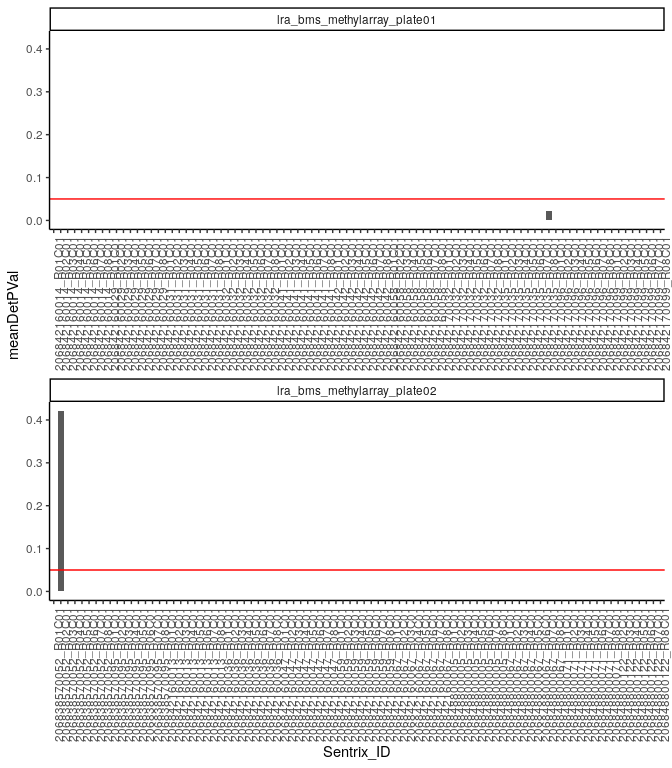

Preprocess DNA methylation
================
Kevin Thomas
6/20/2023

-   [Preprocessing cell type-specific DNA methylation array
    data](#preprocessing-cell-type-specific-dna-methylation-array-data)
    -   [Setup](#setup)
    -   [Raw data import](#raw-data-import)
    -   [Quality control](#quality-control)
        -   [Beta value distribution](#beta-value-distribution)
    -   [Remove sample](#remove-sample)
    -   [Normalization](#normalization)

# Preprocessing cell type-specific DNA methylation array data

## Setup

``` r
BiocManager::install("minfi")
```

    ## 'getOption("repos")' replaces Bioconductor standard repositories, see
    ## '?repositories' for details
    ## 
    ## replacement repositories:
    ##     CRAN: https://packagemanager.rstudio.com/all/__linux__/focal/latest

    ## Bioconductor version 3.13 (BiocManager 1.30.16), R 4.1.0 (2021-05-18)

    ## Warning: package(s) not installed when version(s) same as current; use `force = TRUE` to
    ##   re-install: 'minfi'

    ## Installation paths not writeable, unable to update packages
    ##   path: /usr/local/lib/R/library
    ##   packages:
    ##     boot, class, cluster, codetools, foreign, KernSmooth, lattice, MASS,
    ##     Matrix, mgcv, nlme, nnet, rpart, spatial, survival

    ## Old packages: 'AnnotationHub', 'ape', 'aplot', 'backports', 'batchelor',
    ##   'bayesm', 'bbmle', 'bdsmatrix', 'beachmat', 'BH', 'BiocManager',
    ##   'BiocParallel', 'biomaRt', 'bit', 'blob', 'brew', 'brio', 'broom', 'bslib',
    ##   'cachem', 'Cairo', 'callr', 'car', 'carData', 'caret', 'checkmate',
    ##   'circlize', 'circular', 'classInt', 'cli', 'clipr', 'clue',
    ##   'clusterProfiler', 'colorspace', 'commonmark', 'compositions', 'conflicted',
    ##   'conquer', 'corrplot', 'cpp11', 'crayon', 'credentials', 'crosstalk', 'curl',
    ##   'data.table', 'DBI', 'dbplyr', 'DelayedMatrixStats', 'deldir', 'dendextend',
    ##   'densityClust', 'DEoptimR', 'desc', 'details', 'devtools', 'dials',
    ##   'diffobj', 'digest', 'doParallel', 'doRNG', 'DOSE', 'dplyr', 'drake',
    ##   'DropletUtils', 'dsb', 'DT', 'dtplyr', 'e1071', 'edgeR', 'enrichplot',
    ##   'enrichR', 'entropy', 'evaluate', 'expm', 'fansi', 'farver', 'fastICA',
    ##   'fastmap', 'fdrtool', 'fitdistrplus', 'flexmix', 'FNN', 'forcats', 'foreach',
    ##   'formatR', 'Formula', 'fs', 'furrr', 'future', 'future.apply',
    ##   'future.callr', 'gargle', 'gdata', 'genefilter', 'generics', 'GenomeInfoDb',
    ##   'GenomicFeatures', 'gert', 'ggbeeswarm', 'ggfittext', 'ggforce', 'ggh4x',
    ##   'ggplot2', 'ggpubr', 'ggraph', 'ggrepel', 'ggridges', 'ggsci', 'ggsignif',
    ##   'ggtext', 'ggtree', 'gh', 'git2r', 'gitcreds', 'glmnet', 'globals', 'glue',
    ##   'gmodels', 'goftest', 'googledrive', 'googlesheets4', 'gower', 'gplots',
    ##   'graphlayouts', 'gridtext', 'gtable', 'gtools', 'hardhat', 'harmony',
    ##   'haven', 'hdf5r', 'hexbin', 'highr', 'Hmisc', 'hms', 'htmlTable',
    ##   'htmltools', 'htmlwidgets', 'httpuv', 'httr', 'hunspell', 'hwriter', 'ica',
    ##   'igraph', 'import', 'infer', 'inspectdf', 'ipred', 'irlba', 'isoband',
    ##   'iterators', 'janitor', 'jpeg', 'jsonlite', 'kernlab', 'knitr', 'ks',
    ##   'later', 'latticeExtra', 'lava', 'leiden', 'leidenAlg', 'lhs', 'lifecycle',
    ##   'listenv', 'littler', 'lme4', 'lmtest', 'locfit', 'loo', 'lubridate',
    ##   'magrittr', 'maptools', 'markdown', 'mathjaxr', 'MatrixGenerics',
    ##   'MatrixModels', 'matrixStats', 'mclust', 'memoise', 'metap', 'mime', 'minqa',
    ##   'misc3d', 'mixtools', 'mnormt', 'modeldata', 'modelr', 'multcomp', 'mutoss',
    ##   'mvtnorm', 'N2R', 'nloptr', 'NMF', 'openssl', 'openxlsx', 'paletteer',
    ##   'parallelDist', 'parallelly', 'parsnip', 'patchwork', 'pbapply', 'pbdZMQ',
    ##   'pbkrtest', 'pbmcapply', 'pcaPP', 'pillar', 'pkgbuild', 'pkgload',
    ##   'pkgmaker', 'plotly', 'plotrix', 'plyr', 'png', 'polyclip', 'polynom',
    ##   'pracma', 'prismatic', 'pROC', 'processx', 'prodlim', 'proxy', 'ps', 'pscl',
    ##   'psych', 'purrr', 'quantreg', 'R.methodsS3', 'R.oo', 'R.utils', 'R6',
    ##   'randomForest', 'raster', 'rbibutils', 'rcmdcheck', 'RColorBrewer', 'Rcpp',
    ##   'RcppAnnoy', 'RcppArmadillo', 'RcppEigen', 'RcppGSL', 'RcppHNSW',
    ##   'RcppNumerical', 'RcppParallel', 'RcppSpdlog', 'RCurl', 'Rdpack', 'readr',
    ##   'readxl', 'recipes', 'remotes', 'reprex', 'restfulr', 'reticulate', 'Rfast',
    ##   'Rfast2', 'RhpcBLASctl', 'rio', 'rjson', 'rlang', 'rmarkdown', 'rngtools',
    ##   'robustbase', 'roxygen2', 'rprojroot', 'rrcov', 'rsample', 'RSpectra',
    ##   'RSQLite', 'rstan', 'rstatix', 'rstudioapi', 'rtracklayer', 'Rtsne',
    ##   'rvcheck', 'rversions', 'rvest', 's2', 'S4Vectors', 'sandwich', 'sass',
    ##   'scales', 'scattermore', 'scatterpie', 'sccore', 'sctransform', 'segmented',
    ##   'sessioninfo', 'Seurat', 'SeuratObject', 'sf', 'shadowtext', 'shiny',
    ##   'sitmo', 'slam', 'slider', 'sn', 'snow', 'SoupX', 'sourcetools', 'sp',
    ##   'sparsesvd', 'spatstat.data', 'spatstat.geom', 'spatstat.sparse',
    ##   'spatstat.utils', 'spData', 'spdep', 'speedglm', 'spelling', 'StanHeaders',
    ##   'stringdist', 'stringi', 'stringr', 'svglite', 'svMisc', 'sys',
    ##   'systemfonts', 'targets', 'testthat', 'TH.data', 'tibble', 'tidygraph',
    ##   'tidymodels', 'tidyr', 'tidyselect', 'tidytree', 'tidyverse', 'timeDate',
    ##   'tinytex', 'treeio', 'tune', 'tweenr', 'tzdb', 'units', 'usethis', 'utf8',
    ##   'uuid', 'uwot', 'V8', 'vctrs', 'VGAM', 'viridis', 'viridisLite', 'visdat',
    ##   'visNetwork', 'vroom', 'waldo', 'webshot', 'WGCNA', 'whisker', 'withr', 'wk',
    ##   'workflowr', 'workflows', 'workflowsets', 'WriteXLS', 'xfun', 'xgboost',
    ##   'XML', 'xml2', 'yaml', 'yardstick', 'zip', 'zoo'

``` r
BiocManager::install("preprocessCore", force = TRUE, configure.args = "--disable-threading")
```

    ## 'getOption("repos")' replaces Bioconductor standard repositories, see
    ## '?repositories' for details
    ## 
    ## replacement repositories:
    ##     CRAN: https://packagemanager.rstudio.com/all/__linux__/focal/latest

    ## Bioconductor version 3.13 (BiocManager 1.30.16), R 4.1.0 (2021-05-18)

    ## Installing package(s) 'preprocessCore'

    ## Installation paths not writeable, unable to update packages
    ##   path: /usr/local/lib/R/library
    ##   packages:
    ##     boot, class, cluster, codetools, foreign, KernSmooth, lattice, MASS,
    ##     Matrix, mgcv, nlme, nnet, rpart, spatial, survival

    ## Old packages: 'AnnotationHub', 'ape', 'aplot', 'backports', 'batchelor',
    ##   'bayesm', 'bbmle', 'bdsmatrix', 'beachmat', 'BH', 'BiocManager',
    ##   'BiocParallel', 'biomaRt', 'bit', 'blob', 'brew', 'brio', 'broom', 'bslib',
    ##   'cachem', 'Cairo', 'callr', 'car', 'carData', 'caret', 'checkmate',
    ##   'circlize', 'circular', 'classInt', 'cli', 'clipr', 'clue',
    ##   'clusterProfiler', 'colorspace', 'commonmark', 'compositions', 'conflicted',
    ##   'conquer', 'corrplot', 'cpp11', 'crayon', 'credentials', 'crosstalk', 'curl',
    ##   'data.table', 'DBI', 'dbplyr', 'DelayedMatrixStats', 'deldir', 'dendextend',
    ##   'densityClust', 'DEoptimR', 'desc', 'details', 'devtools', 'dials',
    ##   'diffobj', 'digest', 'doParallel', 'doRNG', 'DOSE', 'dplyr', 'drake',
    ##   'DropletUtils', 'dsb', 'DT', 'dtplyr', 'e1071', 'edgeR', 'enrichplot',
    ##   'enrichR', 'entropy', 'evaluate', 'expm', 'fansi', 'farver', 'fastICA',
    ##   'fastmap', 'fdrtool', 'fitdistrplus', 'flexmix', 'FNN', 'forcats', 'foreach',
    ##   'formatR', 'Formula', 'fs', 'furrr', 'future', 'future.apply',
    ##   'future.callr', 'gargle', 'gdata', 'genefilter', 'generics', 'GenomeInfoDb',
    ##   'GenomicFeatures', 'gert', 'ggbeeswarm', 'ggfittext', 'ggforce', 'ggh4x',
    ##   'ggplot2', 'ggpubr', 'ggraph', 'ggrepel', 'ggridges', 'ggsci', 'ggsignif',
    ##   'ggtext', 'ggtree', 'gh', 'git2r', 'gitcreds', 'glmnet', 'globals', 'glue',
    ##   'gmodels', 'goftest', 'googledrive', 'googlesheets4', 'gower', 'gplots',
    ##   'graphlayouts', 'gridtext', 'gtable', 'gtools', 'hardhat', 'harmony',
    ##   'haven', 'hdf5r', 'hexbin', 'highr', 'Hmisc', 'hms', 'htmlTable',
    ##   'htmltools', 'htmlwidgets', 'httpuv', 'httr', 'hunspell', 'hwriter', 'ica',
    ##   'igraph', 'import', 'infer', 'inspectdf', 'ipred', 'irlba', 'isoband',
    ##   'iterators', 'janitor', 'jpeg', 'jsonlite', 'kernlab', 'knitr', 'ks',
    ##   'later', 'latticeExtra', 'lava', 'leiden', 'leidenAlg', 'lhs', 'lifecycle',
    ##   'listenv', 'littler', 'lme4', 'lmtest', 'locfit', 'loo', 'lubridate',
    ##   'magrittr', 'maptools', 'markdown', 'mathjaxr', 'MatrixGenerics',
    ##   'MatrixModels', 'matrixStats', 'mclust', 'memoise', 'metap', 'mime', 'minqa',
    ##   'misc3d', 'mixtools', 'mnormt', 'modeldata', 'modelr', 'multcomp', 'mutoss',
    ##   'mvtnorm', 'N2R', 'nloptr', 'NMF', 'openssl', 'openxlsx', 'paletteer',
    ##   'parallelDist', 'parallelly', 'parsnip', 'patchwork', 'pbapply', 'pbdZMQ',
    ##   'pbkrtest', 'pbmcapply', 'pcaPP', 'pillar', 'pkgbuild', 'pkgload',
    ##   'pkgmaker', 'plotly', 'plotrix', 'plyr', 'png', 'polyclip', 'polynom',
    ##   'pracma', 'prismatic', 'pROC', 'processx', 'prodlim', 'proxy', 'ps', 'pscl',
    ##   'psych', 'purrr', 'quantreg', 'R.methodsS3', 'R.oo', 'R.utils', 'R6',
    ##   'randomForest', 'raster', 'rbibutils', 'rcmdcheck', 'RColorBrewer', 'Rcpp',
    ##   'RcppAnnoy', 'RcppArmadillo', 'RcppEigen', 'RcppGSL', 'RcppHNSW',
    ##   'RcppNumerical', 'RcppParallel', 'RcppSpdlog', 'RCurl', 'Rdpack', 'readr',
    ##   'readxl', 'recipes', 'remotes', 'reprex', 'restfulr', 'reticulate', 'Rfast',
    ##   'Rfast2', 'RhpcBLASctl', 'rio', 'rjson', 'rlang', 'rmarkdown', 'rngtools',
    ##   'robustbase', 'roxygen2', 'rprojroot', 'rrcov', 'rsample', 'RSpectra',
    ##   'RSQLite', 'rstan', 'rstatix', 'rstudioapi', 'rtracklayer', 'Rtsne',
    ##   'rvcheck', 'rversions', 'rvest', 's2', 'S4Vectors', 'sandwich', 'sass',
    ##   'scales', 'scattermore', 'scatterpie', 'sccore', 'sctransform', 'segmented',
    ##   'sessioninfo', 'Seurat', 'SeuratObject', 'sf', 'shadowtext', 'shiny',
    ##   'sitmo', 'slam', 'slider', 'sn', 'snow', 'SoupX', 'sourcetools', 'sp',
    ##   'sparsesvd', 'spatstat.data', 'spatstat.geom', 'spatstat.sparse',
    ##   'spatstat.utils', 'spData', 'spdep', 'speedglm', 'spelling', 'StanHeaders',
    ##   'stringdist', 'stringi', 'stringr', 'svglite', 'svMisc', 'sys',
    ##   'systemfonts', 'targets', 'testthat', 'TH.data', 'tibble', 'tidygraph',
    ##   'tidymodels', 'tidyr', 'tidyselect', 'tidytree', 'tidyverse', 'timeDate',
    ##   'tinytex', 'treeio', 'tune', 'tweenr', 'tzdb', 'units', 'usethis', 'utf8',
    ##   'uuid', 'uwot', 'V8', 'vctrs', 'VGAM', 'viridis', 'viridisLite', 'visdat',
    ##   'visNetwork', 'vroom', 'waldo', 'webshot', 'WGCNA', 'whisker', 'withr', 'wk',
    ##   'workflowr', 'workflows', 'workflowsets', 'WriteXLS', 'xfun', 'xgboost',
    ##   'XML', 'xml2', 'yaml', 'yardstick', 'zip', 'zoo'

``` r
BiocManager::install("IlluminaHumanMethylationEPICmanifest")
```

    ## 'getOption("repos")' replaces Bioconductor standard repositories, see
    ## '?repositories' for details
    ## 
    ## replacement repositories:
    ##     CRAN: https://packagemanager.rstudio.com/all/__linux__/focal/latest

    ## Bioconductor version 3.13 (BiocManager 1.30.16), R 4.1.0 (2021-05-18)

    ## Warning: package(s) not installed when version(s) same as current; use `force = TRUE` to
    ##   re-install: 'IlluminaHumanMethylationEPICmanifest'

    ## Installation paths not writeable, unable to update packages
    ##   path: /usr/local/lib/R/library
    ##   packages:
    ##     boot, class, cluster, codetools, foreign, KernSmooth, lattice, MASS,
    ##     Matrix, mgcv, nlme, nnet, rpart, spatial, survival

    ## Old packages: 'AnnotationHub', 'ape', 'aplot', 'backports', 'batchelor',
    ##   'bayesm', 'bbmle', 'bdsmatrix', 'beachmat', 'BH', 'BiocManager',
    ##   'BiocParallel', 'biomaRt', 'bit', 'blob', 'brew', 'brio', 'broom', 'bslib',
    ##   'cachem', 'Cairo', 'callr', 'car', 'carData', 'caret', 'checkmate',
    ##   'circlize', 'circular', 'classInt', 'cli', 'clipr', 'clue',
    ##   'clusterProfiler', 'colorspace', 'commonmark', 'compositions', 'conflicted',
    ##   'conquer', 'corrplot', 'cpp11', 'crayon', 'credentials', 'crosstalk', 'curl',
    ##   'data.table', 'DBI', 'dbplyr', 'DelayedMatrixStats', 'deldir', 'dendextend',
    ##   'densityClust', 'DEoptimR', 'desc', 'details', 'devtools', 'dials',
    ##   'diffobj', 'digest', 'doParallel', 'doRNG', 'DOSE', 'dplyr', 'drake',
    ##   'DropletUtils', 'dsb', 'DT', 'dtplyr', 'e1071', 'edgeR', 'enrichplot',
    ##   'enrichR', 'entropy', 'evaluate', 'expm', 'fansi', 'farver', 'fastICA',
    ##   'fastmap', 'fdrtool', 'fitdistrplus', 'flexmix', 'FNN', 'forcats', 'foreach',
    ##   'formatR', 'Formula', 'fs', 'furrr', 'future', 'future.apply',
    ##   'future.callr', 'gargle', 'gdata', 'genefilter', 'generics', 'GenomeInfoDb',
    ##   'GenomicFeatures', 'gert', 'ggbeeswarm', 'ggfittext', 'ggforce', 'ggh4x',
    ##   'ggplot2', 'ggpubr', 'ggraph', 'ggrepel', 'ggridges', 'ggsci', 'ggsignif',
    ##   'ggtext', 'ggtree', 'gh', 'git2r', 'gitcreds', 'glmnet', 'globals', 'glue',
    ##   'gmodels', 'goftest', 'googledrive', 'googlesheets4', 'gower', 'gplots',
    ##   'graphlayouts', 'gridtext', 'gtable', 'gtools', 'hardhat', 'harmony',
    ##   'haven', 'hdf5r', 'hexbin', 'highr', 'Hmisc', 'hms', 'htmlTable',
    ##   'htmltools', 'htmlwidgets', 'httpuv', 'httr', 'hunspell', 'hwriter', 'ica',
    ##   'igraph', 'import', 'infer', 'inspectdf', 'ipred', 'irlba', 'isoband',
    ##   'iterators', 'janitor', 'jpeg', 'jsonlite', 'kernlab', 'knitr', 'ks',
    ##   'later', 'latticeExtra', 'lava', 'leiden', 'leidenAlg', 'lhs', 'lifecycle',
    ##   'listenv', 'littler', 'lme4', 'lmtest', 'locfit', 'loo', 'lubridate',
    ##   'magrittr', 'maptools', 'markdown', 'mathjaxr', 'MatrixGenerics',
    ##   'MatrixModels', 'matrixStats', 'mclust', 'memoise', 'metap', 'mime', 'minqa',
    ##   'misc3d', 'mixtools', 'mnormt', 'modeldata', 'modelr', 'multcomp', 'mutoss',
    ##   'mvtnorm', 'N2R', 'nloptr', 'NMF', 'openssl', 'openxlsx', 'paletteer',
    ##   'parallelDist', 'parallelly', 'parsnip', 'patchwork', 'pbapply', 'pbdZMQ',
    ##   'pbkrtest', 'pbmcapply', 'pcaPP', 'pillar', 'pkgbuild', 'pkgload',
    ##   'pkgmaker', 'plotly', 'plotrix', 'plyr', 'png', 'polyclip', 'polynom',
    ##   'pracma', 'prismatic', 'pROC', 'processx', 'prodlim', 'proxy', 'ps', 'pscl',
    ##   'psych', 'purrr', 'quantreg', 'R.methodsS3', 'R.oo', 'R.utils', 'R6',
    ##   'randomForest', 'raster', 'rbibutils', 'rcmdcheck', 'RColorBrewer', 'Rcpp',
    ##   'RcppAnnoy', 'RcppArmadillo', 'RcppEigen', 'RcppGSL', 'RcppHNSW',
    ##   'RcppNumerical', 'RcppParallel', 'RcppSpdlog', 'RCurl', 'Rdpack', 'readr',
    ##   'readxl', 'recipes', 'remotes', 'reprex', 'restfulr', 'reticulate', 'Rfast',
    ##   'Rfast2', 'RhpcBLASctl', 'rio', 'rjson', 'rlang', 'rmarkdown', 'rngtools',
    ##   'robustbase', 'roxygen2', 'rprojroot', 'rrcov', 'rsample', 'RSpectra',
    ##   'RSQLite', 'rstan', 'rstatix', 'rstudioapi', 'rtracklayer', 'Rtsne',
    ##   'rvcheck', 'rversions', 'rvest', 's2', 'S4Vectors', 'sandwich', 'sass',
    ##   'scales', 'scattermore', 'scatterpie', 'sccore', 'sctransform', 'segmented',
    ##   'sessioninfo', 'Seurat', 'SeuratObject', 'sf', 'shadowtext', 'shiny',
    ##   'sitmo', 'slam', 'slider', 'sn', 'snow', 'SoupX', 'sourcetools', 'sp',
    ##   'sparsesvd', 'spatstat.data', 'spatstat.geom', 'spatstat.sparse',
    ##   'spatstat.utils', 'spData', 'spdep', 'speedglm', 'spelling', 'StanHeaders',
    ##   'stringdist', 'stringi', 'stringr', 'svglite', 'svMisc', 'sys',
    ##   'systemfonts', 'targets', 'testthat', 'TH.data', 'tibble', 'tidygraph',
    ##   'tidymodels', 'tidyr', 'tidyselect', 'tidytree', 'tidyverse', 'timeDate',
    ##   'tinytex', 'treeio', 'tune', 'tweenr', 'tzdb', 'units', 'usethis', 'utf8',
    ##   'uuid', 'uwot', 'V8', 'vctrs', 'VGAM', 'viridis', 'viridisLite', 'visdat',
    ##   'visNetwork', 'vroom', 'waldo', 'webshot', 'WGCNA', 'whisker', 'withr', 'wk',
    ##   'workflowr', 'workflows', 'workflowsets', 'WriteXLS', 'xfun', 'xgboost',
    ##   'XML', 'xml2', 'yaml', 'yardstick', 'zip', 'zoo'

``` r
BiocManager::install("IlluminaHumanMethylationEPICanno.ilm10b4.hg19")
```

    ## 'getOption("repos")' replaces Bioconductor standard repositories, see
    ## '?repositories' for details
    ## 
    ## replacement repositories:
    ##     CRAN: https://packagemanager.rstudio.com/all/__linux__/focal/latest

    ## Bioconductor version 3.13 (BiocManager 1.30.16), R 4.1.0 (2021-05-18)

    ## Warning: package(s) not installed when version(s) same as current; use `force = TRUE` to
    ##   re-install: 'IlluminaHumanMethylationEPICanno.ilm10b4.hg19'

    ## Installation paths not writeable, unable to update packages
    ##   path: /usr/local/lib/R/library
    ##   packages:
    ##     boot, class, cluster, codetools, foreign, KernSmooth, lattice, MASS,
    ##     Matrix, mgcv, nlme, nnet, rpart, spatial, survival

    ## Old packages: 'AnnotationHub', 'ape', 'aplot', 'backports', 'batchelor',
    ##   'bayesm', 'bbmle', 'bdsmatrix', 'beachmat', 'BH', 'BiocManager',
    ##   'BiocParallel', 'biomaRt', 'bit', 'blob', 'brew', 'brio', 'broom', 'bslib',
    ##   'cachem', 'Cairo', 'callr', 'car', 'carData', 'caret', 'checkmate',
    ##   'circlize', 'circular', 'classInt', 'cli', 'clipr', 'clue',
    ##   'clusterProfiler', 'colorspace', 'commonmark', 'compositions', 'conflicted',
    ##   'conquer', 'corrplot', 'cpp11', 'crayon', 'credentials', 'crosstalk', 'curl',
    ##   'data.table', 'DBI', 'dbplyr', 'DelayedMatrixStats', 'deldir', 'dendextend',
    ##   'densityClust', 'DEoptimR', 'desc', 'details', 'devtools', 'dials',
    ##   'diffobj', 'digest', 'doParallel', 'doRNG', 'DOSE', 'dplyr', 'drake',
    ##   'DropletUtils', 'dsb', 'DT', 'dtplyr', 'e1071', 'edgeR', 'enrichplot',
    ##   'enrichR', 'entropy', 'evaluate', 'expm', 'fansi', 'farver', 'fastICA',
    ##   'fastmap', 'fdrtool', 'fitdistrplus', 'flexmix', 'FNN', 'forcats', 'foreach',
    ##   'formatR', 'Formula', 'fs', 'furrr', 'future', 'future.apply',
    ##   'future.callr', 'gargle', 'gdata', 'genefilter', 'generics', 'GenomeInfoDb',
    ##   'GenomicFeatures', 'gert', 'ggbeeswarm', 'ggfittext', 'ggforce', 'ggh4x',
    ##   'ggplot2', 'ggpubr', 'ggraph', 'ggrepel', 'ggridges', 'ggsci', 'ggsignif',
    ##   'ggtext', 'ggtree', 'gh', 'git2r', 'gitcreds', 'glmnet', 'globals', 'glue',
    ##   'gmodels', 'goftest', 'googledrive', 'googlesheets4', 'gower', 'gplots',
    ##   'graphlayouts', 'gridtext', 'gtable', 'gtools', 'hardhat', 'harmony',
    ##   'haven', 'hdf5r', 'hexbin', 'highr', 'Hmisc', 'hms', 'htmlTable',
    ##   'htmltools', 'htmlwidgets', 'httpuv', 'httr', 'hunspell', 'hwriter', 'ica',
    ##   'igraph', 'import', 'infer', 'inspectdf', 'ipred', 'irlba', 'isoband',
    ##   'iterators', 'janitor', 'jpeg', 'jsonlite', 'kernlab', 'knitr', 'ks',
    ##   'later', 'latticeExtra', 'lava', 'leiden', 'leidenAlg', 'lhs', 'lifecycle',
    ##   'listenv', 'littler', 'lme4', 'lmtest', 'locfit', 'loo', 'lubridate',
    ##   'magrittr', 'maptools', 'markdown', 'mathjaxr', 'MatrixGenerics',
    ##   'MatrixModels', 'matrixStats', 'mclust', 'memoise', 'metap', 'mime', 'minqa',
    ##   'misc3d', 'mixtools', 'mnormt', 'modeldata', 'modelr', 'multcomp', 'mutoss',
    ##   'mvtnorm', 'N2R', 'nloptr', 'NMF', 'openssl', 'openxlsx', 'paletteer',
    ##   'parallelDist', 'parallelly', 'parsnip', 'patchwork', 'pbapply', 'pbdZMQ',
    ##   'pbkrtest', 'pbmcapply', 'pcaPP', 'pillar', 'pkgbuild', 'pkgload',
    ##   'pkgmaker', 'plotly', 'plotrix', 'plyr', 'png', 'polyclip', 'polynom',
    ##   'pracma', 'prismatic', 'pROC', 'processx', 'prodlim', 'proxy', 'ps', 'pscl',
    ##   'psych', 'purrr', 'quantreg', 'R.methodsS3', 'R.oo', 'R.utils', 'R6',
    ##   'randomForest', 'raster', 'rbibutils', 'rcmdcheck', 'RColorBrewer', 'Rcpp',
    ##   'RcppAnnoy', 'RcppArmadillo', 'RcppEigen', 'RcppGSL', 'RcppHNSW',
    ##   'RcppNumerical', 'RcppParallel', 'RcppSpdlog', 'RCurl', 'Rdpack', 'readr',
    ##   'readxl', 'recipes', 'remotes', 'reprex', 'restfulr', 'reticulate', 'Rfast',
    ##   'Rfast2', 'RhpcBLASctl', 'rio', 'rjson', 'rlang', 'rmarkdown', 'rngtools',
    ##   'robustbase', 'roxygen2', 'rprojroot', 'rrcov', 'rsample', 'RSpectra',
    ##   'RSQLite', 'rstan', 'rstatix', 'rstudioapi', 'rtracklayer', 'Rtsne',
    ##   'rvcheck', 'rversions', 'rvest', 's2', 'S4Vectors', 'sandwich', 'sass',
    ##   'scales', 'scattermore', 'scatterpie', 'sccore', 'sctransform', 'segmented',
    ##   'sessioninfo', 'Seurat', 'SeuratObject', 'sf', 'shadowtext', 'shiny',
    ##   'sitmo', 'slam', 'slider', 'sn', 'snow', 'SoupX', 'sourcetools', 'sp',
    ##   'sparsesvd', 'spatstat.data', 'spatstat.geom', 'spatstat.sparse',
    ##   'spatstat.utils', 'spData', 'spdep', 'speedglm', 'spelling', 'StanHeaders',
    ##   'stringdist', 'stringi', 'stringr', 'svglite', 'svMisc', 'sys',
    ##   'systemfonts', 'targets', 'testthat', 'TH.data', 'tibble', 'tidygraph',
    ##   'tidymodels', 'tidyr', 'tidyselect', 'tidytree', 'tidyverse', 'timeDate',
    ##   'tinytex', 'treeio', 'tune', 'tweenr', 'tzdb', 'units', 'usethis', 'utf8',
    ##   'uuid', 'uwot', 'V8', 'vctrs', 'VGAM', 'viridis', 'viridisLite', 'visdat',
    ##   'visNetwork', 'vroom', 'waldo', 'webshot', 'WGCNA', 'whisker', 'withr', 'wk',
    ##   'workflowr', 'workflows', 'workflowsets', 'WriteXLS', 'xfun', 'xgboost',
    ##   'XML', 'xml2', 'yaml', 'yardstick', 'zip', 'zoo'

``` r
library(minfi)
```

    ## Loading required package: BiocGenerics

    ## Loading required package: parallel

    ## 
    ## Attaching package: 'BiocGenerics'

    ## The following objects are masked from 'package:parallel':
    ## 
    ##     clusterApply, clusterApplyLB, clusterCall, clusterEvalQ,
    ##     clusterExport, clusterMap, parApply, parCapply, parLapply,
    ##     parLapplyLB, parRapply, parSapply, parSapplyLB

    ## The following objects are masked from 'package:stats':
    ## 
    ##     IQR, mad, sd, var, xtabs

    ## The following objects are masked from 'package:base':
    ## 
    ##     anyDuplicated, append, as.data.frame, basename, cbind, colnames,
    ##     dirname, do.call, duplicated, eval, evalq, Filter, Find, get, grep,
    ##     grepl, intersect, is.unsorted, lapply, Map, mapply, match, mget,
    ##     order, paste, pmax, pmax.int, pmin, pmin.int, Position, rank,
    ##     rbind, Reduce, rownames, sapply, setdiff, sort, table, tapply,
    ##     union, unique, unsplit, which.max, which.min

    ## Loading required package: GenomicRanges

    ## Loading required package: stats4

    ## Loading required package: S4Vectors

    ## 
    ## Attaching package: 'S4Vectors'

    ## The following objects are masked from 'package:base':
    ## 
    ##     expand.grid, I, unname

    ## Loading required package: IRanges

    ## Loading required package: GenomeInfoDb

    ## Loading required package: SummarizedExperiment

    ## Loading required package: MatrixGenerics

    ## Loading required package: matrixStats

    ## 
    ## Attaching package: 'MatrixGenerics'

    ## The following objects are masked from 'package:matrixStats':
    ## 
    ##     colAlls, colAnyNAs, colAnys, colAvgsPerRowSet, colCollapse,
    ##     colCounts, colCummaxs, colCummins, colCumprods, colCumsums,
    ##     colDiffs, colIQRDiffs, colIQRs, colLogSumExps, colMadDiffs,
    ##     colMads, colMaxs, colMeans2, colMedians, colMins, colOrderStats,
    ##     colProds, colQuantiles, colRanges, colRanks, colSdDiffs, colSds,
    ##     colSums2, colTabulates, colVarDiffs, colVars, colWeightedMads,
    ##     colWeightedMeans, colWeightedMedians, colWeightedSds,
    ##     colWeightedVars, rowAlls, rowAnyNAs, rowAnys, rowAvgsPerColSet,
    ##     rowCollapse, rowCounts, rowCummaxs, rowCummins, rowCumprods,
    ##     rowCumsums, rowDiffs, rowIQRDiffs, rowIQRs, rowLogSumExps,
    ##     rowMadDiffs, rowMads, rowMaxs, rowMeans2, rowMedians, rowMins,
    ##     rowOrderStats, rowProds, rowQuantiles, rowRanges, rowRanks,
    ##     rowSdDiffs, rowSds, rowSums2, rowTabulates, rowVarDiffs, rowVars,
    ##     rowWeightedMads, rowWeightedMeans, rowWeightedMedians,
    ##     rowWeightedSds, rowWeightedVars

    ## Loading required package: Biobase

    ## Welcome to Bioconductor
    ## 
    ##     Vignettes contain introductory material; view with
    ##     'browseVignettes()'. To cite Bioconductor, see
    ##     'citation("Biobase")', and for packages 'citation("pkgname")'.

    ## 
    ## Attaching package: 'Biobase'

    ## The following object is masked from 'package:MatrixGenerics':
    ## 
    ##     rowMedians

    ## The following objects are masked from 'package:matrixStats':
    ## 
    ##     anyMissing, rowMedians

    ## Loading required package: Biostrings

    ## Loading required package: XVector

    ## 
    ## Attaching package: 'Biostrings'

    ## The following object is masked from 'package:base':
    ## 
    ##     strsplit

    ## Loading required package: bumphunter

    ## Loading required package: foreach

    ## Loading required package: iterators

    ## Loading required package: locfit

    ## locfit 1.5-9.4    2020-03-24

    ## Setting options('download.file.method.GEOquery'='auto')

    ## Setting options('GEOquery.inmemory.gpl'=FALSE)

``` r
library(tidyverse)
```

    ## ── Attaching packages ─────────────────────────────────────── tidyverse 1.3.1 ──

    ## ✓ ggplot2 3.3.5     ✓ purrr   0.3.4
    ## ✓ tibble  3.1.3     ✓ dplyr   1.0.7
    ## ✓ tidyr   1.1.3     ✓ stringr 1.4.0
    ## ✓ readr   2.0.0     ✓ forcats 0.5.1

    ## ── Conflicts ────────────────────────────────────────── tidyverse_conflicts() ──
    ## x purrr::accumulate() masks foreach::accumulate()
    ## x dplyr::collapse()   masks Biostrings::collapse(), IRanges::collapse()
    ## x dplyr::combine()    masks minfi::combine(), Biobase::combine(), BiocGenerics::combine()
    ## x purrr::compact()    masks XVector::compact()
    ## x dplyr::count()      masks matrixStats::count()
    ## x dplyr::desc()       masks IRanges::desc()
    ## x tidyr::expand()     masks S4Vectors::expand()
    ## x dplyr::filter()     masks stats::filter()
    ## x dplyr::first()      masks S4Vectors::first()
    ## x dplyr::lag()        masks stats::lag()
    ## x purrr::none()       masks locfit::none()
    ## x ggplot2::Position() masks BiocGenerics::Position(), base::Position()
    ## x purrr::reduce()     masks GenomicRanges::reduce(), IRanges::reduce()
    ## x dplyr::rename()     masks S4Vectors::rename()
    ## x dplyr::slice()      masks XVector::slice(), IRanges::slice()
    ## x purrr::when()       masks foreach::when()

## Raw data import

``` r
# Read sample sheet
data_dir <- "~/workspace/datasets/dna_methyl/lra_bms_dna_methyl"
sheetEpic <- read.metharray.sheet(base=data_dir, pattern="csv$", ignore.case=T, verbose=T, recursive=T)
```

    ## [read.metharray.sheet] Found the following CSV files:

    ## [1] "/home/rstudio/workspace/datasets/dna_methyl/lra_bms_dna_methyl/sample_sheet_full.csv"

``` r
# Fix file names
sheetEpic$Basename <- paste0(data_dir, "/", sheetEpic$Array, "/", sheetEpic$Slide)

# Import raw data
rawData.idat <- read.metharray.exp(targets = sheetEpic, recursive = T, verbose = T, force = T)
```

    ## [read.metharray] Reading 206842160032_R01C01_Grn.idat

    ## Warning in readChar(con, nchars = n): truncating string with embedded nuls

    ## [read.metharray] Reading 206842160059_R02C01_Grn.idat

    ## Warning in readChar(con, nchars = n): truncating string with embedded nuls

    ## [read.metharray] Reading 206842170096_R01C01_Grn.idat

    ## Warning in readChar(con, nchars = n): truncating string with embedded nuls

    ## [read.metharray] Reading 206838570052_R03C01_Grn.idat

    ## Warning in readChar(con, nchars = n): truncating string with embedded nuls

    ## [read.metharray] Reading 206842160067_R03C01_Grn.idat

    ## Warning in readChar(con, nchars = n): truncating string with embedded nuls

    ## [read.metharray] Reading 206842160058_R01C01_Grn.idat

    ## Warning in readChar(con, nchars = n): truncating string with embedded nuls

    ## [read.metharray] Reading 206838570052_R02C01_Grn.idat

    ## Warning in readChar(con, nchars = n): truncating string with embedded nuls

    ## [read.metharray] Reading 206848800067_R01C01_Grn.idat

    ## Warning in readChar(con, nchars = n): truncating string with embedded nuls

    ## [read.metharray] Reading 206842160013_R02C01_Grn.idat

    ## Warning in readChar(con, nchars = n): truncating string with embedded nuls

    ## [read.metharray] Reading 206842160013_R03C01_Grn.idat

    ## Warning in readChar(con, nchars = n): truncating string with embedded nuls

    ## [read.metharray] Reading 206842160032_R03C01_Grn.idat

    ## Warning in readChar(con, nchars = n): truncating string with embedded nuls

    ## [read.metharray] Reading 206842160036_R02C01_Grn.idat

    ## Warning in readChar(con, nchars = n): truncating string with embedded nuls

    ## [read.metharray] Reading 206842160041_R03C01_Grn.idat

    ## Warning in readChar(con, nchars = n): truncating string with embedded nuls

    ## [read.metharray] Reading 206842160014_R03C01_Grn.idat

    ## Warning in readChar(con, nchars = n): truncating string with embedded nuls

    ## [read.metharray] Reading 206842160067_R02C01_Grn.idat

    ## Warning in readChar(con, nchars = n): truncating string with embedded nuls

    ## [read.metharray] Reading 206842170032_R01C01_Grn.idat

    ## Warning in readChar(con, nchars = n): truncating string with embedded nuls

    ## [read.metharray] Reading 206842160031_R02C01_Grn.idat

    ## Warning in readChar(con, nchars = n): truncating string with embedded nuls

    ## [read.metharray] Reading 206842170096_R03C01_Grn.idat

    ## Warning in readChar(con, nchars = n): truncating string with embedded nuls

    ## [read.metharray] Reading 206842160029_R01C01_Grn.idat

    ## Warning in readChar(con, nchars = n): truncating string with embedded nuls

    ## [read.metharray] Reading 206842170099_R02C01_Grn.idat

    ## Warning in readChar(con, nchars = n): truncating string with embedded nuls

    ## [read.metharray] Reading 206842160041_R02C01_Grn.idat

    ## Warning in readChar(con, nchars = n): truncating string with embedded nuls

    ## [read.metharray] Reading 206842160042_R01C01_Grn.idat

    ## Warning in readChar(con, nchars = n): truncating string with embedded nuls

    ## [read.metharray] Reading 206848800071_R02C01_Grn.idat

    ## Warning in readChar(con, nchars = n): truncating string with embedded nuls

    ## [read.metharray] Reading 206848800122_R02C01_Grn.idat

    ## Warning in readChar(con, nchars = n): truncating string with embedded nuls

    ## [read.metharray] Reading 206848800005_R02C01_Grn.idat

    ## Warning in readChar(con, nchars = n): truncating string with embedded nuls

    ## [read.metharray] Reading 206842170035_R01C01_Grn.idat

    ## Warning in readChar(con, nchars = n): truncating string with embedded nuls

    ## [read.metharray] Reading 206838570095_R02C01_Grn.idat

    ## Warning in readChar(con, nchars = n): truncating string with embedded nuls

    ## [read.metharray] Reading 206842160047_R02C01_Grn.idat

    ## Warning in readChar(con, nchars = n): truncating string with embedded nuls

    ## [read.metharray] Reading 206842160014_R02C01_Grn.idat

    ## Warning in readChar(con, nchars = n): truncating string with embedded nuls

    ## [read.metharray] Reading 206842170096_R06C01_Grn.idat

    ## Warning in readChar(con, nchars = n): truncating string with embedded nuls

    ## [read.metharray] Reading 206842160014_R06C01_Grn.idat

    ## Warning in readChar(con, nchars = n): truncating string with embedded nuls

    ## [read.metharray] Reading 206842170032_R05C01_Grn.idat

    ## Warning in readChar(con, nchars = n): truncating string with embedded nuls

    ## [read.metharray] Reading 206848800071_R04C01_Grn.idat

    ## Warning in readChar(con, nchars = n): truncating string with embedded nuls

    ## [read.metharray] Reading 206842170099_R05C01_Grn.idat

    ## Warning in readChar(con, nchars = n): truncating string with embedded nuls

    ## [read.metharray] Reading 206838570052_R06C01_Grn.idat

    ## Warning in readChar(con, nchars = n): truncating string with embedded nuls

    ## [read.metharray] Reading 206842160032_R06C01_Grn.idat

    ## Warning in readChar(con, nchars = n): truncating string with embedded nuls

    ## [read.metharray] Reading 206842160042_R05C01_Grn.idat

    ## Warning in readChar(con, nchars = n): truncating string with embedded nuls

    ## [read.metharray] Reading 206842160031_R04C01_Grn.idat

    ## Warning in readChar(con, nchars = n): truncating string with embedded nuls

    ## [read.metharray] Reading 206842160047_R04C01_Grn.idat

    ## Warning in readChar(con, nchars = n): truncating string with embedded nuls

    ## [read.metharray] Reading 206842160041_R06C01_Grn.idat

    ## Warning in readChar(con, nchars = n): truncating string with embedded nuls

    ## [read.metharray] Reading 206842160067_R04C01_Grn.idat

    ## Warning in readChar(con, nchars = n): truncating string with embedded nuls

    ## [read.metharray] Reading 206842160041_R05C01_Grn.idat

    ## Warning in readChar(con, nchars = n): truncating string with embedded nuls

    ## [read.metharray] Reading 206838570095_R05C01_Grn.idat

    ## Warning in readChar(con, nchars = n): truncating string with embedded nuls

    ## [read.metharray] Reading 206842170035_R04C01_Grn.idat

    ## Warning in readChar(con, nchars = n): truncating string with embedded nuls

    ## [read.metharray] Reading 206842160059_R05C01_Grn.idat

    ## Warning in readChar(con, nchars = n): truncating string with embedded nuls

    ## [read.metharray] Reading 206842160029_R05C01_Grn.idat

    ## Warning in readChar(con, nchars = n): truncating string with embedded nuls

    ## [read.metharray] Reading 206838570052_R05C01_Grn.idat

    ## Warning in readChar(con, nchars = n): truncating string with embedded nuls

    ## [read.metharray] Reading 206848800122_R04C01_Grn.idat

    ## Warning in readChar(con, nchars = n): truncating string with embedded nuls

    ## [read.metharray] Reading 206842160036_R05C01_Grn.idat

    ## Warning in readChar(con, nchars = n): truncating string with embedded nuls

    ## [read.metharray] Reading 206848800067_R04C01_Grn.idat

    ## Warning in readChar(con, nchars = n): truncating string with embedded nuls

    ## [read.metharray] Reading 206842160013_R06C01_Grn.idat

    ## Warning in readChar(con, nchars = n): truncating string with embedded nuls

    ## [read.metharray] Reading 206842160014_R05C01_Grn.idat

    ## Warning in readChar(con, nchars = n): truncating string with embedded nuls

    ## [read.metharray] Reading 206842160013_R04C01_Grn.idat

    ## Warning in readChar(con, nchars = n): truncating string with embedded nuls

    ## [read.metharray] Reading 206842160067_R06C01_Grn.idat

    ## Warning in readChar(con, nchars = n): truncating string with embedded nuls

    ## [read.metharray] Reading 206842160058_R04C01_Grn.idat

    ## Warning in readChar(con, nchars = n): truncating string with embedded nuls

    ## [read.metharray] Reading 206838570095_R03C01_Grn.idat

    ## Warning in readChar(con, nchars = n): truncating string with embedded nuls

    ## [read.metharray] Reading 206842170096_R05C01_Grn.idat

    ## Warning in readChar(con, nchars = n): truncating string with embedded nuls

    ## [read.metharray] Reading 206848800005_R04C01_Grn.idat

    ## Warning in readChar(con, nchars = n): truncating string with embedded nuls

    ## [read.metharray] Reading 206842160032_R05C01_Grn.idat

    ## Warning in readChar(con, nchars = n): truncating string with embedded nuls

    ## [read.metharray] Reading 206842170096_R07C01_Grn.idat

    ## Warning in readChar(con, nchars = n): truncating string with embedded nuls

    ## [read.metharray] Reading 206842160031_R06C01_Grn.idat

    ## Warning in readChar(con, nchars = n): truncating string with embedded nuls

    ## [read.metharray] Reading 206848800071_R06C01_Grn.idat

    ## Warning in readChar(con, nchars = n): truncating string with embedded nuls

    ## [read.metharray] Reading 206842160014_R07C01_Grn.idat

    ## Warning in readChar(con, nchars = n): truncating string with embedded nuls

    ## [read.metharray] Reading 206848800122_R06C01_Grn.idat

    ## Warning in readChar(con, nchars = n): truncating string with embedded nuls

    ## [read.metharray] Reading 206842160041_R07C01_Grn.idat

    ## Warning in readChar(con, nchars = n): truncating string with embedded nuls

    ## [read.metharray] Reading 206848800067_R07C01_Grn.idat

    ## Warning in readChar(con, nchars = n): truncating string with embedded nuls

    ## [read.metharray] Reading 206842160029_R08C01_Grn.idat

    ## Warning in readChar(con, nchars = n): truncating string with embedded nuls

    ## [read.metharray] Reading 206842160042_R06C01_Grn.idat

    ## Warning in readChar(con, nchars = n): truncating string with embedded nuls

    ## [read.metharray] Reading 206842160032_R07C01_Grn.idat

    ## Warning in readChar(con, nchars = n): truncating string with embedded nuls

    ## [read.metharray] Reading 206842170032_R06C01_Grn.idat

    ## Warning in readChar(con, nchars = n): truncating string with embedded nuls

    ## [read.metharray] Reading 206848800071_R08C01_Grn.idat

    ## Warning in readChar(con, nchars = n): truncating string with embedded nuls

    ## [read.metharray] Reading 206842160013_R08C01_Grn.idat

    ## Warning in readChar(con, nchars = n): truncating string with embedded nuls

    ## [read.metharray] Reading 206842160036_R07C01_Grn.idat

    ## Warning in readChar(con, nchars = n): truncating string with embedded nuls

    ## [read.metharray] Reading 206842160036_R08C01_Grn.idat

    ## Warning in readChar(con, nchars = n): truncating string with embedded nuls

    ## [read.metharray] Reading 206838570095_R08C01_Grn.idat

    ## Warning in readChar(con, nchars = n): truncating string with embedded nuls

    ## [read.metharray] Reading 206842160029_R06C01_Grn.idat

    ## Warning in readChar(con, nchars = n): truncating string with embedded nuls

    ## [read.metharray] Reading 206842160059_R08C01_Grn.idat

    ## Warning in readChar(con, nchars = n): truncating string with embedded nuls

    ## [read.metharray] Reading 206838570052_R08C01_Grn.idat

    ## Warning in readChar(con, nchars = n): truncating string with embedded nuls

    ## [read.metharray] Reading 206848800005_R07C01_Grn.idat

    ## Warning in readChar(con, nchars = n): truncating string with embedded nuls

    ## [read.metharray] Reading 206842170032_R08C01_Grn.idat

    ## Warning in readChar(con, nchars = n): truncating string with embedded nuls

    ## [read.metharray] Reading 206842170099_R07C01_Grn.idat

    ## Warning in readChar(con, nchars = n): truncating string with embedded nuls

    ## [read.metharray] Reading 206842160047_R06C01_Grn.idat

    ## Warning in readChar(con, nchars = n): truncating string with embedded nuls

    ## [read.metharray] Reading 206842160058_R06C01_Grn.idat

    ## Warning in readChar(con, nchars = n): truncating string with embedded nuls

    ## [read.metharray] Reading 206842160067_R08C01_Grn.idat

    ## Warning in readChar(con, nchars = n): truncating string with embedded nuls

    ## [read.metharray] Reading 206838570095_R07C01_Grn.idat

    ## Warning in readChar(con, nchars = n): truncating string with embedded nuls

    ## [read.metharray] Reading 206842170099_R08C01_Grn.idat

    ## Warning in readChar(con, nchars = n): truncating string with embedded nuls

    ## [read.metharray] Reading 206842160042_R08C01_Grn.idat

    ## Warning in readChar(con, nchars = n): truncating string with embedded nuls

    ## [read.metharray] Reading 206842160059_R07C01_Grn.idat

    ## Warning in readChar(con, nchars = n): truncating string with embedded nuls

    ## [read.metharray] Reading 206842170035_R06C01_Grn.idat

    ## Warning in readChar(con, nchars = n): truncating string with embedded nuls

    ## [read.metharray] Reading 206842160058_R02C01_Grn.idat

    ## Warning in readChar(con, nchars = n): truncating string with embedded nuls

    ## [read.metharray] Reading 206848800071_R01C01_Grn.idat

    ## Warning in readChar(con, nchars = n): truncating string with embedded nuls

    ## [read.metharray] Reading 206842170032_R03C01_Grn.idat

    ## Warning in readChar(con, nchars = n): truncating string with embedded nuls

    ## [read.metharray] Reading 206838570052_R01C01_Grn.idat

    ## Warning in readChar(con, nchars = n): truncating string with embedded nuls

    ## [read.metharray] Reading 206842160029_R02C01_Grn.idat

    ## Warning in readChar(con, nchars = n): truncating string with embedded nuls

    ## [read.metharray] Reading 206842160067_R01C01_Grn.idat

    ## Warning in readChar(con, nchars = n): truncating string with embedded nuls

    ## [read.metharray] Reading 206842160041_R01C01_Grn.idat

    ## Warning in readChar(con, nchars = n): truncating string with embedded nuls

    ## [read.metharray] Reading 206842160042_R03C01_Grn.idat

    ## Warning in readChar(con, nchars = n): truncating string with embedded nuls

    ## [read.metharray] Reading 206842170099_R03C01_Grn.idat

    ## Warning in readChar(con, nchars = n): truncating string with embedded nuls

    ## [read.metharray] Reading 206842160042_R02C01_Grn.idat

    ## Warning in readChar(con, nchars = n): truncating string with embedded nuls

    ## [read.metharray] Reading 206842160032_R02C01_Grn.idat

    ## Warning in readChar(con, nchars = n): truncating string with embedded nuls

    ## [read.metharray] Reading 206842160013_R01C01_Grn.idat

    ## Warning in readChar(con, nchars = n): truncating string with embedded nuls

    ## [read.metharray] Reading 206848800071_R03C01_Grn.idat

    ## Warning in readChar(con, nchars = n): truncating string with embedded nuls

    ## [read.metharray] Reading 206842160047_R01C01_Grn.idat

    ## Warning in readChar(con, nchars = n): truncating string with embedded nuls

    ## [read.metharray] Reading 206842160029_R03C01_Grn.idat

    ## Warning in readChar(con, nchars = n): truncating string with embedded nuls

    ## [read.metharray] Reading 206842170099_R01C01_Grn.idat

    ## Warning in readChar(con, nchars = n): truncating string with embedded nuls

    ## [read.metharray] Reading 206842160036_R01C01_Grn.idat

    ## Warning in readChar(con, nchars = n): truncating string with embedded nuls

    ## [read.metharray] Reading 206848800122_R03C01_Grn.idat

    ## Warning in readChar(con, nchars = n): truncating string with embedded nuls

    ## [read.metharray] Reading 206838570095_R01C01_Grn.idat

    ## Warning in readChar(con, nchars = n): truncating string with embedded nuls

    ## [read.metharray] Reading 206842170096_R02C01_Grn.idat

    ## Warning in readChar(con, nchars = n): truncating string with embedded nuls

    ## [read.metharray] Reading 206842170035_R02C01_Grn.idat

    ## Warning in readChar(con, nchars = n): truncating string with embedded nuls

    ## [read.metharray] Reading 206842160059_R03C01_Grn.idat

    ## Warning in readChar(con, nchars = n): truncating string with embedded nuls

    ## [read.metharray] Reading 206842160031_R01C01_Grn.idat

    ## Warning in readChar(con, nchars = n): truncating string with embedded nuls

    ## [read.metharray] Reading 206842160059_R01C01_Grn.idat

    ## Warning in readChar(con, nchars = n): truncating string with embedded nuls

    ## [read.metharray] Reading 206848800005_R01C01_Grn.idat

    ## Warning in readChar(con, nchars = n): truncating string with embedded nuls

    ## [read.metharray] Reading 206848800067_R02C01_Grn.idat

    ## Warning in readChar(con, nchars = n): truncating string with embedded nuls

    ## [read.metharray] Reading 206842170032_R02C01_Grn.idat

    ## Warning in readChar(con, nchars = n): truncating string with embedded nuls

    ## [read.metharray] Reading 206842160014_R01C01_Grn.idat

    ## Warning in readChar(con, nchars = n): truncating string with embedded nuls

    ## [read.metharray] Reading 206842160036_R03C01_Grn.idat

    ## Warning in readChar(con, nchars = n): truncating string with embedded nuls

    ## [read.metharray] Reading 206842160031_R05C01_Grn.idat

    ## Warning in readChar(con, nchars = n): truncating string with embedded nuls

    ## [read.metharray] Reading 206842160059_R04C01_Grn.idat

    ## Warning in readChar(con, nchars = n): truncating string with embedded nuls

    ## [read.metharray] Reading 206842160032_R04C01_Grn.idat

    ## Warning in readChar(con, nchars = n): truncating string with embedded nuls

    ## [read.metharray] Reading 206842160058_R03C01_Grn.idat

    ## Warning in readChar(con, nchars = n): truncating string with embedded nuls

    ## [read.metharray] Reading 206842160047_R05C01_Grn.idat

    ## Warning in readChar(con, nchars = n): truncating string with embedded nuls

    ## [read.metharray] Reading 206848800067_R05C01_Grn.idat

    ## Warning in readChar(con, nchars = n): truncating string with embedded nuls

    ## [read.metharray] Reading 206838570095_R04C01_Grn.idat

    ## Warning in readChar(con, nchars = n): truncating string with embedded nuls

    ## [read.metharray] Reading 206842160029_R04C01_Grn.idat

    ## Warning in readChar(con, nchars = n): truncating string with embedded nuls

    ## [read.metharray] Reading 206842170099_R04C01_Grn.idat

    ## Warning in readChar(con, nchars = n): truncating string with embedded nuls

    ## [read.metharray] Reading 206842160042_R04C01_Grn.idat

    ## Warning in readChar(con, nchars = n): truncating string with embedded nuls

    ## [read.metharray] Reading 206842160031_R03C01_Grn.idat

    ## Warning in readChar(con, nchars = n): truncating string with embedded nuls

    ## [read.metharray] Reading 206842170096_R04C01_Grn.idat

    ## Warning in readChar(con, nchars = n): truncating string with embedded nuls

    ## [read.metharray] Reading 206848800067_R03C01_Grn.idat

    ## Warning in readChar(con, nchars = n): truncating string with embedded nuls

    ## [read.metharray] Reading 206842160067_R05C01_Grn.idat

    ## Warning in readChar(con, nchars = n): truncating string with embedded nuls

    ## [read.metharray] Reading 206842170035_R05C01_Grn.idat

    ## Warning in readChar(con, nchars = n): truncating string with embedded nuls

    ## [read.metharray] Reading 206842160041_R04C01_Grn.idat

    ## Warning in readChar(con, nchars = n): truncating string with embedded nuls

    ## [read.metharray] Reading 206842160013_R05C01_Grn.idat

    ## Warning in readChar(con, nchars = n): truncating string with embedded nuls

    ## [read.metharray] Reading 206848800071_R05C01_Grn.idat

    ## Warning in readChar(con, nchars = n): truncating string with embedded nuls

    ## [read.metharray] Reading 206842160058_R05C01_Grn.idat

    ## Warning in readChar(con, nchars = n): truncating string with embedded nuls

    ## [read.metharray] Reading 206842160036_R04C01_Grn.idat

    ## Warning in readChar(con, nchars = n): truncating string with embedded nuls

    ## [read.metharray] Reading 206842170032_R04C01_Grn.idat

    ## Warning in readChar(con, nchars = n): truncating string with embedded nuls

    ## [read.metharray] Reading 206838570052_R04C01_Grn.idat

    ## Warning in readChar(con, nchars = n): truncating string with embedded nuls

    ## [read.metharray] Reading 206842170035_R03C01_Grn.idat

    ## Warning in readChar(con, nchars = n): truncating string with embedded nuls

    ## [read.metharray] Reading 206848800005_R03C01_Grn.idat

    ## Warning in readChar(con, nchars = n): truncating string with embedded nuls

    ## [read.metharray] Reading 206842160047_R03C01_Grn.idat

    ## Warning in readChar(con, nchars = n): truncating string with embedded nuls

    ## [read.metharray] Reading 206848800005_R05C01_Grn.idat

    ## Warning in readChar(con, nchars = n): truncating string with embedded nuls

    ## [read.metharray] Reading 206842160014_R04C01_Grn.idat

    ## Warning in readChar(con, nchars = n): truncating string with embedded nuls

    ## [read.metharray] Reading 206848800122_R05C01_Grn.idat

    ## Warning in readChar(con, nchars = n): truncating string with embedded nuls

    ## [read.metharray] Reading 206842170032_R07C01_Grn.idat

    ## Warning in readChar(con, nchars = n): truncating string with embedded nuls

    ## [read.metharray] Reading 206842170035_R07C01_Grn.idat

    ## Warning in readChar(con, nchars = n): truncating string with embedded nuls

    ## [read.metharray] Reading 206848800122_R08C01_Grn.idat

    ## Warning in readChar(con, nchars = n): truncating string with embedded nuls

    ## [read.metharray] Reading 206842170096_R08C01_Grn.idat

    ## Warning in readChar(con, nchars = n): truncating string with embedded nuls

    ## [read.metharray] Reading 206842160029_R07C01_Grn.idat

    ## Warning in readChar(con, nchars = n): truncating string with embedded nuls

    ## [read.metharray] Reading 206838570095_R06C01_Grn.idat

    ## Warning in readChar(con, nchars = n): truncating string with embedded nuls

    ## [read.metharray] Reading 206842160014_R08C01_Grn.idat

    ## Warning in readChar(con, nchars = n): truncating string with embedded nuls

    ## [read.metharray] Reading 206842160032_R08C01_Grn.idat

    ## Warning in readChar(con, nchars = n): truncating string with embedded nuls

    ## [read.metharray] Reading 206842160058_R08C01_Grn.idat

    ## Warning in readChar(con, nchars = n): truncating string with embedded nuls

    ## [read.metharray] Reading 206842160031_R08C01_Grn.idat

    ## Warning in readChar(con, nchars = n): truncating string with embedded nuls

    ## [read.metharray] Reading 206848800122_R07C01_Grn.idat

    ## Warning in readChar(con, nchars = n): truncating string with embedded nuls

    ## [read.metharray] Reading 206848800071_R07C01_Grn.idat

    ## Warning in readChar(con, nchars = n): truncating string with embedded nuls

    ## [read.metharray] Reading 206842160067_R07C01_Grn.idat

    ## Warning in readChar(con, nchars = n): truncating string with embedded nuls

    ## [read.metharray] Reading 206842160031_R07C01_Grn.idat

    ## Warning in readChar(con, nchars = n): truncating string with embedded nuls

    ## [read.metharray] Reading 206842170099_R06C01_Grn.idat

    ## Warning in readChar(con, nchars = n): truncating string with embedded nuls

    ## [read.metharray] Reading 206848800067_R06C01_Grn.idat

    ## Warning in readChar(con, nchars = n): truncating string with embedded nuls

    ## [read.metharray] Reading 206842160041_R08C01_Grn.idat

    ## Warning in readChar(con, nchars = n): truncating string with embedded nuls

    ## [read.metharray] Reading 206842160058_R07C01_Grn.idat

    ## Warning in readChar(con, nchars = n): truncating string with embedded nuls

    ## [read.metharray] Reading 206838570052_R07C01_Grn.idat

    ## Warning in readChar(con, nchars = n): truncating string with embedded nuls

    ## [read.metharray] Reading 206842160059_R06C01_Grn.idat

    ## Warning in readChar(con, nchars = n): truncating string with embedded nuls

    ## [read.metharray] Reading 206842160036_R06C01_Grn.idat

    ## Warning in readChar(con, nchars = n): truncating string with embedded nuls

    ## [read.metharray] Reading 206842160042_R07C01_Grn.idat

    ## Warning in readChar(con, nchars = n): truncating string with embedded nuls

    ## [read.metharray] Reading 206842160013_R07C01_Grn.idat

    ## Warning in readChar(con, nchars = n): truncating string with embedded nuls

    ## [read.metharray] Reading 206842160047_R08C01_Grn.idat

    ## Warning in readChar(con, nchars = n): truncating string with embedded nuls

    ## [read.metharray] Reading 206848800005_R06C01_Grn.idat

    ## Warning in readChar(con, nchars = n): truncating string with embedded nuls

    ## [read.metharray] Reading 206848800005_R08C01_Grn.idat

    ## Warning in readChar(con, nchars = n): truncating string with embedded nuls

    ## [read.metharray] Reading 206842160047_R07C01_Grn.idat

    ## Warning in readChar(con, nchars = n): truncating string with embedded nuls

    ## [read.metharray] Reading 206848800067_R08C01_Grn.idat

    ## Warning in readChar(con, nchars = n): truncating string with embedded nuls

    ## [read.metharray] Reading 206842170035_R08C01_Grn.idat

    ## Warning in readChar(con, nchars = n): truncating string with embedded nuls

    ## [read.metharray] Reading 206842160032_R01C01_Red.idat

    ## Warning in readChar(con, nchars = n): truncating string with embedded nuls

    ## [read.metharray] Reading 206842160059_R02C01_Red.idat

    ## Warning in readChar(con, nchars = n): truncating string with embedded nuls

    ## [read.metharray] Reading 206842170096_R01C01_Red.idat

    ## Warning in readChar(con, nchars = n): truncating string with embedded nuls

    ## [read.metharray] Reading 206838570052_R03C01_Red.idat

    ## Warning in readChar(con, nchars = n): truncating string with embedded nuls

    ## [read.metharray] Reading 206842160067_R03C01_Red.idat

    ## Warning in readChar(con, nchars = n): truncating string with embedded nuls

    ## [read.metharray] Reading 206842160058_R01C01_Red.idat

    ## Warning in readChar(con, nchars = n): truncating string with embedded nuls

    ## [read.metharray] Reading 206838570052_R02C01_Red.idat

    ## Warning in readChar(con, nchars = n): truncating string with embedded nuls

    ## [read.metharray] Reading 206848800067_R01C01_Red.idat

    ## Warning in readChar(con, nchars = n): truncating string with embedded nuls

    ## [read.metharray] Reading 206842160013_R02C01_Red.idat

    ## Warning in readChar(con, nchars = n): truncating string with embedded nuls

    ## [read.metharray] Reading 206842160013_R03C01_Red.idat

    ## Warning in readChar(con, nchars = n): truncating string with embedded nuls

    ## [read.metharray] Reading 206842160032_R03C01_Red.idat

    ## Warning in readChar(con, nchars = n): truncating string with embedded nuls

    ## [read.metharray] Reading 206842160036_R02C01_Red.idat

    ## Warning in readChar(con, nchars = n): truncating string with embedded nuls

    ## [read.metharray] Reading 206842160041_R03C01_Red.idat

    ## Warning in readChar(con, nchars = n): truncating string with embedded nuls

    ## [read.metharray] Reading 206842160014_R03C01_Red.idat

    ## Warning in readChar(con, nchars = n): truncating string with embedded nuls

    ## [read.metharray] Reading 206842160067_R02C01_Red.idat

    ## Warning in readChar(con, nchars = n): truncating string with embedded nuls

    ## [read.metharray] Reading 206842170032_R01C01_Red.idat

    ## Warning in readChar(con, nchars = n): truncating string with embedded nuls

    ## [read.metharray] Reading 206842160031_R02C01_Red.idat

    ## Warning in readChar(con, nchars = n): truncating string with embedded nuls

    ## [read.metharray] Reading 206842170096_R03C01_Red.idat

    ## Warning in readChar(con, nchars = n): truncating string with embedded nuls

    ## [read.metharray] Reading 206842160029_R01C01_Red.idat

    ## Warning in readChar(con, nchars = n): truncating string with embedded nuls

    ## [read.metharray] Reading 206842170099_R02C01_Red.idat

    ## Warning in readChar(con, nchars = n): truncating string with embedded nuls

    ## [read.metharray] Reading 206842160041_R02C01_Red.idat

    ## Warning in readChar(con, nchars = n): truncating string with embedded nuls

    ## [read.metharray] Reading 206842160042_R01C01_Red.idat

    ## Warning in readChar(con, nchars = n): truncating string with embedded nuls

    ## [read.metharray] Reading 206848800071_R02C01_Red.idat

    ## Warning in readChar(con, nchars = n): truncating string with embedded nuls

    ## [read.metharray] Reading 206848800122_R02C01_Red.idat

    ## Warning in readChar(con, nchars = n): truncating string with embedded nuls

    ## [read.metharray] Reading 206848800005_R02C01_Red.idat

    ## Warning in readChar(con, nchars = n): truncating string with embedded nuls

    ## [read.metharray] Reading 206842170035_R01C01_Red.idat

    ## Warning in readChar(con, nchars = n): truncating string with embedded nuls

    ## [read.metharray] Reading 206838570095_R02C01_Red.idat

    ## Warning in readChar(con, nchars = n): truncating string with embedded nuls

    ## [read.metharray] Reading 206842160047_R02C01_Red.idat

    ## Warning in readChar(con, nchars = n): truncating string with embedded nuls

    ## [read.metharray] Reading 206842160014_R02C01_Red.idat

    ## Warning in readChar(con, nchars = n): truncating string with embedded nuls

    ## [read.metharray] Reading 206842170096_R06C01_Red.idat

    ## Warning in readChar(con, nchars = n): truncating string with embedded nuls

    ## [read.metharray] Reading 206842160014_R06C01_Red.idat

    ## Warning in readChar(con, nchars = n): truncating string with embedded nuls

    ## [read.metharray] Reading 206842170032_R05C01_Red.idat

    ## Warning in readChar(con, nchars = n): truncating string with embedded nuls

    ## [read.metharray] Reading 206848800071_R04C01_Red.idat

    ## Warning in readChar(con, nchars = n): truncating string with embedded nuls

    ## [read.metharray] Reading 206842170099_R05C01_Red.idat

    ## Warning in readChar(con, nchars = n): truncating string with embedded nuls

    ## [read.metharray] Reading 206838570052_R06C01_Red.idat

    ## Warning in readChar(con, nchars = n): truncating string with embedded nuls

    ## [read.metharray] Reading 206842160032_R06C01_Red.idat

    ## Warning in readChar(con, nchars = n): truncating string with embedded nuls

    ## [read.metharray] Reading 206842160042_R05C01_Red.idat

    ## Warning in readChar(con, nchars = n): truncating string with embedded nuls

    ## [read.metharray] Reading 206842160031_R04C01_Red.idat

    ## Warning in readChar(con, nchars = n): truncating string with embedded nuls

    ## [read.metharray] Reading 206842160047_R04C01_Red.idat

    ## Warning in readChar(con, nchars = n): truncating string with embedded nuls

    ## [read.metharray] Reading 206842160041_R06C01_Red.idat

    ## Warning in readChar(con, nchars = n): truncating string with embedded nuls

    ## [read.metharray] Reading 206842160067_R04C01_Red.idat

    ## Warning in readChar(con, nchars = n): truncating string with embedded nuls

    ## [read.metharray] Reading 206842160041_R05C01_Red.idat

    ## Warning in readChar(con, nchars = n): truncating string with embedded nuls

    ## [read.metharray] Reading 206838570095_R05C01_Red.idat

    ## Warning in readChar(con, nchars = n): truncating string with embedded nuls

    ## [read.metharray] Reading 206842170035_R04C01_Red.idat

    ## Warning in readChar(con, nchars = n): truncating string with embedded nuls

    ## [read.metharray] Reading 206842160059_R05C01_Red.idat

    ## Warning in readChar(con, nchars = n): truncating string with embedded nuls

    ## [read.metharray] Reading 206842160029_R05C01_Red.idat

    ## Warning in readChar(con, nchars = n): truncating string with embedded nuls

    ## [read.metharray] Reading 206838570052_R05C01_Red.idat

    ## Warning in readChar(con, nchars = n): truncating string with embedded nuls

    ## [read.metharray] Reading 206848800122_R04C01_Red.idat

    ## Warning in readChar(con, nchars = n): truncating string with embedded nuls

    ## [read.metharray] Reading 206842160036_R05C01_Red.idat

    ## Warning in readChar(con, nchars = n): truncating string with embedded nuls

    ## [read.metharray] Reading 206848800067_R04C01_Red.idat

    ## Warning in readChar(con, nchars = n): truncating string with embedded nuls

    ## [read.metharray] Reading 206842160013_R06C01_Red.idat

    ## Warning in readChar(con, nchars = n): truncating string with embedded nuls

    ## [read.metharray] Reading 206842160014_R05C01_Red.idat

    ## Warning in readChar(con, nchars = n): truncating string with embedded nuls

    ## [read.metharray] Reading 206842160013_R04C01_Red.idat

    ## Warning in readChar(con, nchars = n): truncating string with embedded nuls

    ## [read.metharray] Reading 206842160067_R06C01_Red.idat

    ## Warning in readChar(con, nchars = n): truncating string with embedded nuls

    ## [read.metharray] Reading 206842160058_R04C01_Red.idat

    ## Warning in readChar(con, nchars = n): truncating string with embedded nuls

    ## [read.metharray] Reading 206838570095_R03C01_Red.idat

    ## Warning in readChar(con, nchars = n): truncating string with embedded nuls

    ## [read.metharray] Reading 206842170096_R05C01_Red.idat

    ## Warning in readChar(con, nchars = n): truncating string with embedded nuls

    ## [read.metharray] Reading 206848800005_R04C01_Red.idat

    ## Warning in readChar(con, nchars = n): truncating string with embedded nuls

    ## [read.metharray] Reading 206842160032_R05C01_Red.idat

    ## Warning in readChar(con, nchars = n): truncating string with embedded nuls

    ## [read.metharray] Reading 206842170096_R07C01_Red.idat

    ## Warning in readChar(con, nchars = n): truncating string with embedded nuls

    ## [read.metharray] Reading 206842160031_R06C01_Red.idat

    ## Warning in readChar(con, nchars = n): truncating string with embedded nuls

    ## [read.metharray] Reading 206848800071_R06C01_Red.idat

    ## Warning in readChar(con, nchars = n): truncating string with embedded nuls

    ## [read.metharray] Reading 206842160014_R07C01_Red.idat

    ## Warning in readChar(con, nchars = n): truncating string with embedded nuls

    ## [read.metharray] Reading 206848800122_R06C01_Red.idat

    ## Warning in readChar(con, nchars = n): truncating string with embedded nuls

    ## [read.metharray] Reading 206842160041_R07C01_Red.idat

    ## Warning in readChar(con, nchars = n): truncating string with embedded nuls

    ## [read.metharray] Reading 206848800067_R07C01_Red.idat

    ## Warning in readChar(con, nchars = n): truncating string with embedded nuls

    ## [read.metharray] Reading 206842160029_R08C01_Red.idat

    ## Warning in readChar(con, nchars = n): truncating string with embedded nuls

    ## [read.metharray] Reading 206842160042_R06C01_Red.idat

    ## Warning in readChar(con, nchars = n): truncating string with embedded nuls

    ## [read.metharray] Reading 206842160032_R07C01_Red.idat

    ## Warning in readChar(con, nchars = n): truncating string with embedded nuls

    ## [read.metharray] Reading 206842170032_R06C01_Red.idat

    ## Warning in readChar(con, nchars = n): truncating string with embedded nuls

    ## [read.metharray] Reading 206848800071_R08C01_Red.idat

    ## Warning in readChar(con, nchars = n): truncating string with embedded nuls

    ## [read.metharray] Reading 206842160013_R08C01_Red.idat

    ## Warning in readChar(con, nchars = n): truncating string with embedded nuls

    ## [read.metharray] Reading 206842160036_R07C01_Red.idat

    ## Warning in readChar(con, nchars = n): truncating string with embedded nuls

    ## [read.metharray] Reading 206842160036_R08C01_Red.idat

    ## Warning in readChar(con, nchars = n): truncating string with embedded nuls

    ## [read.metharray] Reading 206838570095_R08C01_Red.idat

    ## Warning in readChar(con, nchars = n): truncating string with embedded nuls

    ## [read.metharray] Reading 206842160029_R06C01_Red.idat

    ## Warning in readChar(con, nchars = n): truncating string with embedded nuls

    ## [read.metharray] Reading 206842160059_R08C01_Red.idat

    ## Warning in readChar(con, nchars = n): truncating string with embedded nuls

    ## [read.metharray] Reading 206838570052_R08C01_Red.idat

    ## Warning in readChar(con, nchars = n): truncating string with embedded nuls

    ## [read.metharray] Reading 206848800005_R07C01_Red.idat

    ## Warning in readChar(con, nchars = n): truncating string with embedded nuls

    ## [read.metharray] Reading 206842170032_R08C01_Red.idat

    ## Warning in readChar(con, nchars = n): truncating string with embedded nuls

    ## [read.metharray] Reading 206842170099_R07C01_Red.idat

    ## Warning in readChar(con, nchars = n): truncating string with embedded nuls

    ## [read.metharray] Reading 206842160047_R06C01_Red.idat

    ## Warning in readChar(con, nchars = n): truncating string with embedded nuls

    ## [read.metharray] Reading 206842160058_R06C01_Red.idat

    ## Warning in readChar(con, nchars = n): truncating string with embedded nuls

    ## [read.metharray] Reading 206842160067_R08C01_Red.idat

    ## Warning in readChar(con, nchars = n): truncating string with embedded nuls

    ## [read.metharray] Reading 206838570095_R07C01_Red.idat

    ## Warning in readChar(con, nchars = n): truncating string with embedded nuls

    ## [read.metharray] Reading 206842170099_R08C01_Red.idat

    ## Warning in readChar(con, nchars = n): truncating string with embedded nuls

    ## [read.metharray] Reading 206842160042_R08C01_Red.idat

    ## Warning in readChar(con, nchars = n): truncating string with embedded nuls

    ## [read.metharray] Reading 206842160059_R07C01_Red.idat

    ## Warning in readChar(con, nchars = n): truncating string with embedded nuls

    ## [read.metharray] Reading 206842170035_R06C01_Red.idat

    ## Warning in readChar(con, nchars = n): truncating string with embedded nuls

    ## [read.metharray] Reading 206842160058_R02C01_Red.idat

    ## Warning in readChar(con, nchars = n): truncating string with embedded nuls

    ## [read.metharray] Reading 206848800071_R01C01_Red.idat

    ## Warning in readChar(con, nchars = n): truncating string with embedded nuls

    ## [read.metharray] Reading 206842170032_R03C01_Red.idat

    ## Warning in readChar(con, nchars = n): truncating string with embedded nuls

    ## [read.metharray] Reading 206838570052_R01C01_Red.idat

    ## Warning in readChar(con, nchars = n): truncating string with embedded nuls

    ## [read.metharray] Reading 206842160029_R02C01_Red.idat

    ## Warning in readChar(con, nchars = n): truncating string with embedded nuls

    ## [read.metharray] Reading 206842160067_R01C01_Red.idat

    ## Warning in readChar(con, nchars = n): truncating string with embedded nuls

    ## [read.metharray] Reading 206842160041_R01C01_Red.idat

    ## Warning in readChar(con, nchars = n): truncating string with embedded nuls

    ## [read.metharray] Reading 206842160042_R03C01_Red.idat

    ## Warning in readChar(con, nchars = n): truncating string with embedded nuls

    ## [read.metharray] Reading 206842170099_R03C01_Red.idat

    ## Warning in readChar(con, nchars = n): truncating string with embedded nuls

    ## [read.metharray] Reading 206842160042_R02C01_Red.idat

    ## Warning in readChar(con, nchars = n): truncating string with embedded nuls

    ## [read.metharray] Reading 206842160032_R02C01_Red.idat

    ## Warning in readChar(con, nchars = n): truncating string with embedded nuls

    ## [read.metharray] Reading 206842160013_R01C01_Red.idat

    ## Warning in readChar(con, nchars = n): truncating string with embedded nuls

    ## [read.metharray] Reading 206848800071_R03C01_Red.idat

    ## Warning in readChar(con, nchars = n): truncating string with embedded nuls

    ## [read.metharray] Reading 206842160047_R01C01_Red.idat

    ## Warning in readChar(con, nchars = n): truncating string with embedded nuls

    ## [read.metharray] Reading 206842160029_R03C01_Red.idat

    ## Warning in readChar(con, nchars = n): truncating string with embedded nuls

    ## [read.metharray] Reading 206842170099_R01C01_Red.idat

    ## Warning in readChar(con, nchars = n): truncating string with embedded nuls

    ## [read.metharray] Reading 206842160036_R01C01_Red.idat

    ## Warning in readChar(con, nchars = n): truncating string with embedded nuls

    ## [read.metharray] Reading 206848800122_R03C01_Red.idat

    ## Warning in readChar(con, nchars = n): truncating string with embedded nuls

    ## [read.metharray] Reading 206838570095_R01C01_Red.idat

    ## Warning in readChar(con, nchars = n): truncating string with embedded nuls

    ## [read.metharray] Reading 206842170096_R02C01_Red.idat

    ## Warning in readChar(con, nchars = n): truncating string with embedded nuls

    ## [read.metharray] Reading 206842170035_R02C01_Red.idat

    ## Warning in readChar(con, nchars = n): truncating string with embedded nuls

    ## [read.metharray] Reading 206842160059_R03C01_Red.idat

    ## Warning in readChar(con, nchars = n): truncating string with embedded nuls

    ## [read.metharray] Reading 206842160031_R01C01_Red.idat

    ## Warning in readChar(con, nchars = n): truncating string with embedded nuls

    ## [read.metharray] Reading 206842160059_R01C01_Red.idat

    ## Warning in readChar(con, nchars = n): truncating string with embedded nuls

    ## [read.metharray] Reading 206848800005_R01C01_Red.idat

    ## Warning in readChar(con, nchars = n): truncating string with embedded nuls

    ## [read.metharray] Reading 206848800067_R02C01_Red.idat

    ## Warning in readChar(con, nchars = n): truncating string with embedded nuls

    ## [read.metharray] Reading 206842170032_R02C01_Red.idat

    ## Warning in readChar(con, nchars = n): truncating string with embedded nuls

    ## [read.metharray] Reading 206842160014_R01C01_Red.idat

    ## Warning in readChar(con, nchars = n): truncating string with embedded nuls

    ## [read.metharray] Reading 206842160036_R03C01_Red.idat

    ## Warning in readChar(con, nchars = n): truncating string with embedded nuls

    ## [read.metharray] Reading 206842160031_R05C01_Red.idat

    ## Warning in readChar(con, nchars = n): truncating string with embedded nuls

    ## [read.metharray] Reading 206842160059_R04C01_Red.idat

    ## Warning in readChar(con, nchars = n): truncating string with embedded nuls

    ## [read.metharray] Reading 206842160032_R04C01_Red.idat

    ## Warning in readChar(con, nchars = n): truncating string with embedded nuls

    ## [read.metharray] Reading 206842160058_R03C01_Red.idat

    ## Warning in readChar(con, nchars = n): truncating string with embedded nuls

    ## [read.metharray] Reading 206842160047_R05C01_Red.idat

    ## Warning in readChar(con, nchars = n): truncating string with embedded nuls

    ## [read.metharray] Reading 206848800067_R05C01_Red.idat

    ## Warning in readChar(con, nchars = n): truncating string with embedded nuls

    ## [read.metharray] Reading 206838570095_R04C01_Red.idat

    ## Warning in readChar(con, nchars = n): truncating string with embedded nuls

    ## [read.metharray] Reading 206842160029_R04C01_Red.idat

    ## Warning in readChar(con, nchars = n): truncating string with embedded nuls

    ## [read.metharray] Reading 206842170099_R04C01_Red.idat

    ## Warning in readChar(con, nchars = n): truncating string with embedded nuls

    ## [read.metharray] Reading 206842160042_R04C01_Red.idat

    ## Warning in readChar(con, nchars = n): truncating string with embedded nuls

    ## [read.metharray] Reading 206842160031_R03C01_Red.idat

    ## Warning in readChar(con, nchars = n): truncating string with embedded nuls

    ## [read.metharray] Reading 206842170096_R04C01_Red.idat

    ## Warning in readChar(con, nchars = n): truncating string with embedded nuls

    ## [read.metharray] Reading 206848800067_R03C01_Red.idat

    ## Warning in readChar(con, nchars = n): truncating string with embedded nuls

    ## [read.metharray] Reading 206842160067_R05C01_Red.idat

    ## Warning in readChar(con, nchars = n): truncating string with embedded nuls

    ## [read.metharray] Reading 206842170035_R05C01_Red.idat

    ## Warning in readChar(con, nchars = n): truncating string with embedded nuls

    ## [read.metharray] Reading 206842160041_R04C01_Red.idat

    ## Warning in readChar(con, nchars = n): truncating string with embedded nuls

    ## [read.metharray] Reading 206842160013_R05C01_Red.idat

    ## Warning in readChar(con, nchars = n): truncating string with embedded nuls

    ## [read.metharray] Reading 206848800071_R05C01_Red.idat

    ## Warning in readChar(con, nchars = n): truncating string with embedded nuls

    ## [read.metharray] Reading 206842160058_R05C01_Red.idat

    ## Warning in readChar(con, nchars = n): truncating string with embedded nuls

    ## [read.metharray] Reading 206842160036_R04C01_Red.idat

    ## Warning in readChar(con, nchars = n): truncating string with embedded nuls

    ## [read.metharray] Reading 206842170032_R04C01_Red.idat

    ## Warning in readChar(con, nchars = n): truncating string with embedded nuls

    ## [read.metharray] Reading 206838570052_R04C01_Red.idat

    ## Warning in readChar(con, nchars = n): truncating string with embedded nuls

    ## [read.metharray] Reading 206842170035_R03C01_Red.idat

    ## Warning in readChar(con, nchars = n): truncating string with embedded nuls

    ## [read.metharray] Reading 206848800005_R03C01_Red.idat

    ## Warning in readChar(con, nchars = n): truncating string with embedded nuls

    ## [read.metharray] Reading 206842160047_R03C01_Red.idat

    ## Warning in readChar(con, nchars = n): truncating string with embedded nuls

    ## [read.metharray] Reading 206848800005_R05C01_Red.idat

    ## Warning in readChar(con, nchars = n): truncating string with embedded nuls

    ## [read.metharray] Reading 206842160014_R04C01_Red.idat

    ## Warning in readChar(con, nchars = n): truncating string with embedded nuls

    ## [read.metharray] Reading 206848800122_R05C01_Red.idat

    ## Warning in readChar(con, nchars = n): truncating string with embedded nuls

    ## [read.metharray] Reading 206842170032_R07C01_Red.idat

    ## Warning in readChar(con, nchars = n): truncating string with embedded nuls

    ## [read.metharray] Reading 206842170035_R07C01_Red.idat

    ## Warning in readChar(con, nchars = n): truncating string with embedded nuls

    ## [read.metharray] Reading 206848800122_R08C01_Red.idat

    ## Warning in readChar(con, nchars = n): truncating string with embedded nuls

    ## [read.metharray] Reading 206842170096_R08C01_Red.idat

    ## Warning in readChar(con, nchars = n): truncating string with embedded nuls

    ## [read.metharray] Reading 206842160029_R07C01_Red.idat

    ## Warning in readChar(con, nchars = n): truncating string with embedded nuls

    ## [read.metharray] Reading 206838570095_R06C01_Red.idat

    ## Warning in readChar(con, nchars = n): truncating string with embedded nuls

    ## [read.metharray] Reading 206842160014_R08C01_Red.idat

    ## Warning in readChar(con, nchars = n): truncating string with embedded nuls

    ## [read.metharray] Reading 206842160032_R08C01_Red.idat

    ## Warning in readChar(con, nchars = n): truncating string with embedded nuls

    ## [read.metharray] Reading 206842160058_R08C01_Red.idat

    ## Warning in readChar(con, nchars = n): truncating string with embedded nuls

    ## [read.metharray] Reading 206842160031_R08C01_Red.idat

    ## Warning in readChar(con, nchars = n): truncating string with embedded nuls

    ## [read.metharray] Reading 206848800122_R07C01_Red.idat

    ## Warning in readChar(con, nchars = n): truncating string with embedded nuls

    ## [read.metharray] Reading 206848800071_R07C01_Red.idat

    ## Warning in readChar(con, nchars = n): truncating string with embedded nuls

    ## [read.metharray] Reading 206842160067_R07C01_Red.idat

    ## Warning in readChar(con, nchars = n): truncating string with embedded nuls

    ## [read.metharray] Reading 206842160031_R07C01_Red.idat

    ## Warning in readChar(con, nchars = n): truncating string with embedded nuls

    ## [read.metharray] Reading 206842170099_R06C01_Red.idat

    ## Warning in readChar(con, nchars = n): truncating string with embedded nuls

    ## [read.metharray] Reading 206848800067_R06C01_Red.idat

    ## Warning in readChar(con, nchars = n): truncating string with embedded nuls

    ## [read.metharray] Reading 206842160041_R08C01_Red.idat

    ## Warning in readChar(con, nchars = n): truncating string with embedded nuls

    ## [read.metharray] Reading 206842160058_R07C01_Red.idat

    ## Warning in readChar(con, nchars = n): truncating string with embedded nuls

    ## [read.metharray] Reading 206838570052_R07C01_Red.idat

    ## Warning in readChar(con, nchars = n): truncating string with embedded nuls

    ## [read.metharray] Reading 206842160059_R06C01_Red.idat

    ## Warning in readChar(con, nchars = n): truncating string with embedded nuls

    ## [read.metharray] Reading 206842160036_R06C01_Red.idat

    ## Warning in readChar(con, nchars = n): truncating string with embedded nuls

    ## [read.metharray] Reading 206842160042_R07C01_Red.idat

    ## Warning in readChar(con, nchars = n): truncating string with embedded nuls

    ## [read.metharray] Reading 206842160013_R07C01_Red.idat

    ## Warning in readChar(con, nchars = n): truncating string with embedded nuls

    ## [read.metharray] Reading 206842160047_R08C01_Red.idat

    ## Warning in readChar(con, nchars = n): truncating string with embedded nuls

    ## [read.metharray] Reading 206848800005_R06C01_Red.idat

    ## Warning in readChar(con, nchars = n): truncating string with embedded nuls

    ## [read.metharray] Reading 206848800005_R08C01_Red.idat

    ## Warning in readChar(con, nchars = n): truncating string with embedded nuls

    ## [read.metharray] Reading 206842160047_R07C01_Red.idat

    ## Warning in readChar(con, nchars = n): truncating string with embedded nuls

    ## [read.metharray] Reading 206848800067_R08C01_Red.idat

    ## Warning in readChar(con, nchars = n): truncating string with embedded nuls

    ## [read.metharray] Reading 206842170035_R08C01_Red.idat

    ## Warning in readChar(con, nchars = n): truncating string with embedded nuls

    ## [read.metharray] Read idat files in 46.8 seconds

    ## [read.metharray] Creating data matrices ... done in 212.5 seconds
    ## [read.metharray] Instantiating final object ... done in 0.1 seconds

## Quality control

### Beta value distribution

``` r
densityPlot(dat = rawData.idat)
```

    ## Loading required package: IlluminaHumanMethylationEPICmanifest

<!-- -->
### Average detection p value

``` r
meanDetectionPValue <- detectionP(rawData.idat) %>% colMeans()
enframe(meanDetectionPValue, name = "Sentrix_ID", value = "meanDetPVal") %>%
  left_join(sheetEpic, by = c("Sentrix_ID"="Slide")) %>%
  ggplot(aes(x = Sentrix_ID, y = meanDetPVal)) +
  geom_col() +
  geom_hline(yintercept = 0.05, col = "red") +
  facet_wrap(~Plate, ncol = 1, scales = "free_x") +
  theme_classic() +
  theme(axis.text.x = element_text(angle = 90))
```

<!-- -->
Sample with Sentrix_ID 206838570052_R02C01 should be removed.

## Remove sample

``` r
# Edit sample sheet
sheetEpic_filt <- sheetEpic %>%
  filter(Slide != "206838570052_R02C01")

# Import filtered samples only data
rawData.filt.idat <- read.metharray.exp(targets = sheetEpic_filt, recursive = T, verbose = T, force = T) 
```

    ## [read.metharray] Reading 206842160032_R01C01_Grn.idat

    ## Warning in readChar(con, nchars = n): truncating string with embedded nuls

    ## [read.metharray] Reading 206842160059_R02C01_Grn.idat

    ## Warning in readChar(con, nchars = n): truncating string with embedded nuls

    ## [read.metharray] Reading 206842170096_R01C01_Grn.idat

    ## Warning in readChar(con, nchars = n): truncating string with embedded nuls

    ## [read.metharray] Reading 206838570052_R03C01_Grn.idat

    ## Warning in readChar(con, nchars = n): truncating string with embedded nuls

    ## [read.metharray] Reading 206842160067_R03C01_Grn.idat

    ## Warning in readChar(con, nchars = n): truncating string with embedded nuls

    ## [read.metharray] Reading 206842160058_R01C01_Grn.idat

    ## Warning in readChar(con, nchars = n): truncating string with embedded nuls

    ## [read.metharray] Reading 206848800067_R01C01_Grn.idat

    ## Warning in readChar(con, nchars = n): truncating string with embedded nuls

    ## [read.metharray] Reading 206842160013_R02C01_Grn.idat

    ## Warning in readChar(con, nchars = n): truncating string with embedded nuls

    ## [read.metharray] Reading 206842160013_R03C01_Grn.idat

    ## Warning in readChar(con, nchars = n): truncating string with embedded nuls

    ## [read.metharray] Reading 206842160032_R03C01_Grn.idat

    ## Warning in readChar(con, nchars = n): truncating string with embedded nuls

    ## [read.metharray] Reading 206842160036_R02C01_Grn.idat

    ## Warning in readChar(con, nchars = n): truncating string with embedded nuls

    ## [read.metharray] Reading 206842160041_R03C01_Grn.idat

    ## Warning in readChar(con, nchars = n): truncating string with embedded nuls

    ## [read.metharray] Reading 206842160014_R03C01_Grn.idat

    ## Warning in readChar(con, nchars = n): truncating string with embedded nuls

    ## [read.metharray] Reading 206842160067_R02C01_Grn.idat

    ## Warning in readChar(con, nchars = n): truncating string with embedded nuls

    ## [read.metharray] Reading 206842170032_R01C01_Grn.idat

    ## Warning in readChar(con, nchars = n): truncating string with embedded nuls

    ## [read.metharray] Reading 206842160031_R02C01_Grn.idat

    ## Warning in readChar(con, nchars = n): truncating string with embedded nuls

    ## [read.metharray] Reading 206842170096_R03C01_Grn.idat

    ## Warning in readChar(con, nchars = n): truncating string with embedded nuls

    ## [read.metharray] Reading 206842160029_R01C01_Grn.idat

    ## Warning in readChar(con, nchars = n): truncating string with embedded nuls

    ## [read.metharray] Reading 206842170099_R02C01_Grn.idat

    ## Warning in readChar(con, nchars = n): truncating string with embedded nuls

    ## [read.metharray] Reading 206842160041_R02C01_Grn.idat

    ## Warning in readChar(con, nchars = n): truncating string with embedded nuls

    ## [read.metharray] Reading 206842160042_R01C01_Grn.idat

    ## Warning in readChar(con, nchars = n): truncating string with embedded nuls

    ## [read.metharray] Reading 206848800071_R02C01_Grn.idat

    ## Warning in readChar(con, nchars = n): truncating string with embedded nuls

    ## [read.metharray] Reading 206848800122_R02C01_Grn.idat

    ## Warning in readChar(con, nchars = n): truncating string with embedded nuls

    ## [read.metharray] Reading 206848800005_R02C01_Grn.idat

    ## Warning in readChar(con, nchars = n): truncating string with embedded nuls

    ## [read.metharray] Reading 206842170035_R01C01_Grn.idat

    ## Warning in readChar(con, nchars = n): truncating string with embedded nuls

    ## [read.metharray] Reading 206838570095_R02C01_Grn.idat

    ## Warning in readChar(con, nchars = n): truncating string with embedded nuls

    ## [read.metharray] Reading 206842160047_R02C01_Grn.idat

    ## Warning in readChar(con, nchars = n): truncating string with embedded nuls

    ## [read.metharray] Reading 206842160014_R02C01_Grn.idat

    ## Warning in readChar(con, nchars = n): truncating string with embedded nuls

    ## [read.metharray] Reading 206842170096_R06C01_Grn.idat

    ## Warning in readChar(con, nchars = n): truncating string with embedded nuls

    ## [read.metharray] Reading 206842160014_R06C01_Grn.idat

    ## Warning in readChar(con, nchars = n): truncating string with embedded nuls

    ## [read.metharray] Reading 206842170032_R05C01_Grn.idat

    ## Warning in readChar(con, nchars = n): truncating string with embedded nuls

    ## [read.metharray] Reading 206848800071_R04C01_Grn.idat

    ## Warning in readChar(con, nchars = n): truncating string with embedded nuls

    ## [read.metharray] Reading 206842170099_R05C01_Grn.idat

    ## Warning in readChar(con, nchars = n): truncating string with embedded nuls

    ## [read.metharray] Reading 206838570052_R06C01_Grn.idat

    ## Warning in readChar(con, nchars = n): truncating string with embedded nuls

    ## [read.metharray] Reading 206842160032_R06C01_Grn.idat

    ## Warning in readChar(con, nchars = n): truncating string with embedded nuls

    ## [read.metharray] Reading 206842160042_R05C01_Grn.idat

    ## Warning in readChar(con, nchars = n): truncating string with embedded nuls

    ## [read.metharray] Reading 206842160031_R04C01_Grn.idat

    ## Warning in readChar(con, nchars = n): truncating string with embedded nuls

    ## [read.metharray] Reading 206842160047_R04C01_Grn.idat

    ## Warning in readChar(con, nchars = n): truncating string with embedded nuls

    ## [read.metharray] Reading 206842160041_R06C01_Grn.idat

    ## Warning in readChar(con, nchars = n): truncating string with embedded nuls

    ## [read.metharray] Reading 206842160067_R04C01_Grn.idat

    ## Warning in readChar(con, nchars = n): truncating string with embedded nuls

    ## [read.metharray] Reading 206842160041_R05C01_Grn.idat

    ## Warning in readChar(con, nchars = n): truncating string with embedded nuls

    ## [read.metharray] Reading 206838570095_R05C01_Grn.idat

    ## Warning in readChar(con, nchars = n): truncating string with embedded nuls

    ## [read.metharray] Reading 206842170035_R04C01_Grn.idat

    ## Warning in readChar(con, nchars = n): truncating string with embedded nuls

    ## [read.metharray] Reading 206842160059_R05C01_Grn.idat

    ## Warning in readChar(con, nchars = n): truncating string with embedded nuls

    ## [read.metharray] Reading 206842160029_R05C01_Grn.idat

    ## Warning in readChar(con, nchars = n): truncating string with embedded nuls

    ## [read.metharray] Reading 206838570052_R05C01_Grn.idat

    ## Warning in readChar(con, nchars = n): truncating string with embedded nuls

    ## [read.metharray] Reading 206848800122_R04C01_Grn.idat

    ## Warning in readChar(con, nchars = n): truncating string with embedded nuls

    ## [read.metharray] Reading 206842160036_R05C01_Grn.idat

    ## Warning in readChar(con, nchars = n): truncating string with embedded nuls

    ## [read.metharray] Reading 206848800067_R04C01_Grn.idat

    ## Warning in readChar(con, nchars = n): truncating string with embedded nuls

    ## [read.metharray] Reading 206842160013_R06C01_Grn.idat

    ## Warning in readChar(con, nchars = n): truncating string with embedded nuls

    ## [read.metharray] Reading 206842160014_R05C01_Grn.idat

    ## Warning in readChar(con, nchars = n): truncating string with embedded nuls

    ## [read.metharray] Reading 206842160013_R04C01_Grn.idat

    ## Warning in readChar(con, nchars = n): truncating string with embedded nuls

    ## [read.metharray] Reading 206842160067_R06C01_Grn.idat

    ## Warning in readChar(con, nchars = n): truncating string with embedded nuls

    ## [read.metharray] Reading 206842160058_R04C01_Grn.idat

    ## Warning in readChar(con, nchars = n): truncating string with embedded nuls

    ## [read.metharray] Reading 206838570095_R03C01_Grn.idat

    ## Warning in readChar(con, nchars = n): truncating string with embedded nuls

    ## [read.metharray] Reading 206842170096_R05C01_Grn.idat

    ## Warning in readChar(con, nchars = n): truncating string with embedded nuls

    ## [read.metharray] Reading 206848800005_R04C01_Grn.idat

    ## Warning in readChar(con, nchars = n): truncating string with embedded nuls

    ## [read.metharray] Reading 206842160032_R05C01_Grn.idat

    ## Warning in readChar(con, nchars = n): truncating string with embedded nuls

    ## [read.metharray] Reading 206842170096_R07C01_Grn.idat

    ## Warning in readChar(con, nchars = n): truncating string with embedded nuls

    ## [read.metharray] Reading 206842160031_R06C01_Grn.idat

    ## Warning in readChar(con, nchars = n): truncating string with embedded nuls

    ## [read.metharray] Reading 206848800071_R06C01_Grn.idat

    ## Warning in readChar(con, nchars = n): truncating string with embedded nuls

    ## [read.metharray] Reading 206842160014_R07C01_Grn.idat

    ## Warning in readChar(con, nchars = n): truncating string with embedded nuls

    ## [read.metharray] Reading 206848800122_R06C01_Grn.idat

    ## Warning in readChar(con, nchars = n): truncating string with embedded nuls

    ## [read.metharray] Reading 206842160041_R07C01_Grn.idat

    ## Warning in readChar(con, nchars = n): truncating string with embedded nuls

    ## [read.metharray] Reading 206848800067_R07C01_Grn.idat

    ## Warning in readChar(con, nchars = n): truncating string with embedded nuls

    ## [read.metharray] Reading 206842160029_R08C01_Grn.idat

    ## Warning in readChar(con, nchars = n): truncating string with embedded nuls

    ## [read.metharray] Reading 206842160042_R06C01_Grn.idat

    ## Warning in readChar(con, nchars = n): truncating string with embedded nuls

    ## [read.metharray] Reading 206842160032_R07C01_Grn.idat

    ## Warning in readChar(con, nchars = n): truncating string with embedded nuls

    ## [read.metharray] Reading 206842170032_R06C01_Grn.idat

    ## Warning in readChar(con, nchars = n): truncating string with embedded nuls

    ## [read.metharray] Reading 206848800071_R08C01_Grn.idat

    ## Warning in readChar(con, nchars = n): truncating string with embedded nuls

    ## [read.metharray] Reading 206842160013_R08C01_Grn.idat

    ## Warning in readChar(con, nchars = n): truncating string with embedded nuls

    ## [read.metharray] Reading 206842160036_R07C01_Grn.idat

    ## Warning in readChar(con, nchars = n): truncating string with embedded nuls

    ## [read.metharray] Reading 206842160036_R08C01_Grn.idat

    ## Warning in readChar(con, nchars = n): truncating string with embedded nuls

    ## [read.metharray] Reading 206838570095_R08C01_Grn.idat

    ## Warning in readChar(con, nchars = n): truncating string with embedded nuls

    ## [read.metharray] Reading 206842160029_R06C01_Grn.idat

    ## Warning in readChar(con, nchars = n): truncating string with embedded nuls

    ## [read.metharray] Reading 206842160059_R08C01_Grn.idat

    ## Warning in readChar(con, nchars = n): truncating string with embedded nuls

    ## [read.metharray] Reading 206838570052_R08C01_Grn.idat

    ## Warning in readChar(con, nchars = n): truncating string with embedded nuls

    ## [read.metharray] Reading 206848800005_R07C01_Grn.idat

    ## Warning in readChar(con, nchars = n): truncating string with embedded nuls

    ## [read.metharray] Reading 206842170032_R08C01_Grn.idat

    ## Warning in readChar(con, nchars = n): truncating string with embedded nuls

    ## [read.metharray] Reading 206842170099_R07C01_Grn.idat

    ## Warning in readChar(con, nchars = n): truncating string with embedded nuls

    ## [read.metharray] Reading 206842160047_R06C01_Grn.idat

    ## Warning in readChar(con, nchars = n): truncating string with embedded nuls

    ## [read.metharray] Reading 206842160058_R06C01_Grn.idat

    ## Warning in readChar(con, nchars = n): truncating string with embedded nuls

    ## [read.metharray] Reading 206842160067_R08C01_Grn.idat

    ## Warning in readChar(con, nchars = n): truncating string with embedded nuls

    ## [read.metharray] Reading 206838570095_R07C01_Grn.idat

    ## Warning in readChar(con, nchars = n): truncating string with embedded nuls

    ## [read.metharray] Reading 206842170099_R08C01_Grn.idat

    ## Warning in readChar(con, nchars = n): truncating string with embedded nuls

    ## [read.metharray] Reading 206842160042_R08C01_Grn.idat

    ## Warning in readChar(con, nchars = n): truncating string with embedded nuls

    ## [read.metharray] Reading 206842160059_R07C01_Grn.idat

    ## Warning in readChar(con, nchars = n): truncating string with embedded nuls

    ## [read.metharray] Reading 206842170035_R06C01_Grn.idat

    ## Warning in readChar(con, nchars = n): truncating string with embedded nuls

    ## [read.metharray] Reading 206842160058_R02C01_Grn.idat

    ## Warning in readChar(con, nchars = n): truncating string with embedded nuls

    ## [read.metharray] Reading 206848800071_R01C01_Grn.idat

    ## Warning in readChar(con, nchars = n): truncating string with embedded nuls

    ## [read.metharray] Reading 206842170032_R03C01_Grn.idat

    ## Warning in readChar(con, nchars = n): truncating string with embedded nuls

    ## [read.metharray] Reading 206838570052_R01C01_Grn.idat

    ## Warning in readChar(con, nchars = n): truncating string with embedded nuls

    ## [read.metharray] Reading 206842160029_R02C01_Grn.idat

    ## Warning in readChar(con, nchars = n): truncating string with embedded nuls

    ## [read.metharray] Reading 206842160067_R01C01_Grn.idat

    ## Warning in readChar(con, nchars = n): truncating string with embedded nuls

    ## [read.metharray] Reading 206842160041_R01C01_Grn.idat

    ## Warning in readChar(con, nchars = n): truncating string with embedded nuls

    ## [read.metharray] Reading 206842160042_R03C01_Grn.idat

    ## Warning in readChar(con, nchars = n): truncating string with embedded nuls

    ## [read.metharray] Reading 206842170099_R03C01_Grn.idat

    ## Warning in readChar(con, nchars = n): truncating string with embedded nuls

    ## [read.metharray] Reading 206842160042_R02C01_Grn.idat

    ## Warning in readChar(con, nchars = n): truncating string with embedded nuls

    ## [read.metharray] Reading 206842160032_R02C01_Grn.idat

    ## Warning in readChar(con, nchars = n): truncating string with embedded nuls

    ## [read.metharray] Reading 206842160013_R01C01_Grn.idat

    ## Warning in readChar(con, nchars = n): truncating string with embedded nuls

    ## [read.metharray] Reading 206848800071_R03C01_Grn.idat

    ## Warning in readChar(con, nchars = n): truncating string with embedded nuls

    ## [read.metharray] Reading 206842160047_R01C01_Grn.idat

    ## Warning in readChar(con, nchars = n): truncating string with embedded nuls

    ## [read.metharray] Reading 206842160029_R03C01_Grn.idat

    ## Warning in readChar(con, nchars = n): truncating string with embedded nuls

    ## [read.metharray] Reading 206842170099_R01C01_Grn.idat

    ## Warning in readChar(con, nchars = n): truncating string with embedded nuls

    ## [read.metharray] Reading 206842160036_R01C01_Grn.idat

    ## Warning in readChar(con, nchars = n): truncating string with embedded nuls

    ## [read.metharray] Reading 206848800122_R03C01_Grn.idat

    ## Warning in readChar(con, nchars = n): truncating string with embedded nuls

    ## [read.metharray] Reading 206838570095_R01C01_Grn.idat

    ## Warning in readChar(con, nchars = n): truncating string with embedded nuls

    ## [read.metharray] Reading 206842170096_R02C01_Grn.idat

    ## Warning in readChar(con, nchars = n): truncating string with embedded nuls

    ## [read.metharray] Reading 206842170035_R02C01_Grn.idat

    ## Warning in readChar(con, nchars = n): truncating string with embedded nuls

    ## [read.metharray] Reading 206842160059_R03C01_Grn.idat

    ## Warning in readChar(con, nchars = n): truncating string with embedded nuls

    ## [read.metharray] Reading 206842160031_R01C01_Grn.idat

    ## Warning in readChar(con, nchars = n): truncating string with embedded nuls

    ## [read.metharray] Reading 206842160059_R01C01_Grn.idat

    ## Warning in readChar(con, nchars = n): truncating string with embedded nuls

    ## [read.metharray] Reading 206848800005_R01C01_Grn.idat

    ## Warning in readChar(con, nchars = n): truncating string with embedded nuls

    ## [read.metharray] Reading 206848800067_R02C01_Grn.idat

    ## Warning in readChar(con, nchars = n): truncating string with embedded nuls

    ## [read.metharray] Reading 206842170032_R02C01_Grn.idat

    ## Warning in readChar(con, nchars = n): truncating string with embedded nuls

    ## [read.metharray] Reading 206842160014_R01C01_Grn.idat

    ## Warning in readChar(con, nchars = n): truncating string with embedded nuls

    ## [read.metharray] Reading 206842160036_R03C01_Grn.idat

    ## Warning in readChar(con, nchars = n): truncating string with embedded nuls

    ## [read.metharray] Reading 206842160031_R05C01_Grn.idat

    ## Warning in readChar(con, nchars = n): truncating string with embedded nuls

    ## [read.metharray] Reading 206842160059_R04C01_Grn.idat

    ## Warning in readChar(con, nchars = n): truncating string with embedded nuls

    ## [read.metharray] Reading 206842160032_R04C01_Grn.idat

    ## Warning in readChar(con, nchars = n): truncating string with embedded nuls

    ## [read.metharray] Reading 206842160058_R03C01_Grn.idat

    ## Warning in readChar(con, nchars = n): truncating string with embedded nuls

    ## [read.metharray] Reading 206842160047_R05C01_Grn.idat

    ## Warning in readChar(con, nchars = n): truncating string with embedded nuls

    ## [read.metharray] Reading 206848800067_R05C01_Grn.idat

    ## Warning in readChar(con, nchars = n): truncating string with embedded nuls

    ## [read.metharray] Reading 206838570095_R04C01_Grn.idat

    ## Warning in readChar(con, nchars = n): truncating string with embedded nuls

    ## [read.metharray] Reading 206842160029_R04C01_Grn.idat

    ## Warning in readChar(con, nchars = n): truncating string with embedded nuls

    ## [read.metharray] Reading 206842170099_R04C01_Grn.idat

    ## Warning in readChar(con, nchars = n): truncating string with embedded nuls

    ## [read.metharray] Reading 206842160042_R04C01_Grn.idat

    ## Warning in readChar(con, nchars = n): truncating string with embedded nuls

    ## [read.metharray] Reading 206842160031_R03C01_Grn.idat

    ## Warning in readChar(con, nchars = n): truncating string with embedded nuls

    ## [read.metharray] Reading 206842170096_R04C01_Grn.idat

    ## Warning in readChar(con, nchars = n): truncating string with embedded nuls

    ## [read.metharray] Reading 206848800067_R03C01_Grn.idat

    ## Warning in readChar(con, nchars = n): truncating string with embedded nuls

    ## [read.metharray] Reading 206842160067_R05C01_Grn.idat

    ## Warning in readChar(con, nchars = n): truncating string with embedded nuls

    ## [read.metharray] Reading 206842170035_R05C01_Grn.idat

    ## Warning in readChar(con, nchars = n): truncating string with embedded nuls

    ## [read.metharray] Reading 206842160041_R04C01_Grn.idat

    ## Warning in readChar(con, nchars = n): truncating string with embedded nuls

    ## [read.metharray] Reading 206842160013_R05C01_Grn.idat

    ## Warning in readChar(con, nchars = n): truncating string with embedded nuls

    ## [read.metharray] Reading 206848800071_R05C01_Grn.idat

    ## Warning in readChar(con, nchars = n): truncating string with embedded nuls

    ## [read.metharray] Reading 206842160058_R05C01_Grn.idat

    ## Warning in readChar(con, nchars = n): truncating string with embedded nuls

    ## [read.metharray] Reading 206842160036_R04C01_Grn.idat

    ## Warning in readChar(con, nchars = n): truncating string with embedded nuls

    ## [read.metharray] Reading 206842170032_R04C01_Grn.idat

    ## Warning in readChar(con, nchars = n): truncating string with embedded nuls

    ## [read.metharray] Reading 206838570052_R04C01_Grn.idat

    ## Warning in readChar(con, nchars = n): truncating string with embedded nuls

    ## [read.metharray] Reading 206842170035_R03C01_Grn.idat

    ## Warning in readChar(con, nchars = n): truncating string with embedded nuls

    ## [read.metharray] Reading 206848800005_R03C01_Grn.idat

    ## Warning in readChar(con, nchars = n): truncating string with embedded nuls

    ## [read.metharray] Reading 206842160047_R03C01_Grn.idat

    ## Warning in readChar(con, nchars = n): truncating string with embedded nuls

    ## [read.metharray] Reading 206848800005_R05C01_Grn.idat

    ## Warning in readChar(con, nchars = n): truncating string with embedded nuls

    ## [read.metharray] Reading 206842160014_R04C01_Grn.idat

    ## Warning in readChar(con, nchars = n): truncating string with embedded nuls

    ## [read.metharray] Reading 206848800122_R05C01_Grn.idat

    ## Warning in readChar(con, nchars = n): truncating string with embedded nuls

    ## [read.metharray] Reading 206842170032_R07C01_Grn.idat

    ## Warning in readChar(con, nchars = n): truncating string with embedded nuls

    ## [read.metharray] Reading 206842170035_R07C01_Grn.idat

    ## Warning in readChar(con, nchars = n): truncating string with embedded nuls

    ## [read.metharray] Reading 206848800122_R08C01_Grn.idat

    ## Warning in readChar(con, nchars = n): truncating string with embedded nuls

    ## [read.metharray] Reading 206842170096_R08C01_Grn.idat

    ## Warning in readChar(con, nchars = n): truncating string with embedded nuls

    ## [read.metharray] Reading 206842160029_R07C01_Grn.idat

    ## Warning in readChar(con, nchars = n): truncating string with embedded nuls

    ## [read.metharray] Reading 206838570095_R06C01_Grn.idat

    ## Warning in readChar(con, nchars = n): truncating string with embedded nuls

    ## [read.metharray] Reading 206842160014_R08C01_Grn.idat

    ## Warning in readChar(con, nchars = n): truncating string with embedded nuls

    ## [read.metharray] Reading 206842160032_R08C01_Grn.idat

    ## Warning in readChar(con, nchars = n): truncating string with embedded nuls

    ## [read.metharray] Reading 206842160058_R08C01_Grn.idat

    ## Warning in readChar(con, nchars = n): truncating string with embedded nuls

    ## [read.metharray] Reading 206842160031_R08C01_Grn.idat

    ## Warning in readChar(con, nchars = n): truncating string with embedded nuls

    ## [read.metharray] Reading 206848800122_R07C01_Grn.idat

    ## Warning in readChar(con, nchars = n): truncating string with embedded nuls

    ## [read.metharray] Reading 206848800071_R07C01_Grn.idat

    ## Warning in readChar(con, nchars = n): truncating string with embedded nuls

    ## [read.metharray] Reading 206842160067_R07C01_Grn.idat

    ## Warning in readChar(con, nchars = n): truncating string with embedded nuls

    ## [read.metharray] Reading 206842160031_R07C01_Grn.idat

    ## Warning in readChar(con, nchars = n): truncating string with embedded nuls

    ## [read.metharray] Reading 206842170099_R06C01_Grn.idat

    ## Warning in readChar(con, nchars = n): truncating string with embedded nuls

    ## [read.metharray] Reading 206848800067_R06C01_Grn.idat

    ## Warning in readChar(con, nchars = n): truncating string with embedded nuls

    ## [read.metharray] Reading 206842160041_R08C01_Grn.idat

    ## Warning in readChar(con, nchars = n): truncating string with embedded nuls

    ## [read.metharray] Reading 206842160058_R07C01_Grn.idat

    ## Warning in readChar(con, nchars = n): truncating string with embedded nuls

    ## [read.metharray] Reading 206838570052_R07C01_Grn.idat

    ## Warning in readChar(con, nchars = n): truncating string with embedded nuls

    ## [read.metharray] Reading 206842160059_R06C01_Grn.idat

    ## Warning in readChar(con, nchars = n): truncating string with embedded nuls

    ## [read.metharray] Reading 206842160036_R06C01_Grn.idat

    ## Warning in readChar(con, nchars = n): truncating string with embedded nuls

    ## [read.metharray] Reading 206842160042_R07C01_Grn.idat

    ## Warning in readChar(con, nchars = n): truncating string with embedded nuls

    ## [read.metharray] Reading 206842160013_R07C01_Grn.idat

    ## Warning in readChar(con, nchars = n): truncating string with embedded nuls

    ## [read.metharray] Reading 206842160047_R08C01_Grn.idat

    ## Warning in readChar(con, nchars = n): truncating string with embedded nuls

    ## [read.metharray] Reading 206848800005_R06C01_Grn.idat

    ## Warning in readChar(con, nchars = n): truncating string with embedded nuls

    ## [read.metharray] Reading 206848800005_R08C01_Grn.idat

    ## Warning in readChar(con, nchars = n): truncating string with embedded nuls

    ## [read.metharray] Reading 206842160047_R07C01_Grn.idat

    ## Warning in readChar(con, nchars = n): truncating string with embedded nuls

    ## [read.metharray] Reading 206848800067_R08C01_Grn.idat

    ## Warning in readChar(con, nchars = n): truncating string with embedded nuls

    ## [read.metharray] Reading 206842170035_R08C01_Grn.idat

    ## Warning in readChar(con, nchars = n): truncating string with embedded nuls

    ## [read.metharray] Reading 206842160032_R01C01_Red.idat

    ## Warning in readChar(con, nchars = n): truncating string with embedded nuls

    ## [read.metharray] Reading 206842160059_R02C01_Red.idat

    ## Warning in readChar(con, nchars = n): truncating string with embedded nuls

    ## [read.metharray] Reading 206842170096_R01C01_Red.idat

    ## Warning in readChar(con, nchars = n): truncating string with embedded nuls

    ## [read.metharray] Reading 206838570052_R03C01_Red.idat

    ## Warning in readChar(con, nchars = n): truncating string with embedded nuls

    ## [read.metharray] Reading 206842160067_R03C01_Red.idat

    ## Warning in readChar(con, nchars = n): truncating string with embedded nuls

    ## [read.metharray] Reading 206842160058_R01C01_Red.idat

    ## Warning in readChar(con, nchars = n): truncating string with embedded nuls

    ## [read.metharray] Reading 206848800067_R01C01_Red.idat

    ## Warning in readChar(con, nchars = n): truncating string with embedded nuls

    ## [read.metharray] Reading 206842160013_R02C01_Red.idat

    ## Warning in readChar(con, nchars = n): truncating string with embedded nuls

    ## [read.metharray] Reading 206842160013_R03C01_Red.idat

    ## Warning in readChar(con, nchars = n): truncating string with embedded nuls

    ## [read.metharray] Reading 206842160032_R03C01_Red.idat

    ## Warning in readChar(con, nchars = n): truncating string with embedded nuls

    ## [read.metharray] Reading 206842160036_R02C01_Red.idat

    ## Warning in readChar(con, nchars = n): truncating string with embedded nuls

    ## [read.metharray] Reading 206842160041_R03C01_Red.idat

    ## Warning in readChar(con, nchars = n): truncating string with embedded nuls

    ## [read.metharray] Reading 206842160014_R03C01_Red.idat

    ## Warning in readChar(con, nchars = n): truncating string with embedded nuls

    ## [read.metharray] Reading 206842160067_R02C01_Red.idat

    ## Warning in readChar(con, nchars = n): truncating string with embedded nuls

    ## [read.metharray] Reading 206842170032_R01C01_Red.idat

    ## Warning in readChar(con, nchars = n): truncating string with embedded nuls

    ## [read.metharray] Reading 206842160031_R02C01_Red.idat

    ## Warning in readChar(con, nchars = n): truncating string with embedded nuls

    ## [read.metharray] Reading 206842170096_R03C01_Red.idat

    ## Warning in readChar(con, nchars = n): truncating string with embedded nuls

    ## [read.metharray] Reading 206842160029_R01C01_Red.idat

    ## Warning in readChar(con, nchars = n): truncating string with embedded nuls

    ## [read.metharray] Reading 206842170099_R02C01_Red.idat

    ## Warning in readChar(con, nchars = n): truncating string with embedded nuls

    ## [read.metharray] Reading 206842160041_R02C01_Red.idat

    ## Warning in readChar(con, nchars = n): truncating string with embedded nuls

    ## [read.metharray] Reading 206842160042_R01C01_Red.idat

    ## Warning in readChar(con, nchars = n): truncating string with embedded nuls

    ## [read.metharray] Reading 206848800071_R02C01_Red.idat

    ## Warning in readChar(con, nchars = n): truncating string with embedded nuls

    ## [read.metharray] Reading 206848800122_R02C01_Red.idat

    ## Warning in readChar(con, nchars = n): truncating string with embedded nuls

    ## [read.metharray] Reading 206848800005_R02C01_Red.idat

    ## Warning in readChar(con, nchars = n): truncating string with embedded nuls

    ## [read.metharray] Reading 206842170035_R01C01_Red.idat

    ## Warning in readChar(con, nchars = n): truncating string with embedded nuls

    ## [read.metharray] Reading 206838570095_R02C01_Red.idat

    ## Warning in readChar(con, nchars = n): truncating string with embedded nuls

    ## [read.metharray] Reading 206842160047_R02C01_Red.idat

    ## Warning in readChar(con, nchars = n): truncating string with embedded nuls

    ## [read.metharray] Reading 206842160014_R02C01_Red.idat

    ## Warning in readChar(con, nchars = n): truncating string with embedded nuls

    ## [read.metharray] Reading 206842170096_R06C01_Red.idat

    ## Warning in readChar(con, nchars = n): truncating string with embedded nuls

    ## [read.metharray] Reading 206842160014_R06C01_Red.idat

    ## Warning in readChar(con, nchars = n): truncating string with embedded nuls

    ## [read.metharray] Reading 206842170032_R05C01_Red.idat

    ## Warning in readChar(con, nchars = n): truncating string with embedded nuls

    ## [read.metharray] Reading 206848800071_R04C01_Red.idat

    ## Warning in readChar(con, nchars = n): truncating string with embedded nuls

    ## [read.metharray] Reading 206842170099_R05C01_Red.idat

    ## Warning in readChar(con, nchars = n): truncating string with embedded nuls

    ## [read.metharray] Reading 206838570052_R06C01_Red.idat

    ## Warning in readChar(con, nchars = n): truncating string with embedded nuls

    ## [read.metharray] Reading 206842160032_R06C01_Red.idat

    ## Warning in readChar(con, nchars = n): truncating string with embedded nuls

    ## [read.metharray] Reading 206842160042_R05C01_Red.idat

    ## Warning in readChar(con, nchars = n): truncating string with embedded nuls

    ## [read.metharray] Reading 206842160031_R04C01_Red.idat

    ## Warning in readChar(con, nchars = n): truncating string with embedded nuls

    ## [read.metharray] Reading 206842160047_R04C01_Red.idat

    ## Warning in readChar(con, nchars = n): truncating string with embedded nuls

    ## [read.metharray] Reading 206842160041_R06C01_Red.idat

    ## Warning in readChar(con, nchars = n): truncating string with embedded nuls

    ## [read.metharray] Reading 206842160067_R04C01_Red.idat

    ## Warning in readChar(con, nchars = n): truncating string with embedded nuls

    ## [read.metharray] Reading 206842160041_R05C01_Red.idat

    ## Warning in readChar(con, nchars = n): truncating string with embedded nuls

    ## [read.metharray] Reading 206838570095_R05C01_Red.idat

    ## Warning in readChar(con, nchars = n): truncating string with embedded nuls

    ## [read.metharray] Reading 206842170035_R04C01_Red.idat

    ## Warning in readChar(con, nchars = n): truncating string with embedded nuls

    ## [read.metharray] Reading 206842160059_R05C01_Red.idat

    ## Warning in readChar(con, nchars = n): truncating string with embedded nuls

    ## [read.metharray] Reading 206842160029_R05C01_Red.idat

    ## Warning in readChar(con, nchars = n): truncating string with embedded nuls

    ## [read.metharray] Reading 206838570052_R05C01_Red.idat

    ## Warning in readChar(con, nchars = n): truncating string with embedded nuls

    ## [read.metharray] Reading 206848800122_R04C01_Red.idat

    ## Warning in readChar(con, nchars = n): truncating string with embedded nuls

    ## [read.metharray] Reading 206842160036_R05C01_Red.idat

    ## Warning in readChar(con, nchars = n): truncating string with embedded nuls

    ## [read.metharray] Reading 206848800067_R04C01_Red.idat

    ## Warning in readChar(con, nchars = n): truncating string with embedded nuls

    ## [read.metharray] Reading 206842160013_R06C01_Red.idat

    ## Warning in readChar(con, nchars = n): truncating string with embedded nuls

    ## [read.metharray] Reading 206842160014_R05C01_Red.idat

    ## Warning in readChar(con, nchars = n): truncating string with embedded nuls

    ## [read.metharray] Reading 206842160013_R04C01_Red.idat

    ## Warning in readChar(con, nchars = n): truncating string with embedded nuls

    ## [read.metharray] Reading 206842160067_R06C01_Red.idat

    ## Warning in readChar(con, nchars = n): truncating string with embedded nuls

    ## [read.metharray] Reading 206842160058_R04C01_Red.idat

    ## Warning in readChar(con, nchars = n): truncating string with embedded nuls

    ## [read.metharray] Reading 206838570095_R03C01_Red.idat

    ## Warning in readChar(con, nchars = n): truncating string with embedded nuls

    ## [read.metharray] Reading 206842170096_R05C01_Red.idat

    ## Warning in readChar(con, nchars = n): truncating string with embedded nuls

    ## [read.metharray] Reading 206848800005_R04C01_Red.idat

    ## Warning in readChar(con, nchars = n): truncating string with embedded nuls

    ## [read.metharray] Reading 206842160032_R05C01_Red.idat

    ## Warning in readChar(con, nchars = n): truncating string with embedded nuls

    ## [read.metharray] Reading 206842170096_R07C01_Red.idat

    ## Warning in readChar(con, nchars = n): truncating string with embedded nuls

    ## [read.metharray] Reading 206842160031_R06C01_Red.idat

    ## Warning in readChar(con, nchars = n): truncating string with embedded nuls

    ## [read.metharray] Reading 206848800071_R06C01_Red.idat

    ## Warning in readChar(con, nchars = n): truncating string with embedded nuls

    ## [read.metharray] Reading 206842160014_R07C01_Red.idat

    ## Warning in readChar(con, nchars = n): truncating string with embedded nuls

    ## [read.metharray] Reading 206848800122_R06C01_Red.idat

    ## Warning in readChar(con, nchars = n): truncating string with embedded nuls

    ## [read.metharray] Reading 206842160041_R07C01_Red.idat

    ## Warning in readChar(con, nchars = n): truncating string with embedded nuls

    ## [read.metharray] Reading 206848800067_R07C01_Red.idat

    ## Warning in readChar(con, nchars = n): truncating string with embedded nuls

    ## [read.metharray] Reading 206842160029_R08C01_Red.idat

    ## Warning in readChar(con, nchars = n): truncating string with embedded nuls

    ## [read.metharray] Reading 206842160042_R06C01_Red.idat

    ## Warning in readChar(con, nchars = n): truncating string with embedded nuls

    ## [read.metharray] Reading 206842160032_R07C01_Red.idat

    ## Warning in readChar(con, nchars = n): truncating string with embedded nuls

    ## [read.metharray] Reading 206842170032_R06C01_Red.idat

    ## Warning in readChar(con, nchars = n): truncating string with embedded nuls

    ## [read.metharray] Reading 206848800071_R08C01_Red.idat

    ## Warning in readChar(con, nchars = n): truncating string with embedded nuls

    ## [read.metharray] Reading 206842160013_R08C01_Red.idat

    ## Warning in readChar(con, nchars = n): truncating string with embedded nuls

    ## [read.metharray] Reading 206842160036_R07C01_Red.idat

    ## Warning in readChar(con, nchars = n): truncating string with embedded nuls

    ## [read.metharray] Reading 206842160036_R08C01_Red.idat

    ## Warning in readChar(con, nchars = n): truncating string with embedded nuls

    ## [read.metharray] Reading 206838570095_R08C01_Red.idat

    ## Warning in readChar(con, nchars = n): truncating string with embedded nuls

    ## [read.metharray] Reading 206842160029_R06C01_Red.idat

    ## Warning in readChar(con, nchars = n): truncating string with embedded nuls

    ## [read.metharray] Reading 206842160059_R08C01_Red.idat

    ## Warning in readChar(con, nchars = n): truncating string with embedded nuls

    ## [read.metharray] Reading 206838570052_R08C01_Red.idat

    ## Warning in readChar(con, nchars = n): truncating string with embedded nuls

    ## [read.metharray] Reading 206848800005_R07C01_Red.idat

    ## Warning in readChar(con, nchars = n): truncating string with embedded nuls

    ## [read.metharray] Reading 206842170032_R08C01_Red.idat

    ## Warning in readChar(con, nchars = n): truncating string with embedded nuls

    ## [read.metharray] Reading 206842170099_R07C01_Red.idat

    ## Warning in readChar(con, nchars = n): truncating string with embedded nuls

    ## [read.metharray] Reading 206842160047_R06C01_Red.idat

    ## Warning in readChar(con, nchars = n): truncating string with embedded nuls

    ## [read.metharray] Reading 206842160058_R06C01_Red.idat

    ## Warning in readChar(con, nchars = n): truncating string with embedded nuls

    ## [read.metharray] Reading 206842160067_R08C01_Red.idat

    ## Warning in readChar(con, nchars = n): truncating string with embedded nuls

    ## [read.metharray] Reading 206838570095_R07C01_Red.idat

    ## Warning in readChar(con, nchars = n): truncating string with embedded nuls

    ## [read.metharray] Reading 206842170099_R08C01_Red.idat

    ## Warning in readChar(con, nchars = n): truncating string with embedded nuls

    ## [read.metharray] Reading 206842160042_R08C01_Red.idat

    ## Warning in readChar(con, nchars = n): truncating string with embedded nuls

    ## [read.metharray] Reading 206842160059_R07C01_Red.idat

    ## Warning in readChar(con, nchars = n): truncating string with embedded nuls

    ## [read.metharray] Reading 206842170035_R06C01_Red.idat

    ## Warning in readChar(con, nchars = n): truncating string with embedded nuls

    ## [read.metharray] Reading 206842160058_R02C01_Red.idat

    ## Warning in readChar(con, nchars = n): truncating string with embedded nuls

    ## [read.metharray] Reading 206848800071_R01C01_Red.idat

    ## Warning in readChar(con, nchars = n): truncating string with embedded nuls

    ## [read.metharray] Reading 206842170032_R03C01_Red.idat

    ## Warning in readChar(con, nchars = n): truncating string with embedded nuls

    ## [read.metharray] Reading 206838570052_R01C01_Red.idat

    ## Warning in readChar(con, nchars = n): truncating string with embedded nuls

    ## [read.metharray] Reading 206842160029_R02C01_Red.idat

    ## Warning in readChar(con, nchars = n): truncating string with embedded nuls

    ## [read.metharray] Reading 206842160067_R01C01_Red.idat

    ## Warning in readChar(con, nchars = n): truncating string with embedded nuls

    ## [read.metharray] Reading 206842160041_R01C01_Red.idat

    ## Warning in readChar(con, nchars = n): truncating string with embedded nuls

    ## [read.metharray] Reading 206842160042_R03C01_Red.idat

    ## Warning in readChar(con, nchars = n): truncating string with embedded nuls

    ## [read.metharray] Reading 206842170099_R03C01_Red.idat

    ## Warning in readChar(con, nchars = n): truncating string with embedded nuls

    ## [read.metharray] Reading 206842160042_R02C01_Red.idat

    ## Warning in readChar(con, nchars = n): truncating string with embedded nuls

    ## [read.metharray] Reading 206842160032_R02C01_Red.idat

    ## Warning in readChar(con, nchars = n): truncating string with embedded nuls

    ## [read.metharray] Reading 206842160013_R01C01_Red.idat

    ## Warning in readChar(con, nchars = n): truncating string with embedded nuls

    ## [read.metharray] Reading 206848800071_R03C01_Red.idat

    ## Warning in readChar(con, nchars = n): truncating string with embedded nuls

    ## [read.metharray] Reading 206842160047_R01C01_Red.idat

    ## Warning in readChar(con, nchars = n): truncating string with embedded nuls

    ## [read.metharray] Reading 206842160029_R03C01_Red.idat

    ## Warning in readChar(con, nchars = n): truncating string with embedded nuls

    ## [read.metharray] Reading 206842170099_R01C01_Red.idat

    ## Warning in readChar(con, nchars = n): truncating string with embedded nuls

    ## [read.metharray] Reading 206842160036_R01C01_Red.idat

    ## Warning in readChar(con, nchars = n): truncating string with embedded nuls

    ## [read.metharray] Reading 206848800122_R03C01_Red.idat

    ## Warning in readChar(con, nchars = n): truncating string with embedded nuls

    ## [read.metharray] Reading 206838570095_R01C01_Red.idat

    ## Warning in readChar(con, nchars = n): truncating string with embedded nuls

    ## [read.metharray] Reading 206842170096_R02C01_Red.idat

    ## Warning in readChar(con, nchars = n): truncating string with embedded nuls

    ## [read.metharray] Reading 206842170035_R02C01_Red.idat

    ## Warning in readChar(con, nchars = n): truncating string with embedded nuls

    ## [read.metharray] Reading 206842160059_R03C01_Red.idat

    ## Warning in readChar(con, nchars = n): truncating string with embedded nuls

    ## [read.metharray] Reading 206842160031_R01C01_Red.idat

    ## Warning in readChar(con, nchars = n): truncating string with embedded nuls

    ## [read.metharray] Reading 206842160059_R01C01_Red.idat

    ## Warning in readChar(con, nchars = n): truncating string with embedded nuls

    ## [read.metharray] Reading 206848800005_R01C01_Red.idat

    ## Warning in readChar(con, nchars = n): truncating string with embedded nuls

    ## [read.metharray] Reading 206848800067_R02C01_Red.idat

    ## Warning in readChar(con, nchars = n): truncating string with embedded nuls

    ## [read.metharray] Reading 206842170032_R02C01_Red.idat

    ## Warning in readChar(con, nchars = n): truncating string with embedded nuls

    ## [read.metharray] Reading 206842160014_R01C01_Red.idat

    ## Warning in readChar(con, nchars = n): truncating string with embedded nuls

    ## [read.metharray] Reading 206842160036_R03C01_Red.idat

    ## Warning in readChar(con, nchars = n): truncating string with embedded nuls

    ## [read.metharray] Reading 206842160031_R05C01_Red.idat

    ## Warning in readChar(con, nchars = n): truncating string with embedded nuls

    ## [read.metharray] Reading 206842160059_R04C01_Red.idat

    ## Warning in readChar(con, nchars = n): truncating string with embedded nuls

    ## [read.metharray] Reading 206842160032_R04C01_Red.idat

    ## Warning in readChar(con, nchars = n): truncating string with embedded nuls

    ## [read.metharray] Reading 206842160058_R03C01_Red.idat

    ## Warning in readChar(con, nchars = n): truncating string with embedded nuls

    ## [read.metharray] Reading 206842160047_R05C01_Red.idat

    ## Warning in readChar(con, nchars = n): truncating string with embedded nuls

    ## [read.metharray] Reading 206848800067_R05C01_Red.idat

    ## Warning in readChar(con, nchars = n): truncating string with embedded nuls

    ## [read.metharray] Reading 206838570095_R04C01_Red.idat

    ## Warning in readChar(con, nchars = n): truncating string with embedded nuls

    ## [read.metharray] Reading 206842160029_R04C01_Red.idat

    ## Warning in readChar(con, nchars = n): truncating string with embedded nuls

    ## [read.metharray] Reading 206842170099_R04C01_Red.idat

    ## Warning in readChar(con, nchars = n): truncating string with embedded nuls

    ## [read.metharray] Reading 206842160042_R04C01_Red.idat

    ## Warning in readChar(con, nchars = n): truncating string with embedded nuls

    ## [read.metharray] Reading 206842160031_R03C01_Red.idat

    ## Warning in readChar(con, nchars = n): truncating string with embedded nuls

    ## [read.metharray] Reading 206842170096_R04C01_Red.idat

    ## Warning in readChar(con, nchars = n): truncating string with embedded nuls

    ## [read.metharray] Reading 206848800067_R03C01_Red.idat

    ## Warning in readChar(con, nchars = n): truncating string with embedded nuls

    ## [read.metharray] Reading 206842160067_R05C01_Red.idat

    ## Warning in readChar(con, nchars = n): truncating string with embedded nuls

    ## [read.metharray] Reading 206842170035_R05C01_Red.idat

    ## Warning in readChar(con, nchars = n): truncating string with embedded nuls

    ## [read.metharray] Reading 206842160041_R04C01_Red.idat

    ## Warning in readChar(con, nchars = n): truncating string with embedded nuls

    ## [read.metharray] Reading 206842160013_R05C01_Red.idat

    ## Warning in readChar(con, nchars = n): truncating string with embedded nuls

    ## [read.metharray] Reading 206848800071_R05C01_Red.idat

    ## Warning in readChar(con, nchars = n): truncating string with embedded nuls

    ## [read.metharray] Reading 206842160058_R05C01_Red.idat

    ## Warning in readChar(con, nchars = n): truncating string with embedded nuls

    ## [read.metharray] Reading 206842160036_R04C01_Red.idat

    ## Warning in readChar(con, nchars = n): truncating string with embedded nuls

    ## [read.metharray] Reading 206842170032_R04C01_Red.idat

    ## Warning in readChar(con, nchars = n): truncating string with embedded nuls

    ## [read.metharray] Reading 206838570052_R04C01_Red.idat

    ## Warning in readChar(con, nchars = n): truncating string with embedded nuls

    ## [read.metharray] Reading 206842170035_R03C01_Red.idat

    ## Warning in readChar(con, nchars = n): truncating string with embedded nuls

    ## [read.metharray] Reading 206848800005_R03C01_Red.idat

    ## Warning in readChar(con, nchars = n): truncating string with embedded nuls

    ## [read.metharray] Reading 206842160047_R03C01_Red.idat

    ## Warning in readChar(con, nchars = n): truncating string with embedded nuls

    ## [read.metharray] Reading 206848800005_R05C01_Red.idat

    ## Warning in readChar(con, nchars = n): truncating string with embedded nuls

    ## [read.metharray] Reading 206842160014_R04C01_Red.idat

    ## Warning in readChar(con, nchars = n): truncating string with embedded nuls

    ## [read.metharray] Reading 206848800122_R05C01_Red.idat

    ## Warning in readChar(con, nchars = n): truncating string with embedded nuls

    ## [read.metharray] Reading 206842170032_R07C01_Red.idat

    ## Warning in readChar(con, nchars = n): truncating string with embedded nuls

    ## [read.metharray] Reading 206842170035_R07C01_Red.idat

    ## Warning in readChar(con, nchars = n): truncating string with embedded nuls

    ## [read.metharray] Reading 206848800122_R08C01_Red.idat

    ## Warning in readChar(con, nchars = n): truncating string with embedded nuls

    ## [read.metharray] Reading 206842170096_R08C01_Red.idat

    ## Warning in readChar(con, nchars = n): truncating string with embedded nuls

    ## [read.metharray] Reading 206842160029_R07C01_Red.idat

    ## Warning in readChar(con, nchars = n): truncating string with embedded nuls

    ## [read.metharray] Reading 206838570095_R06C01_Red.idat

    ## Warning in readChar(con, nchars = n): truncating string with embedded nuls

    ## [read.metharray] Reading 206842160014_R08C01_Red.idat

    ## Warning in readChar(con, nchars = n): truncating string with embedded nuls

    ## [read.metharray] Reading 206842160032_R08C01_Red.idat

    ## Warning in readChar(con, nchars = n): truncating string with embedded nuls

    ## [read.metharray] Reading 206842160058_R08C01_Red.idat

    ## Warning in readChar(con, nchars = n): truncating string with embedded nuls

    ## [read.metharray] Reading 206842160031_R08C01_Red.idat

    ## Warning in readChar(con, nchars = n): truncating string with embedded nuls

    ## [read.metharray] Reading 206848800122_R07C01_Red.idat

    ## Warning in readChar(con, nchars = n): truncating string with embedded nuls

    ## [read.metharray] Reading 206848800071_R07C01_Red.idat

    ## Warning in readChar(con, nchars = n): truncating string with embedded nuls

    ## [read.metharray] Reading 206842160067_R07C01_Red.idat

    ## Warning in readChar(con, nchars = n): truncating string with embedded nuls

    ## [read.metharray] Reading 206842160031_R07C01_Red.idat

    ## Warning in readChar(con, nchars = n): truncating string with embedded nuls

    ## [read.metharray] Reading 206842170099_R06C01_Red.idat

    ## Warning in readChar(con, nchars = n): truncating string with embedded nuls

    ## [read.metharray] Reading 206848800067_R06C01_Red.idat

    ## Warning in readChar(con, nchars = n): truncating string with embedded nuls

    ## [read.metharray] Reading 206842160041_R08C01_Red.idat

    ## Warning in readChar(con, nchars = n): truncating string with embedded nuls

    ## [read.metharray] Reading 206842160058_R07C01_Red.idat

    ## Warning in readChar(con, nchars = n): truncating string with embedded nuls

    ## [read.metharray] Reading 206838570052_R07C01_Red.idat

    ## Warning in readChar(con, nchars = n): truncating string with embedded nuls

    ## [read.metharray] Reading 206842160059_R06C01_Red.idat

    ## Warning in readChar(con, nchars = n): truncating string with embedded nuls

    ## [read.metharray] Reading 206842160036_R06C01_Red.idat

    ## Warning in readChar(con, nchars = n): truncating string with embedded nuls

    ## [read.metharray] Reading 206842160042_R07C01_Red.idat

    ## Warning in readChar(con, nchars = n): truncating string with embedded nuls

    ## [read.metharray] Reading 206842160013_R07C01_Red.idat

    ## Warning in readChar(con, nchars = n): truncating string with embedded nuls

    ## [read.metharray] Reading 206842160047_R08C01_Red.idat

    ## Warning in readChar(con, nchars = n): truncating string with embedded nuls

    ## [read.metharray] Reading 206848800005_R06C01_Red.idat

    ## Warning in readChar(con, nchars = n): truncating string with embedded nuls

    ## [read.metharray] Reading 206848800005_R08C01_Red.idat

    ## Warning in readChar(con, nchars = n): truncating string with embedded nuls

    ## [read.metharray] Reading 206842160047_R07C01_Red.idat

    ## Warning in readChar(con, nchars = n): truncating string with embedded nuls

    ## [read.metharray] Reading 206848800067_R08C01_Red.idat

    ## Warning in readChar(con, nchars = n): truncating string with embedded nuls

    ## [read.metharray] Reading 206842170035_R08C01_Red.idat

    ## Warning in readChar(con, nchars = n): truncating string with embedded nuls

    ## [read.metharray] Read idat files in 62.5 seconds

    ## [read.metharray] Creating data matrices ... done in 238.6 seconds
    ## [read.metharray] Instantiating final object ... done in 0.0 seconds

## Normalization

``` r
normalized.idat <- preprocessFunnorm(rawData.filt.idat, bgCorr=T, dyeCorr=T, verbose=T)
```

    ## [preprocessFunnorm] Background and dye bias correction with noob

    ## Loading required package: IlluminaHumanMethylationEPICanno.ilm10b4.hg19

    ## [preprocessFunnorm] Mapping to genome

    ## [preprocessFunnorm] Quantile extraction

    ## Warning in .getSex(CN = CN, xIndex = xIndex, yIndex = yIndex, cutoff = cutoff):
    ## An inconsistency was encountered while determining sex. One possibility is
    ## that only one sex is present. We recommend further checks, for example with the
    ## plotSex function.

    ## [preprocessFunnorm] Normalization

``` r
# Save
saveRDS(normalized.idat, file = "../data/betaMatrix.RDS")
```

``` r
sessionInfo()
```

    ## R version 4.1.0 (2021-05-18)
    ## Platform: x86_64-pc-linux-gnu (64-bit)
    ## Running under: Ubuntu 20.04.2 LTS
    ## 
    ## Matrix products: default
    ## BLAS/LAPACK: /usr/lib/x86_64-linux-gnu/openblas-pthread/libopenblasp-r0.3.8.so
    ## 
    ## locale:
    ##  [1] LC_CTYPE=en_US.UTF-8       LC_NUMERIC=C              
    ##  [3] LC_TIME=en_US.UTF-8        LC_COLLATE=en_US.UTF-8    
    ##  [5] LC_MONETARY=en_US.UTF-8    LC_MESSAGES=C             
    ##  [7] LC_PAPER=en_US.UTF-8       LC_NAME=C                 
    ##  [9] LC_ADDRESS=C               LC_TELEPHONE=C            
    ## [11] LC_MEASUREMENT=en_US.UTF-8 LC_IDENTIFICATION=C       
    ## 
    ## attached base packages:
    ## [1] stats4    parallel  stats     graphics  grDevices utils     datasets 
    ## [8] methods   base     
    ## 
    ## other attached packages:
    ##  [1] IlluminaHumanMethylationEPICanno.ilm10b4.hg19_0.6.0
    ##  [2] IlluminaHumanMethylationEPICmanifest_0.3.0         
    ##  [3] forcats_0.5.1                                      
    ##  [4] stringr_1.4.0                                      
    ##  [5] dplyr_1.0.7                                        
    ##  [6] purrr_0.3.4                                        
    ##  [7] readr_2.0.0                                        
    ##  [8] tidyr_1.1.3                                        
    ##  [9] tibble_3.1.3                                       
    ## [10] ggplot2_3.3.5                                      
    ## [11] tidyverse_1.3.1                                    
    ## [12] minfi_1.38.0                                       
    ## [13] bumphunter_1.34.0                                  
    ## [14] locfit_1.5-9.4                                     
    ## [15] iterators_1.0.13                                   
    ## [16] foreach_1.5.1                                      
    ## [17] Biostrings_2.60.2                                  
    ## [18] XVector_0.32.0                                     
    ## [19] SummarizedExperiment_1.22.0                        
    ## [20] Biobase_2.52.0                                     
    ## [21] MatrixGenerics_1.4.2                               
    ## [22] matrixStats_0.60.0                                 
    ## [23] GenomicRanges_1.44.0                               
    ## [24] GenomeInfoDb_1.28.1                                
    ## [25] IRanges_2.26.0                                     
    ## [26] S4Vectors_0.30.0                                   
    ## [27] BiocGenerics_0.38.0                                
    ## [28] BiocManager_1.30.16                                
    ## 
    ## loaded via a namespace (and not attached):
    ##   [1] readxl_1.3.1              backports_1.2.1          
    ##   [3] BiocFileCache_2.0.0       plyr_1.8.6               
    ##   [5] splines_4.1.0             BiocParallel_1.26.1      
    ##   [7] digest_0.6.27             htmltools_0.5.1.1        
    ##   [9] fansi_0.5.0               magrittr_2.0.1           
    ##  [11] memoise_2.0.0             tzdb_0.1.2               
    ##  [13] limma_3.48.3              annotate_1.70.0          
    ##  [15] modelr_0.1.8              askpass_1.1              
    ##  [17] siggenes_1.66.0           prettyunits_1.1.1        
    ##  [19] colorspace_2.0-2          rvest_1.0.1              
    ##  [21] blob_1.2.2                rappdirs_0.3.3           
    ##  [23] haven_2.4.3               xfun_0.25                
    ##  [25] crayon_1.4.1              RCurl_1.98-1.3           
    ##  [27] jsonlite_1.7.2            genefilter_1.74.0        
    ##  [29] GEOquery_2.60.0           survival_3.2-11          
    ##  [31] glue_1.4.2                gtable_0.3.0             
    ##  [33] zlibbioc_1.38.0           DelayedArray_0.18.0      
    ##  [35] Rhdf5lib_1.14.2           HDF5Array_1.20.0         
    ##  [37] scales_1.1.1              DBI_1.1.1                
    ##  [39] rngtools_1.5              Rcpp_1.0.7               
    ##  [41] xtable_1.8-4              progress_1.2.2           
    ##  [43] bit_4.0.4                 mclust_5.4.7             
    ##  [45] preprocessCore_1.54.0     httr_1.4.2               
    ##  [47] RColorBrewer_1.1-2        ellipsis_0.3.2           
    ##  [49] farver_2.1.0              pkgconfig_2.0.3          
    ##  [51] reshape_0.8.9             XML_3.99-0.6             
    ##  [53] dbplyr_2.1.1              utf8_1.2.2               
    ##  [55] labeling_0.4.2            tidyselect_1.1.1         
    ##  [57] rlang_0.4.11              AnnotationDbi_1.54.1     
    ##  [59] munsell_0.5.0             cellranger_1.1.0         
    ##  [61] tools_4.1.0               cachem_1.0.5             
    ##  [63] cli_3.0.1                 generics_0.1.0           
    ##  [65] RSQLite_2.2.7             broom_0.7.9              
    ##  [67] evaluate_0.14             fastmap_1.1.0            
    ##  [69] yaml_2.2.1                fs_1.5.0                 
    ##  [71] knitr_1.33                bit64_4.0.5              
    ##  [73] beanplot_1.3.1            scrime_1.3.5             
    ##  [75] KEGGREST_1.32.0           nlme_3.1-152             
    ##  [77] doRNG_1.8.2               sparseMatrixStats_1.4.2  
    ##  [79] nor1mix_1.3-0             xml2_1.3.2               
    ##  [81] biomaRt_2.48.2            rstudioapi_0.13          
    ##  [83] compiler_4.1.0            filelock_1.0.2           
    ##  [85] curl_4.3.2                png_0.1-7                
    ##  [87] reprex_2.0.1              stringi_1.7.3            
    ##  [89] highr_0.9                 GenomicFeatures_1.44.0   
    ##  [91] lattice_0.20-44           Matrix_1.3-4             
    ##  [93] multtest_2.48.0           vctrs_0.3.8              
    ##  [95] pillar_1.6.2              lifecycle_1.0.0          
    ##  [97] rhdf5filters_1.4.0        data.table_1.14.0        
    ##  [99] bitops_1.0-7              rtracklayer_1.52.0       
    ## [101] R6_2.5.0                  BiocIO_1.2.0             
    ## [103] codetools_0.2-18          MASS_7.3-54              
    ## [105] assertthat_0.2.1          rhdf5_2.36.0             
    ## [107] openssl_1.4.4             rjson_0.2.20             
    ## [109] withr_2.4.2               GenomicAlignments_1.28.0 
    ## [111] Rsamtools_2.8.0           GenomeInfoDbData_1.2.6   
    ## [113] hms_1.1.0                 quadprog_1.5-8           
    ## [115] grid_4.1.0                base64_2.0.1             
    ## [117] rmarkdown_2.10            DelayedMatrixStats_1.14.2
    ## [119] illuminaio_0.34.0         lubridate_1.7.10         
    ## [121] restfulr_0.0.13
