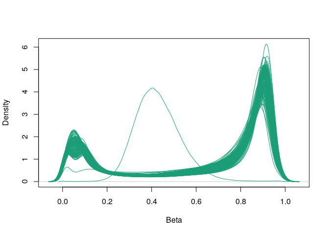
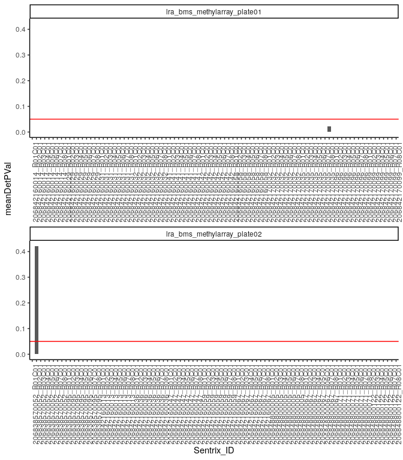
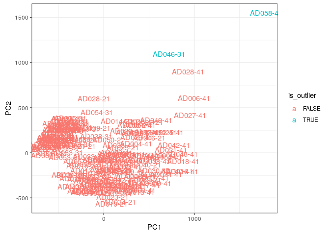

Preprocess DNA methylation
================
Kevin Thomas
6/20/2023

- [Preprocessing cell type-specific DNA methylation array
  data](#preprocessing-cell-type-specific-dna-methylation-array-data)
  - [Setup](#setup)
  - [Raw data import](#raw-data-import)
  - [Quality control](#quality-control)
    - [Beta value distribution](#beta-value-distribution)
  - [Remove sample and re-import
    data](#remove-sample-and-re-import-data)
  - [Normalization](#normalization)
    - [Probe filtering](#probe-filtering)
    - [Data exploration and outlier
      removal](#data-exploration-and-outlier-removal)
  - [Final data assembly](#final-data-assembly)
  - [Save data](#save-data)

# Preprocessing cell type-specific DNA methylation array data

## Setup

``` r
BiocManager::install(
  c("minfi", "IlluminaHumanMethylationEPICmanifest", "IlluminaHumanMethylationEPICanno.ilm10b4.hg19"),
  update = FALSE
)
```

    ## 'getOption("repos")' replaces Bioconductor standard repositories, see
    ## 'help("repositories", package = "BiocManager")' for details.
    ## Replacement repositories:
    ##     CRAN: https://p3m.dev/cran/__linux__/jammy/latest

    ## Bioconductor version 3.19 (BiocManager 1.30.23), R 4.4.1 (2024-06-14)

    ## Warning: package(s) not installed when version(s) same as or greater than current; use
    ##   `force = TRUE` to re-install: 'minfi'

    ## Installing package(s) 'IlluminaHumanMethylationEPICmanifest',
    ##   'IlluminaHumanMethylationEPICanno.ilm10b4.hg19'

``` r
BiocManager::install("preprocessCore", configure.args = c(preprocessCore = "--disable-threading"), force= TRUE, update=FALSE, type = "source")
```

    ## 'getOption("repos")' replaces Bioconductor standard repositories, see
    ## 'help("repositories", package = "BiocManager")' for details.
    ## Replacement repositories:
    ##     CRAN: https://p3m.dev/cran/__linux__/jammy/latest
    ## Bioconductor version 3.19 (BiocManager 1.30.23), R 4.4.1 (2024-06-14)

    ## Installing package(s) 'preprocessCore'

``` r
library(minfi)
```

    ## Loading required package: BiocGenerics

    ## 
    ## Attaching package: 'BiocGenerics'

    ## The following objects are masked from 'package:stats':
    ## 
    ##     IQR, mad, sd, var, xtabs

    ## The following objects are masked from 'package:base':
    ## 
    ##     anyDuplicated, aperm, append, as.data.frame, basename, cbind,
    ##     colnames, dirname, do.call, duplicated, eval, evalq, Filter, Find,
    ##     get, grep, grepl, intersect, is.unsorted, lapply, Map, mapply,
    ##     match, mget, order, paste, pmax, pmax.int, pmin, pmin.int,
    ##     Position, rank, rbind, Reduce, rownames, sapply, setdiff, table,
    ##     tapply, union, unique, unsplit, which.max, which.min

    ## Loading required package: GenomicRanges

    ## Loading required package: stats4

    ## Loading required package: S4Vectors

    ## 
    ## Attaching package: 'S4Vectors'

    ## The following object is masked from 'package:utils':
    ## 
    ##     findMatches

    ## The following objects are masked from 'package:base':
    ## 
    ##     expand.grid, I, unname

    ## Loading required package: IRanges

    ## Loading required package: GenomeInfoDb

    ## Loading required package: SummarizedExperiment

    ## Loading required package: MatrixGenerics

    ## Loading required package: matrixStats

    ## 
    ## Attaching package: 'MatrixGenerics'

    ## The following objects are masked from 'package:matrixStats':
    ## 
    ##     colAlls, colAnyNAs, colAnys, colAvgsPerRowSet, colCollapse,
    ##     colCounts, colCummaxs, colCummins, colCumprods, colCumsums,
    ##     colDiffs, colIQRDiffs, colIQRs, colLogSumExps, colMadDiffs,
    ##     colMads, colMaxs, colMeans2, colMedians, colMins, colOrderStats,
    ##     colProds, colQuantiles, colRanges, colRanks, colSdDiffs, colSds,
    ##     colSums2, colTabulates, colVarDiffs, colVars, colWeightedMads,
    ##     colWeightedMeans, colWeightedMedians, colWeightedSds,
    ##     colWeightedVars, rowAlls, rowAnyNAs, rowAnys, rowAvgsPerColSet,
    ##     rowCollapse, rowCounts, rowCummaxs, rowCummins, rowCumprods,
    ##     rowCumsums, rowDiffs, rowIQRDiffs, rowIQRs, rowLogSumExps,
    ##     rowMadDiffs, rowMads, rowMaxs, rowMeans2, rowMedians, rowMins,
    ##     rowOrderStats, rowProds, rowQuantiles, rowRanges, rowRanks,
    ##     rowSdDiffs, rowSds, rowSums2, rowTabulates, rowVarDiffs, rowVars,
    ##     rowWeightedMads, rowWeightedMeans, rowWeightedMedians,
    ##     rowWeightedSds, rowWeightedVars

    ## Loading required package: Biobase

    ## Welcome to Bioconductor
    ## 
    ##     Vignettes contain introductory material; view with
    ##     'browseVignettes()'. To cite Bioconductor, see
    ##     'citation("Biobase")', and for packages 'citation("pkgname")'.

    ## 
    ## Attaching package: 'Biobase'

    ## The following object is masked from 'package:MatrixGenerics':
    ## 
    ##     rowMedians

    ## The following objects are masked from 'package:matrixStats':
    ## 
    ##     anyMissing, rowMedians

    ## Loading required package: Biostrings

    ## Loading required package: XVector

    ## 
    ## Attaching package: 'Biostrings'

    ## The following object is masked from 'package:base':
    ## 
    ##     strsplit

    ## Loading required package: bumphunter

    ## Loading required package: foreach

    ## Loading required package: iterators

    ## Loading required package: parallel

    ## Loading required package: locfit

    ## locfit 1.5-9.10   2024-06-24

    ## Setting options('download.file.method.GEOquery'='auto')

    ## Setting options('GEOquery.inmemory.gpl'=FALSE)

``` r
library(tidyverse)
```

    ## ── Attaching core tidyverse packages ──────────────────────── tidyverse 2.0.0 ──
    ## ✔ dplyr     1.1.4     ✔ readr     2.1.5
    ## ✔ forcats   1.0.0     ✔ stringr   1.5.1
    ## ✔ ggplot2   3.5.1     ✔ tibble    3.2.1
    ## ✔ lubridate 1.9.3     ✔ tidyr     1.3.1
    ## ✔ purrr     1.0.2

    ## ── Conflicts ────────────────────────────────────────── tidyverse_conflicts() ──
    ## ✖ lubridate::%within%() masks IRanges::%within%()
    ## ✖ purrr::accumulate()   masks foreach::accumulate()
    ## ✖ dplyr::collapse()     masks Biostrings::collapse(), IRanges::collapse()
    ## ✖ dplyr::combine()      masks minfi::combine(), Biobase::combine(), BiocGenerics::combine()
    ## ✖ purrr::compact()      masks XVector::compact()
    ## ✖ dplyr::count()        masks matrixStats::count()
    ## ✖ dplyr::desc()         masks IRanges::desc()
    ## ✖ tidyr::expand()       masks S4Vectors::expand()
    ## ✖ dplyr::filter()       masks stats::filter()
    ## ✖ dplyr::first()        masks S4Vectors::first()
    ## ✖ dplyr::lag()          masks stats::lag()
    ## ✖ purrr::none()         masks locfit::none()
    ## ✖ ggplot2::Position()   masks BiocGenerics::Position(), base::Position()
    ## ✖ purrr::reduce()       masks GenomicRanges::reduce(), IRanges::reduce()
    ## ✖ dplyr::rename()       masks S4Vectors::rename()
    ## ✖ lubridate::second()   masks S4Vectors::second()
    ## ✖ lubridate::second<-() masks S4Vectors::second<-()
    ## ✖ dplyr::slice()        masks XVector::slice(), IRanges::slice()
    ## ✖ purrr::when()         masks foreach::when()
    ## ℹ Use the conflicted package (<http://conflicted.r-lib.org/>) to force all conflicts to become errors

## Raw data import

``` r
# Read sample sheet
data_dir <- "~/workspace/datasets/methylation/lra-bms-methylation"
sheetEpic <- read.metharray.sheet(base=data_dir, pattern="csv$", ignore.case=T, verbose=T, recursive=T)
```

    ## [read.metharray.sheet] Found the following CSV files:

    ## [1] "/home/rstudio/workspace/datasets/methylation/lra-bms-methylation/sample_sheet_full.csv"

``` r
# Fix file names
sheetEpic$Basename <- paste0(data_dir, "/", sheetEpic$Array, "/", sheetEpic$Slide)

# Import raw data
rawData.idat <- read.metharray.exp(targets = sheetEpic, recursive = T, verbose = T, force = T)
```

    ## [read.metharray] Reading 206842160032_R01C01_Grn.idat

    ## [read.metharray] Reading 206842160059_R02C01_Grn.idat

    ## [read.metharray] Reading 206842170096_R01C01_Grn.idat

    ## [read.metharray] Reading 206838570052_R03C01_Grn.idat

    ## [read.metharray] Reading 206842160067_R03C01_Grn.idat

    ## [read.metharray] Reading 206842160058_R01C01_Grn.idat

    ## [read.metharray] Reading 206838570052_R02C01_Grn.idat

    ## [read.metharray] Reading 206848800067_R01C01_Grn.idat

    ## [read.metharray] Reading 206842160013_R02C01_Grn.idat

    ## [read.metharray] Reading 206842160013_R03C01_Grn.idat

    ## [read.metharray] Reading 206842160032_R03C01_Grn.idat

    ## [read.metharray] Reading 206842160036_R02C01_Grn.idat

    ## [read.metharray] Reading 206842160041_R03C01_Grn.idat

    ## [read.metharray] Reading 206842160014_R03C01_Grn.idat

    ## [read.metharray] Reading 206842160067_R02C01_Grn.idat

    ## [read.metharray] Reading 206842170032_R01C01_Grn.idat

    ## [read.metharray] Reading 206842160031_R02C01_Grn.idat

    ## [read.metharray] Reading 206842170096_R03C01_Grn.idat

    ## [read.metharray] Reading 206842160029_R01C01_Grn.idat

    ## [read.metharray] Reading 206842170099_R02C01_Grn.idat

    ## [read.metharray] Reading 206842160041_R02C01_Grn.idat

    ## [read.metharray] Reading 206842160042_R01C01_Grn.idat

    ## [read.metharray] Reading 206848800071_R02C01_Grn.idat

    ## [read.metharray] Reading 206848800122_R02C01_Grn.idat

    ## [read.metharray] Reading 206848800005_R02C01_Grn.idat

    ## [read.metharray] Reading 206842170035_R01C01_Grn.idat

    ## [read.metharray] Reading 206838570095_R02C01_Grn.idat

    ## [read.metharray] Reading 206842160047_R02C01_Grn.idat

    ## [read.metharray] Reading 206842160014_R02C01_Grn.idat

    ## [read.metharray] Reading 206842170096_R06C01_Grn.idat

    ## [read.metharray] Reading 206842160014_R06C01_Grn.idat

    ## [read.metharray] Reading 206842170032_R05C01_Grn.idat

    ## [read.metharray] Reading 206848800071_R04C01_Grn.idat

    ## [read.metharray] Reading 206842170099_R05C01_Grn.idat

    ## [read.metharray] Reading 206838570052_R06C01_Grn.idat

    ## [read.metharray] Reading 206842160032_R06C01_Grn.idat

    ## [read.metharray] Reading 206842160042_R05C01_Grn.idat

    ## [read.metharray] Reading 206842160031_R04C01_Grn.idat

    ## [read.metharray] Reading 206842160047_R04C01_Grn.idat

    ## [read.metharray] Reading 206842160041_R06C01_Grn.idat

    ## [read.metharray] Reading 206842160067_R04C01_Grn.idat

    ## [read.metharray] Reading 206842160041_R05C01_Grn.idat

    ## [read.metharray] Reading 206838570095_R05C01_Grn.idat

    ## [read.metharray] Reading 206842170035_R04C01_Grn.idat

    ## [read.metharray] Reading 206842160059_R05C01_Grn.idat

    ## [read.metharray] Reading 206842160029_R05C01_Grn.idat

    ## [read.metharray] Reading 206838570052_R05C01_Grn.idat

    ## [read.metharray] Reading 206848800122_R04C01_Grn.idat

    ## [read.metharray] Reading 206842160036_R05C01_Grn.idat

    ## [read.metharray] Reading 206848800067_R04C01_Grn.idat

    ## [read.metharray] Reading 206842160013_R06C01_Grn.idat

    ## [read.metharray] Reading 206842160014_R05C01_Grn.idat

    ## [read.metharray] Reading 206842160013_R04C01_Grn.idat

    ## [read.metharray] Reading 206842160067_R06C01_Grn.idat

    ## [read.metharray] Reading 206842160058_R04C01_Grn.idat

    ## [read.metharray] Reading 206838570095_R03C01_Grn.idat

    ## [read.metharray] Reading 206842170096_R05C01_Grn.idat

    ## [read.metharray] Reading 206848800005_R04C01_Grn.idat

    ## [read.metharray] Reading 206842160032_R05C01_Grn.idat

    ## [read.metharray] Reading 206842170096_R07C01_Grn.idat

    ## [read.metharray] Reading 206842160031_R06C01_Grn.idat

    ## [read.metharray] Reading 206848800071_R06C01_Grn.idat

    ## [read.metharray] Reading 206842160014_R07C01_Grn.idat

    ## [read.metharray] Reading 206848800122_R06C01_Grn.idat

    ## [read.metharray] Reading 206842160041_R07C01_Grn.idat

    ## [read.metharray] Reading 206848800067_R07C01_Grn.idat

    ## [read.metharray] Reading 206842160029_R08C01_Grn.idat

    ## [read.metharray] Reading 206842160042_R06C01_Grn.idat

    ## [read.metharray] Reading 206842160032_R07C01_Grn.idat

    ## [read.metharray] Reading 206842170032_R06C01_Grn.idat

    ## [read.metharray] Reading 206848800071_R08C01_Grn.idat

    ## [read.metharray] Reading 206842160013_R08C01_Grn.idat

    ## [read.metharray] Reading 206842160036_R07C01_Grn.idat

    ## [read.metharray] Reading 206842160036_R08C01_Grn.idat

    ## [read.metharray] Reading 206838570095_R08C01_Grn.idat

    ## [read.metharray] Reading 206842160029_R06C01_Grn.idat

    ## [read.metharray] Reading 206842160059_R08C01_Grn.idat

    ## [read.metharray] Reading 206838570052_R08C01_Grn.idat

    ## [read.metharray] Reading 206848800005_R07C01_Grn.idat

    ## [read.metharray] Reading 206842170032_R08C01_Grn.idat

    ## [read.metharray] Reading 206842170099_R07C01_Grn.idat

    ## [read.metharray] Reading 206842160047_R06C01_Grn.idat

    ## [read.metharray] Reading 206842160058_R06C01_Grn.idat

    ## [read.metharray] Reading 206842160067_R08C01_Grn.idat

    ## [read.metharray] Reading 206838570095_R07C01_Grn.idat

    ## [read.metharray] Reading 206842170099_R08C01_Grn.idat

    ## [read.metharray] Reading 206842160042_R08C01_Grn.idat

    ## [read.metharray] Reading 206842160059_R07C01_Grn.idat

    ## [read.metharray] Reading 206842170035_R06C01_Grn.idat

    ## [read.metharray] Reading 206842160058_R02C01_Grn.idat

    ## [read.metharray] Reading 206848800071_R01C01_Grn.idat

    ## [read.metharray] Reading 206842170032_R03C01_Grn.idat

    ## [read.metharray] Reading 206838570052_R01C01_Grn.idat

    ## [read.metharray] Reading 206842160029_R02C01_Grn.idat

    ## [read.metharray] Reading 206842160067_R01C01_Grn.idat

    ## [read.metharray] Reading 206842160041_R01C01_Grn.idat

    ## [read.metharray] Reading 206842160042_R03C01_Grn.idat

    ## [read.metharray] Reading 206842170099_R03C01_Grn.idat

    ## [read.metharray] Reading 206842160042_R02C01_Grn.idat

    ## [read.metharray] Reading 206842160032_R02C01_Grn.idat

    ## [read.metharray] Reading 206842160013_R01C01_Grn.idat

    ## [read.metharray] Reading 206848800071_R03C01_Grn.idat

    ## [read.metharray] Reading 206842160047_R01C01_Grn.idat

    ## [read.metharray] Reading 206842160029_R03C01_Grn.idat

    ## [read.metharray] Reading 206842170099_R01C01_Grn.idat

    ## [read.metharray] Reading 206842160036_R01C01_Grn.idat

    ## [read.metharray] Reading 206848800122_R03C01_Grn.idat

    ## [read.metharray] Reading 206838570095_R01C01_Grn.idat

    ## [read.metharray] Reading 206842170096_R02C01_Grn.idat

    ## [read.metharray] Reading 206842170035_R02C01_Grn.idat

    ## [read.metharray] Reading 206842160059_R03C01_Grn.idat

    ## [read.metharray] Reading 206842160031_R01C01_Grn.idat

    ## [read.metharray] Reading 206842160059_R01C01_Grn.idat

    ## [read.metharray] Reading 206848800005_R01C01_Grn.idat

    ## [read.metharray] Reading 206848800067_R02C01_Grn.idat

    ## [read.metharray] Reading 206842170032_R02C01_Grn.idat

    ## [read.metharray] Reading 206842160014_R01C01_Grn.idat

    ## [read.metharray] Reading 206842160036_R03C01_Grn.idat

    ## [read.metharray] Reading 206842160031_R05C01_Grn.idat

    ## [read.metharray] Reading 206842160059_R04C01_Grn.idat

    ## [read.metharray] Reading 206842160032_R04C01_Grn.idat

    ## [read.metharray] Reading 206842160058_R03C01_Grn.idat

    ## [read.metharray] Reading 206842160047_R05C01_Grn.idat

    ## [read.metharray] Reading 206848800067_R05C01_Grn.idat

    ## [read.metharray] Reading 206838570095_R04C01_Grn.idat

    ## [read.metharray] Reading 206842160029_R04C01_Grn.idat

    ## [read.metharray] Reading 206842170099_R04C01_Grn.idat

    ## [read.metharray] Reading 206842160042_R04C01_Grn.idat

    ## [read.metharray] Reading 206842160031_R03C01_Grn.idat

    ## [read.metharray] Reading 206842170096_R04C01_Grn.idat

    ## [read.metharray] Reading 206848800067_R03C01_Grn.idat

    ## [read.metharray] Reading 206842160067_R05C01_Grn.idat

    ## [read.metharray] Reading 206842170035_R05C01_Grn.idat

    ## [read.metharray] Reading 206842160041_R04C01_Grn.idat

    ## [read.metharray] Reading 206842160013_R05C01_Grn.idat

    ## [read.metharray] Reading 206848800071_R05C01_Grn.idat

    ## [read.metharray] Reading 206842160058_R05C01_Grn.idat

    ## [read.metharray] Reading 206842160036_R04C01_Grn.idat

    ## [read.metharray] Reading 206842170032_R04C01_Grn.idat

    ## [read.metharray] Reading 206838570052_R04C01_Grn.idat

    ## [read.metharray] Reading 206842170035_R03C01_Grn.idat

    ## [read.metharray] Reading 206848800005_R03C01_Grn.idat

    ## [read.metharray] Reading 206842160047_R03C01_Grn.idat

    ## [read.metharray] Reading 206848800005_R05C01_Grn.idat

    ## [read.metharray] Reading 206842160014_R04C01_Grn.idat

    ## [read.metharray] Reading 206848800122_R05C01_Grn.idat

    ## [read.metharray] Reading 206842170032_R07C01_Grn.idat

    ## [read.metharray] Reading 206842170035_R07C01_Grn.idat

    ## [read.metharray] Reading 206848800122_R08C01_Grn.idat

    ## [read.metharray] Reading 206842170096_R08C01_Grn.idat

    ## [read.metharray] Reading 206842160029_R07C01_Grn.idat

    ## [read.metharray] Reading 206838570095_R06C01_Grn.idat

    ## [read.metharray] Reading 206842160014_R08C01_Grn.idat

    ## [read.metharray] Reading 206842160032_R08C01_Grn.idat

    ## [read.metharray] Reading 206842160058_R08C01_Grn.idat

    ## [read.metharray] Reading 206842160031_R08C01_Grn.idat

    ## [read.metharray] Reading 206848800122_R07C01_Grn.idat

    ## [read.metharray] Reading 206848800071_R07C01_Grn.idat

    ## [read.metharray] Reading 206842160067_R07C01_Grn.idat

    ## [read.metharray] Reading 206842160031_R07C01_Grn.idat

    ## [read.metharray] Reading 206842170099_R06C01_Grn.idat

    ## [read.metharray] Reading 206848800067_R06C01_Grn.idat

    ## [read.metharray] Reading 206842160041_R08C01_Grn.idat

    ## [read.metharray] Reading 206842160058_R07C01_Grn.idat

    ## [read.metharray] Reading 206838570052_R07C01_Grn.idat

    ## [read.metharray] Reading 206842160059_R06C01_Grn.idat

    ## [read.metharray] Reading 206842160036_R06C01_Grn.idat

    ## [read.metharray] Reading 206842160042_R07C01_Grn.idat

    ## [read.metharray] Reading 206842160013_R07C01_Grn.idat

    ## [read.metharray] Reading 206842160047_R08C01_Grn.idat

    ## [read.metharray] Reading 206848800005_R06C01_Grn.idat

    ## [read.metharray] Reading 206848800005_R08C01_Grn.idat

    ## [read.metharray] Reading 206842160047_R07C01_Grn.idat

    ## [read.metharray] Reading 206848800067_R08C01_Grn.idat

    ## [read.metharray] Reading 206842170035_R08C01_Grn.idat

    ## [read.metharray] Reading 206842160032_R01C01_Red.idat

    ## [read.metharray] Reading 206842160059_R02C01_Red.idat

    ## [read.metharray] Reading 206842170096_R01C01_Red.idat

    ## [read.metharray] Reading 206838570052_R03C01_Red.idat

    ## [read.metharray] Reading 206842160067_R03C01_Red.idat

    ## [read.metharray] Reading 206842160058_R01C01_Red.idat

    ## [read.metharray] Reading 206838570052_R02C01_Red.idat

    ## [read.metharray] Reading 206848800067_R01C01_Red.idat

    ## [read.metharray] Reading 206842160013_R02C01_Red.idat

    ## [read.metharray] Reading 206842160013_R03C01_Red.idat

    ## [read.metharray] Reading 206842160032_R03C01_Red.idat

    ## [read.metharray] Reading 206842160036_R02C01_Red.idat

    ## [read.metharray] Reading 206842160041_R03C01_Red.idat

    ## [read.metharray] Reading 206842160014_R03C01_Red.idat

    ## [read.metharray] Reading 206842160067_R02C01_Red.idat

    ## [read.metharray] Reading 206842170032_R01C01_Red.idat

    ## [read.metharray] Reading 206842160031_R02C01_Red.idat

    ## [read.metharray] Reading 206842170096_R03C01_Red.idat

    ## [read.metharray] Reading 206842160029_R01C01_Red.idat

    ## [read.metharray] Reading 206842170099_R02C01_Red.idat

    ## [read.metharray] Reading 206842160041_R02C01_Red.idat

    ## [read.metharray] Reading 206842160042_R01C01_Red.idat

    ## [read.metharray] Reading 206848800071_R02C01_Red.idat

    ## [read.metharray] Reading 206848800122_R02C01_Red.idat

    ## [read.metharray] Reading 206848800005_R02C01_Red.idat

    ## [read.metharray] Reading 206842170035_R01C01_Red.idat

    ## [read.metharray] Reading 206838570095_R02C01_Red.idat

    ## [read.metharray] Reading 206842160047_R02C01_Red.idat

    ## [read.metharray] Reading 206842160014_R02C01_Red.idat

    ## [read.metharray] Reading 206842170096_R06C01_Red.idat

    ## [read.metharray] Reading 206842160014_R06C01_Red.idat

    ## [read.metharray] Reading 206842170032_R05C01_Red.idat

    ## [read.metharray] Reading 206848800071_R04C01_Red.idat

    ## [read.metharray] Reading 206842170099_R05C01_Red.idat

    ## [read.metharray] Reading 206838570052_R06C01_Red.idat

    ## [read.metharray] Reading 206842160032_R06C01_Red.idat

    ## [read.metharray] Reading 206842160042_R05C01_Red.idat

    ## [read.metharray] Reading 206842160031_R04C01_Red.idat

    ## [read.metharray] Reading 206842160047_R04C01_Red.idat

    ## [read.metharray] Reading 206842160041_R06C01_Red.idat

    ## [read.metharray] Reading 206842160067_R04C01_Red.idat

    ## [read.metharray] Reading 206842160041_R05C01_Red.idat

    ## [read.metharray] Reading 206838570095_R05C01_Red.idat

    ## [read.metharray] Reading 206842170035_R04C01_Red.idat

    ## [read.metharray] Reading 206842160059_R05C01_Red.idat

    ## [read.metharray] Reading 206842160029_R05C01_Red.idat

    ## [read.metharray] Reading 206838570052_R05C01_Red.idat

    ## [read.metharray] Reading 206848800122_R04C01_Red.idat

    ## [read.metharray] Reading 206842160036_R05C01_Red.idat

    ## [read.metharray] Reading 206848800067_R04C01_Red.idat

    ## [read.metharray] Reading 206842160013_R06C01_Red.idat

    ## [read.metharray] Reading 206842160014_R05C01_Red.idat

    ## [read.metharray] Reading 206842160013_R04C01_Red.idat

    ## [read.metharray] Reading 206842160067_R06C01_Red.idat

    ## [read.metharray] Reading 206842160058_R04C01_Red.idat

    ## [read.metharray] Reading 206838570095_R03C01_Red.idat

    ## [read.metharray] Reading 206842170096_R05C01_Red.idat

    ## [read.metharray] Reading 206848800005_R04C01_Red.idat

    ## [read.metharray] Reading 206842160032_R05C01_Red.idat

    ## [read.metharray] Reading 206842170096_R07C01_Red.idat

    ## [read.metharray] Reading 206842160031_R06C01_Red.idat

    ## [read.metharray] Reading 206848800071_R06C01_Red.idat

    ## [read.metharray] Reading 206842160014_R07C01_Red.idat

    ## [read.metharray] Reading 206848800122_R06C01_Red.idat

    ## [read.metharray] Reading 206842160041_R07C01_Red.idat

    ## [read.metharray] Reading 206848800067_R07C01_Red.idat

    ## [read.metharray] Reading 206842160029_R08C01_Red.idat

    ## [read.metharray] Reading 206842160042_R06C01_Red.idat

    ## [read.metharray] Reading 206842160032_R07C01_Red.idat

    ## [read.metharray] Reading 206842170032_R06C01_Red.idat

    ## [read.metharray] Reading 206848800071_R08C01_Red.idat

    ## [read.metharray] Reading 206842160013_R08C01_Red.idat

    ## [read.metharray] Reading 206842160036_R07C01_Red.idat

    ## [read.metharray] Reading 206842160036_R08C01_Red.idat

    ## [read.metharray] Reading 206838570095_R08C01_Red.idat

    ## [read.metharray] Reading 206842160029_R06C01_Red.idat

    ## [read.metharray] Reading 206842160059_R08C01_Red.idat

    ## [read.metharray] Reading 206838570052_R08C01_Red.idat

    ## [read.metharray] Reading 206848800005_R07C01_Red.idat

    ## [read.metharray] Reading 206842170032_R08C01_Red.idat

    ## [read.metharray] Reading 206842170099_R07C01_Red.idat

    ## [read.metharray] Reading 206842160047_R06C01_Red.idat

    ## [read.metharray] Reading 206842160058_R06C01_Red.idat

    ## [read.metharray] Reading 206842160067_R08C01_Red.idat

    ## [read.metharray] Reading 206838570095_R07C01_Red.idat

    ## [read.metharray] Reading 206842170099_R08C01_Red.idat

    ## [read.metharray] Reading 206842160042_R08C01_Red.idat

    ## [read.metharray] Reading 206842160059_R07C01_Red.idat

    ## [read.metharray] Reading 206842170035_R06C01_Red.idat

    ## [read.metharray] Reading 206842160058_R02C01_Red.idat

    ## [read.metharray] Reading 206848800071_R01C01_Red.idat

    ## [read.metharray] Reading 206842170032_R03C01_Red.idat

    ## [read.metharray] Reading 206838570052_R01C01_Red.idat

    ## [read.metharray] Reading 206842160029_R02C01_Red.idat

    ## [read.metharray] Reading 206842160067_R01C01_Red.idat

    ## [read.metharray] Reading 206842160041_R01C01_Red.idat

    ## [read.metharray] Reading 206842160042_R03C01_Red.idat

    ## [read.metharray] Reading 206842170099_R03C01_Red.idat

    ## [read.metharray] Reading 206842160042_R02C01_Red.idat

    ## [read.metharray] Reading 206842160032_R02C01_Red.idat

    ## [read.metharray] Reading 206842160013_R01C01_Red.idat

    ## [read.metharray] Reading 206848800071_R03C01_Red.idat

    ## [read.metharray] Reading 206842160047_R01C01_Red.idat

    ## [read.metharray] Reading 206842160029_R03C01_Red.idat

    ## [read.metharray] Reading 206842170099_R01C01_Red.idat

    ## [read.metharray] Reading 206842160036_R01C01_Red.idat

    ## [read.metharray] Reading 206848800122_R03C01_Red.idat

    ## [read.metharray] Reading 206838570095_R01C01_Red.idat

    ## [read.metharray] Reading 206842170096_R02C01_Red.idat

    ## [read.metharray] Reading 206842170035_R02C01_Red.idat

    ## [read.metharray] Reading 206842160059_R03C01_Red.idat

    ## [read.metharray] Reading 206842160031_R01C01_Red.idat

    ## [read.metharray] Reading 206842160059_R01C01_Red.idat

    ## [read.metharray] Reading 206848800005_R01C01_Red.idat

    ## [read.metharray] Reading 206848800067_R02C01_Red.idat

    ## [read.metharray] Reading 206842170032_R02C01_Red.idat

    ## [read.metharray] Reading 206842160014_R01C01_Red.idat

    ## [read.metharray] Reading 206842160036_R03C01_Red.idat

    ## [read.metharray] Reading 206842160031_R05C01_Red.idat

    ## [read.metharray] Reading 206842160059_R04C01_Red.idat

    ## [read.metharray] Reading 206842160032_R04C01_Red.idat

    ## [read.metharray] Reading 206842160058_R03C01_Red.idat

    ## [read.metharray] Reading 206842160047_R05C01_Red.idat

    ## [read.metharray] Reading 206848800067_R05C01_Red.idat

    ## [read.metharray] Reading 206838570095_R04C01_Red.idat

    ## [read.metharray] Reading 206842160029_R04C01_Red.idat

    ## [read.metharray] Reading 206842170099_R04C01_Red.idat

    ## [read.metharray] Reading 206842160042_R04C01_Red.idat

    ## [read.metharray] Reading 206842160031_R03C01_Red.idat

    ## [read.metharray] Reading 206842170096_R04C01_Red.idat

    ## [read.metharray] Reading 206848800067_R03C01_Red.idat

    ## [read.metharray] Reading 206842160067_R05C01_Red.idat

    ## [read.metharray] Reading 206842170035_R05C01_Red.idat

    ## [read.metharray] Reading 206842160041_R04C01_Red.idat

    ## [read.metharray] Reading 206842160013_R05C01_Red.idat

    ## [read.metharray] Reading 206848800071_R05C01_Red.idat

    ## [read.metharray] Reading 206842160058_R05C01_Red.idat

    ## [read.metharray] Reading 206842160036_R04C01_Red.idat

    ## [read.metharray] Reading 206842170032_R04C01_Red.idat

    ## [read.metharray] Reading 206838570052_R04C01_Red.idat

    ## [read.metharray] Reading 206842170035_R03C01_Red.idat

    ## [read.metharray] Reading 206848800005_R03C01_Red.idat

    ## [read.metharray] Reading 206842160047_R03C01_Red.idat

    ## [read.metharray] Reading 206848800005_R05C01_Red.idat

    ## [read.metharray] Reading 206842160014_R04C01_Red.idat

    ## [read.metharray] Reading 206848800122_R05C01_Red.idat

    ## [read.metharray] Reading 206842170032_R07C01_Red.idat

    ## [read.metharray] Reading 206842170035_R07C01_Red.idat

    ## [read.metharray] Reading 206848800122_R08C01_Red.idat

    ## [read.metharray] Reading 206842170096_R08C01_Red.idat

    ## [read.metharray] Reading 206842160029_R07C01_Red.idat

    ## [read.metharray] Reading 206838570095_R06C01_Red.idat

    ## [read.metharray] Reading 206842160014_R08C01_Red.idat

    ## [read.metharray] Reading 206842160032_R08C01_Red.idat

    ## [read.metharray] Reading 206842160058_R08C01_Red.idat

    ## [read.metharray] Reading 206842160031_R08C01_Red.idat

    ## [read.metharray] Reading 206848800122_R07C01_Red.idat

    ## [read.metharray] Reading 206848800071_R07C01_Red.idat

    ## [read.metharray] Reading 206842160067_R07C01_Red.idat

    ## [read.metharray] Reading 206842160031_R07C01_Red.idat

    ## [read.metharray] Reading 206842170099_R06C01_Red.idat

    ## [read.metharray] Reading 206848800067_R06C01_Red.idat

    ## [read.metharray] Reading 206842160041_R08C01_Red.idat

    ## [read.metharray] Reading 206842160058_R07C01_Red.idat

    ## [read.metharray] Reading 206838570052_R07C01_Red.idat

    ## [read.metharray] Reading 206842160059_R06C01_Red.idat

    ## [read.metharray] Reading 206842160036_R06C01_Red.idat

    ## [read.metharray] Reading 206842160042_R07C01_Red.idat

    ## [read.metharray] Reading 206842160013_R07C01_Red.idat

    ## [read.metharray] Reading 206842160047_R08C01_Red.idat

    ## [read.metharray] Reading 206848800005_R06C01_Red.idat

    ## [read.metharray] Reading 206848800005_R08C01_Red.idat

    ## [read.metharray] Reading 206842160047_R07C01_Red.idat

    ## [read.metharray] Reading 206848800067_R08C01_Red.idat

    ## [read.metharray] Reading 206842170035_R08C01_Red.idat

    ## [read.metharray] Read idat files in 50.2 seconds

    ## [read.metharray] Creating data matrices ... done in 233.8 seconds
    ## [read.metharray] Instantiating final object ... done in 0.0 seconds

## Quality control

### Beta value distribution

``` r
densityPlot(dat = rawData.idat)
```

    ## Loading required package: IlluminaHumanMethylationEPICmanifest

<!-- --> \###
Filter samples by average detection p value

``` r
detP <- detectionP(rawData.idat)
meanDetectionPValue <- colMeans(detP)
enframe(meanDetectionPValue, name = "Sentrix_ID", value = "meanDetPVal") %>%
  left_join(sheetEpic, by = c("Sentrix_ID"="Slide")) %>%
  ggplot(aes(x = Sentrix_ID, y = meanDetPVal)) +
  geom_col() +
  geom_hline(yintercept = 0.05, col = "red") +
  facet_wrap(~Plate, ncol = 1, scales = "free_x") +
  theme_classic() +
  theme(axis.text.x = element_text(angle = 90))
```

<!-- -->

``` r
rm(detP)
gc(verbose = FALSE) # memory management
```

    ##             used   (Mb) gc trigger   (Mb)   max used   (Mb)
    ## Ncells  12871739  687.5   20250804 1081.6   15268641  815.5
    ## Vcells 221625901 1690.9  966408119 7373.2 1207998513 9216.3

Sample with Sentrix_ID 206838570052_R02C01 should be removed.

## Remove sample and re-import data

``` r
# Edit sample sheet
sheetEpic_filt <- sheetEpic %>%
  filter(Slide != "206838570052_R02C01")

# Import filtered samples only data
rawData.filt.idat <- read.metharray.exp(targets = sheetEpic_filt, recursive = T, verbose = F, force = F) 
```

## Normalization

``` r
normalized.idat <- preprocessFunnorm(rawData.filt.idat, bgCorr=T, dyeCorr=T, verbose=T)
```

    ## [preprocessFunnorm] Background and dye bias correction with noob

    ## Loading required package: IlluminaHumanMethylationEPICanno.ilm10b4.hg19

    ## [preprocessFunnorm] Mapping to genome

    ## [preprocessFunnorm] Quantile extraction

    ## Warning in .getSex(CN = CN, xIndex = xIndex, yIndex = yIndex, cutoff = cutoff):
    ## An inconsistency was encountered while determining sex. One possibility is that
    ## only one sex is present. We recommend further checks, for example with the
    ## plotSex function.

    ## [preprocessFunnorm] Normalization

``` r
gc(verbose = FALSE) # For memory management
```

    ##             used   (Mb) gc trigger    (Mb)   max used    (Mb)
    ## Ncells  17075267  912.0   33570471  1792.9   33570471  1792.9
    ## Vcells 796843643 6079.5 2220777576 16943.2 2768344936 21120.8

### Probe filtering

``` r
detP <- detectionP(rawData.filt.idat)
detP <- detP[match(featureNames(normalized.idat), rownames(detP)),]
keepP <- rowSums(detP < 0.05) == ncol(normalized.idat)
normalized.idat <- normalized.idat[keepP,]
```

Removing all CpG probes with a p-value of detection less than 0.05 in
all samples.

### Data exploration and outlier removal

``` r
# Get M values
methyl_m <- getM(normalized.idat)
gc(verbose = FALSE) # For memory management
```

    ##              used   (Mb) gc trigger    (Mb)   max used    (Mb)
    ## Ncells   17075946  912.0   33570471  1792.9   33570471  1792.9
    ## Vcells 1071583373 8175.6 2220777576 16943.2 2768344936 21120.8

``` r
# Perform PCA
pca <- prcomp(
  x = t(methyl_m),
  center = TRUE,
  scale. = TRUE
)

# Identify outliers
outliers <- pca$x[,1:2] |>
  bind_cols(sheetEpic_filt) |>
  group_by(group1) |>
  filter(
    abs(PC1 - mean(PC1)) > 3*sd(PC1),
    abs(PC2 - mean(PC2)) > 3*sd(PC2)
  ) |>
  pull(Sample)

# Visualize on PCA plot
pca$x[,1:2] |>
  bind_cols(sheetEpic_filt) |>
  mutate(is_outlier = Sample %in% outliers) |>
  ggplot(aes(x = PC1, y = PC2, col = is_outlier)) +
  geom_text(aes(label = Sample)) +
  coord_fixed() +
  theme_bw()
```

<!-- --> Samples
AD058-41 and AD046-31 should be removed as outliers as well.

## Final data assembly

``` r
# Final sample selection
sheetEpic_filt <- sheetEpic %>%
  filter(Slide != "206838570052_R02C01", !Sample %in% outliers)

# Import
rawData.filt.idat <- read.metharray.exp(targets = sheetEpic_filt, recursive = T, verbose = T, force = T)
```

    ## [read.metharray] Reading 206842160032_R01C01_Grn.idat

    ## [read.metharray] Reading 206842160059_R02C01_Grn.idat

    ## [read.metharray] Reading 206842170096_R01C01_Grn.idat

    ## [read.metharray] Reading 206838570052_R03C01_Grn.idat

    ## [read.metharray] Reading 206842160067_R03C01_Grn.idat

    ## [read.metharray] Reading 206842160058_R01C01_Grn.idat

    ## [read.metharray] Reading 206848800067_R01C01_Grn.idat

    ## [read.metharray] Reading 206842160013_R02C01_Grn.idat

    ## [read.metharray] Reading 206842160013_R03C01_Grn.idat

    ## [read.metharray] Reading 206842160032_R03C01_Grn.idat

    ## [read.metharray] Reading 206842160036_R02C01_Grn.idat

    ## [read.metharray] Reading 206842160041_R03C01_Grn.idat

    ## [read.metharray] Reading 206842160014_R03C01_Grn.idat

    ## [read.metharray] Reading 206842160067_R02C01_Grn.idat

    ## [read.metharray] Reading 206842170032_R01C01_Grn.idat

    ## [read.metharray] Reading 206842160031_R02C01_Grn.idat

    ## [read.metharray] Reading 206842170096_R03C01_Grn.idat

    ## [read.metharray] Reading 206842160029_R01C01_Grn.idat

    ## [read.metharray] Reading 206842170099_R02C01_Grn.idat

    ## [read.metharray] Reading 206842160041_R02C01_Grn.idat

    ## [read.metharray] Reading 206842160042_R01C01_Grn.idat

    ## [read.metharray] Reading 206848800071_R02C01_Grn.idat

    ## [read.metharray] Reading 206848800122_R02C01_Grn.idat

    ## [read.metharray] Reading 206848800005_R02C01_Grn.idat

    ## [read.metharray] Reading 206842170035_R01C01_Grn.idat

    ## [read.metharray] Reading 206838570095_R02C01_Grn.idat

    ## [read.metharray] Reading 206842160047_R02C01_Grn.idat

    ## [read.metharray] Reading 206842160014_R02C01_Grn.idat

    ## [read.metharray] Reading 206842170096_R06C01_Grn.idat

    ## [read.metharray] Reading 206842160014_R06C01_Grn.idat

    ## [read.metharray] Reading 206842170032_R05C01_Grn.idat

    ## [read.metharray] Reading 206848800071_R04C01_Grn.idat

    ## [read.metharray] Reading 206842170099_R05C01_Grn.idat

    ## [read.metharray] Reading 206838570052_R06C01_Grn.idat

    ## [read.metharray] Reading 206842160032_R06C01_Grn.idat

    ## [read.metharray] Reading 206842160042_R05C01_Grn.idat

    ## [read.metharray] Reading 206842160031_R04C01_Grn.idat

    ## [read.metharray] Reading 206842160047_R04C01_Grn.idat

    ## [read.metharray] Reading 206842160041_R06C01_Grn.idat

    ## [read.metharray] Reading 206842160067_R04C01_Grn.idat

    ## [read.metharray] Reading 206842160041_R05C01_Grn.idat

    ## [read.metharray] Reading 206838570095_R05C01_Grn.idat

    ## [read.metharray] Reading 206842170035_R04C01_Grn.idat

    ## [read.metharray] Reading 206842160059_R05C01_Grn.idat

    ## [read.metharray] Reading 206842160029_R05C01_Grn.idat

    ## [read.metharray] Reading 206838570052_R05C01_Grn.idat

    ## [read.metharray] Reading 206848800122_R04C01_Grn.idat

    ## [read.metharray] Reading 206842160036_R05C01_Grn.idat

    ## [read.metharray] Reading 206848800067_R04C01_Grn.idat

    ## [read.metharray] Reading 206842160013_R06C01_Grn.idat

    ## [read.metharray] Reading 206842160014_R05C01_Grn.idat

    ## [read.metharray] Reading 206842160013_R04C01_Grn.idat

    ## [read.metharray] Reading 206842160067_R06C01_Grn.idat

    ## [read.metharray] Reading 206842160058_R04C01_Grn.idat

    ## [read.metharray] Reading 206838570095_R03C01_Grn.idat

    ## [read.metharray] Reading 206842170096_R05C01_Grn.idat

    ## [read.metharray] Reading 206848800005_R04C01_Grn.idat

    ## [read.metharray] Reading 206842160032_R05C01_Grn.idat

    ## [read.metharray] Reading 206842170096_R07C01_Grn.idat

    ## [read.metharray] Reading 206842160031_R06C01_Grn.idat

    ## [read.metharray] Reading 206848800071_R06C01_Grn.idat

    ## [read.metharray] Reading 206842160014_R07C01_Grn.idat

    ## [read.metharray] Reading 206848800122_R06C01_Grn.idat

    ## [read.metharray] Reading 206842160041_R07C01_Grn.idat

    ## [read.metharray] Reading 206848800067_R07C01_Grn.idat

    ## [read.metharray] Reading 206842160029_R08C01_Grn.idat

    ## [read.metharray] Reading 206842160042_R06C01_Grn.idat

    ## [read.metharray] Reading 206842160032_R07C01_Grn.idat

    ## [read.metharray] Reading 206842170032_R06C01_Grn.idat

    ## [read.metharray] Reading 206848800071_R08C01_Grn.idat

    ## [read.metharray] Reading 206842160013_R08C01_Grn.idat

    ## [read.metharray] Reading 206842160036_R07C01_Grn.idat

    ## [read.metharray] Reading 206842160036_R08C01_Grn.idat

    ## [read.metharray] Reading 206838570095_R08C01_Grn.idat

    ## [read.metharray] Reading 206842160029_R06C01_Grn.idat

    ## [read.metharray] Reading 206842160059_R08C01_Grn.idat

    ## [read.metharray] Reading 206838570052_R08C01_Grn.idat

    ## [read.metharray] Reading 206848800005_R07C01_Grn.idat

    ## [read.metharray] Reading 206842170032_R08C01_Grn.idat

    ## [read.metharray] Reading 206842170099_R07C01_Grn.idat

    ## [read.metharray] Reading 206842160047_R06C01_Grn.idat

    ## [read.metharray] Reading 206842160058_R06C01_Grn.idat

    ## [read.metharray] Reading 206842160067_R08C01_Grn.idat

    ## [read.metharray] Reading 206838570095_R07C01_Grn.idat

    ## [read.metharray] Reading 206842170099_R08C01_Grn.idat

    ## [read.metharray] Reading 206842160042_R08C01_Grn.idat

    ## [read.metharray] Reading 206842160059_R07C01_Grn.idat

    ## [read.metharray] Reading 206842170035_R06C01_Grn.idat

    ## [read.metharray] Reading 206842160058_R02C01_Grn.idat

    ## [read.metharray] Reading 206848800071_R01C01_Grn.idat

    ## [read.metharray] Reading 206842170032_R03C01_Grn.idat

    ## [read.metharray] Reading 206838570052_R01C01_Grn.idat

    ## [read.metharray] Reading 206842160029_R02C01_Grn.idat

    ## [read.metharray] Reading 206842160067_R01C01_Grn.idat

    ## [read.metharray] Reading 206842160041_R01C01_Grn.idat

    ## [read.metharray] Reading 206842160042_R03C01_Grn.idat

    ## [read.metharray] Reading 206842170099_R03C01_Grn.idat

    ## [read.metharray] Reading 206842160042_R02C01_Grn.idat

    ## [read.metharray] Reading 206842160032_R02C01_Grn.idat

    ## [read.metharray] Reading 206842160013_R01C01_Grn.idat

    ## [read.metharray] Reading 206848800071_R03C01_Grn.idat

    ## [read.metharray] Reading 206842160047_R01C01_Grn.idat

    ## [read.metharray] Reading 206842160029_R03C01_Grn.idat

    ## [read.metharray] Reading 206842170099_R01C01_Grn.idat

    ## [read.metharray] Reading 206842160036_R01C01_Grn.idat

    ## [read.metharray] Reading 206848800122_R03C01_Grn.idat

    ## [read.metharray] Reading 206838570095_R01C01_Grn.idat

    ## [read.metharray] Reading 206842170096_R02C01_Grn.idat

    ## [read.metharray] Reading 206842170035_R02C01_Grn.idat

    ## [read.metharray] Reading 206842160059_R03C01_Grn.idat

    ## [read.metharray] Reading 206842160031_R01C01_Grn.idat

    ## [read.metharray] Reading 206842160059_R01C01_Grn.idat

    ## [read.metharray] Reading 206848800005_R01C01_Grn.idat

    ## [read.metharray] Reading 206848800067_R02C01_Grn.idat

    ## [read.metharray] Reading 206842170032_R02C01_Grn.idat

    ## [read.metharray] Reading 206842160014_R01C01_Grn.idat

    ## [read.metharray] Reading 206842160036_R03C01_Grn.idat

    ## [read.metharray] Reading 206842160031_R05C01_Grn.idat

    ## [read.metharray] Reading 206842160059_R04C01_Grn.idat

    ## [read.metharray] Reading 206842160032_R04C01_Grn.idat

    ## [read.metharray] Reading 206842160058_R03C01_Grn.idat

    ## [read.metharray] Reading 206842160047_R05C01_Grn.idat

    ## [read.metharray] Reading 206848800067_R05C01_Grn.idat

    ## [read.metharray] Reading 206838570095_R04C01_Grn.idat

    ## [read.metharray] Reading 206842160029_R04C01_Grn.idat

    ## [read.metharray] Reading 206842170099_R04C01_Grn.idat

    ## [read.metharray] Reading 206842160042_R04C01_Grn.idat

    ## [read.metharray] Reading 206842160031_R03C01_Grn.idat

    ## [read.metharray] Reading 206842170096_R04C01_Grn.idat

    ## [read.metharray] Reading 206848800067_R03C01_Grn.idat

    ## [read.metharray] Reading 206842160067_R05C01_Grn.idat

    ## [read.metharray] Reading 206842170035_R05C01_Grn.idat

    ## [read.metharray] Reading 206842160041_R04C01_Grn.idat

    ## [read.metharray] Reading 206842160013_R05C01_Grn.idat

    ## [read.metharray] Reading 206848800071_R05C01_Grn.idat

    ## [read.metharray] Reading 206842160058_R05C01_Grn.idat

    ## [read.metharray] Reading 206842160036_R04C01_Grn.idat

    ## [read.metharray] Reading 206838570052_R04C01_Grn.idat

    ## [read.metharray] Reading 206842170035_R03C01_Grn.idat

    ## [read.metharray] Reading 206848800005_R03C01_Grn.idat

    ## [read.metharray] Reading 206842160047_R03C01_Grn.idat

    ## [read.metharray] Reading 206848800005_R05C01_Grn.idat

    ## [read.metharray] Reading 206842160014_R04C01_Grn.idat

    ## [read.metharray] Reading 206848800122_R05C01_Grn.idat

    ## [read.metharray] Reading 206842170032_R07C01_Grn.idat

    ## [read.metharray] Reading 206842170035_R07C01_Grn.idat

    ## [read.metharray] Reading 206848800122_R08C01_Grn.idat

    ## [read.metharray] Reading 206842170096_R08C01_Grn.idat

    ## [read.metharray] Reading 206842160029_R07C01_Grn.idat

    ## [read.metharray] Reading 206838570095_R06C01_Grn.idat

    ## [read.metharray] Reading 206842160014_R08C01_Grn.idat

    ## [read.metharray] Reading 206842160032_R08C01_Grn.idat

    ## [read.metharray] Reading 206842160058_R08C01_Grn.idat

    ## [read.metharray] Reading 206842160031_R08C01_Grn.idat

    ## [read.metharray] Reading 206848800122_R07C01_Grn.idat

    ## [read.metharray] Reading 206848800071_R07C01_Grn.idat

    ## [read.metharray] Reading 206842160067_R07C01_Grn.idat

    ## [read.metharray] Reading 206842160031_R07C01_Grn.idat

    ## [read.metharray] Reading 206842170099_R06C01_Grn.idat

    ## [read.metharray] Reading 206848800067_R06C01_Grn.idat

    ## [read.metharray] Reading 206842160041_R08C01_Grn.idat

    ## [read.metharray] Reading 206842160058_R07C01_Grn.idat

    ## [read.metharray] Reading 206838570052_R07C01_Grn.idat

    ## [read.metharray] Reading 206842160059_R06C01_Grn.idat

    ## [read.metharray] Reading 206842160036_R06C01_Grn.idat

    ## [read.metharray] Reading 206842160042_R07C01_Grn.idat

    ## [read.metharray] Reading 206842160013_R07C01_Grn.idat

    ## [read.metharray] Reading 206842160047_R08C01_Grn.idat

    ## [read.metharray] Reading 206848800005_R06C01_Grn.idat

    ## [read.metharray] Reading 206848800005_R08C01_Grn.idat

    ## [read.metharray] Reading 206842160047_R07C01_Grn.idat

    ## [read.metharray] Reading 206848800067_R08C01_Grn.idat

    ## [read.metharray] Reading 206842160032_R01C01_Red.idat

    ## [read.metharray] Reading 206842160059_R02C01_Red.idat

    ## [read.metharray] Reading 206842170096_R01C01_Red.idat

    ## [read.metharray] Reading 206838570052_R03C01_Red.idat

    ## [read.metharray] Reading 206842160067_R03C01_Red.idat

    ## [read.metharray] Reading 206842160058_R01C01_Red.idat

    ## [read.metharray] Reading 206848800067_R01C01_Red.idat

    ## [read.metharray] Reading 206842160013_R02C01_Red.idat

    ## [read.metharray] Reading 206842160013_R03C01_Red.idat

    ## [read.metharray] Reading 206842160032_R03C01_Red.idat

    ## [read.metharray] Reading 206842160036_R02C01_Red.idat

    ## [read.metharray] Reading 206842160041_R03C01_Red.idat

    ## [read.metharray] Reading 206842160014_R03C01_Red.idat

    ## [read.metharray] Reading 206842160067_R02C01_Red.idat

    ## [read.metharray] Reading 206842170032_R01C01_Red.idat

    ## [read.metharray] Reading 206842160031_R02C01_Red.idat

    ## [read.metharray] Reading 206842170096_R03C01_Red.idat

    ## [read.metharray] Reading 206842160029_R01C01_Red.idat

    ## [read.metharray] Reading 206842170099_R02C01_Red.idat

    ## [read.metharray] Reading 206842160041_R02C01_Red.idat

    ## [read.metharray] Reading 206842160042_R01C01_Red.idat

    ## [read.metharray] Reading 206848800071_R02C01_Red.idat

    ## [read.metharray] Reading 206848800122_R02C01_Red.idat

    ## [read.metharray] Reading 206848800005_R02C01_Red.idat

    ## [read.metharray] Reading 206842170035_R01C01_Red.idat

    ## [read.metharray] Reading 206838570095_R02C01_Red.idat

    ## [read.metharray] Reading 206842160047_R02C01_Red.idat

    ## [read.metharray] Reading 206842160014_R02C01_Red.idat

    ## [read.metharray] Reading 206842170096_R06C01_Red.idat

    ## [read.metharray] Reading 206842160014_R06C01_Red.idat

    ## [read.metharray] Reading 206842170032_R05C01_Red.idat

    ## [read.metharray] Reading 206848800071_R04C01_Red.idat

    ## [read.metharray] Reading 206842170099_R05C01_Red.idat

    ## [read.metharray] Reading 206838570052_R06C01_Red.idat

    ## [read.metharray] Reading 206842160032_R06C01_Red.idat

    ## [read.metharray] Reading 206842160042_R05C01_Red.idat

    ## [read.metharray] Reading 206842160031_R04C01_Red.idat

    ## [read.metharray] Reading 206842160047_R04C01_Red.idat

    ## [read.metharray] Reading 206842160041_R06C01_Red.idat

    ## [read.metharray] Reading 206842160067_R04C01_Red.idat

    ## [read.metharray] Reading 206842160041_R05C01_Red.idat

    ## [read.metharray] Reading 206838570095_R05C01_Red.idat

    ## [read.metharray] Reading 206842170035_R04C01_Red.idat

    ## [read.metharray] Reading 206842160059_R05C01_Red.idat

    ## [read.metharray] Reading 206842160029_R05C01_Red.idat

    ## [read.metharray] Reading 206838570052_R05C01_Red.idat

    ## [read.metharray] Reading 206848800122_R04C01_Red.idat

    ## [read.metharray] Reading 206842160036_R05C01_Red.idat

    ## [read.metharray] Reading 206848800067_R04C01_Red.idat

    ## [read.metharray] Reading 206842160013_R06C01_Red.idat

    ## [read.metharray] Reading 206842160014_R05C01_Red.idat

    ## [read.metharray] Reading 206842160013_R04C01_Red.idat

    ## [read.metharray] Reading 206842160067_R06C01_Red.idat

    ## [read.metharray] Reading 206842160058_R04C01_Red.idat

    ## [read.metharray] Reading 206838570095_R03C01_Red.idat

    ## [read.metharray] Reading 206842170096_R05C01_Red.idat

    ## [read.metharray] Reading 206848800005_R04C01_Red.idat

    ## [read.metharray] Reading 206842160032_R05C01_Red.idat

    ## [read.metharray] Reading 206842170096_R07C01_Red.idat

    ## [read.metharray] Reading 206842160031_R06C01_Red.idat

    ## [read.metharray] Reading 206848800071_R06C01_Red.idat

    ## [read.metharray] Reading 206842160014_R07C01_Red.idat

    ## [read.metharray] Reading 206848800122_R06C01_Red.idat

    ## [read.metharray] Reading 206842160041_R07C01_Red.idat

    ## [read.metharray] Reading 206848800067_R07C01_Red.idat

    ## [read.metharray] Reading 206842160029_R08C01_Red.idat

    ## [read.metharray] Reading 206842160042_R06C01_Red.idat

    ## [read.metharray] Reading 206842160032_R07C01_Red.idat

    ## [read.metharray] Reading 206842170032_R06C01_Red.idat

    ## [read.metharray] Reading 206848800071_R08C01_Red.idat

    ## [read.metharray] Reading 206842160013_R08C01_Red.idat

    ## [read.metharray] Reading 206842160036_R07C01_Red.idat

    ## [read.metharray] Reading 206842160036_R08C01_Red.idat

    ## [read.metharray] Reading 206838570095_R08C01_Red.idat

    ## [read.metharray] Reading 206842160029_R06C01_Red.idat

    ## [read.metharray] Reading 206842160059_R08C01_Red.idat

    ## [read.metharray] Reading 206838570052_R08C01_Red.idat

    ## [read.metharray] Reading 206848800005_R07C01_Red.idat

    ## [read.metharray] Reading 206842170032_R08C01_Red.idat

    ## [read.metharray] Reading 206842170099_R07C01_Red.idat

    ## [read.metharray] Reading 206842160047_R06C01_Red.idat

    ## [read.metharray] Reading 206842160058_R06C01_Red.idat

    ## [read.metharray] Reading 206842160067_R08C01_Red.idat

    ## [read.metharray] Reading 206838570095_R07C01_Red.idat

    ## [read.metharray] Reading 206842170099_R08C01_Red.idat

    ## [read.metharray] Reading 206842160042_R08C01_Red.idat

    ## [read.metharray] Reading 206842160059_R07C01_Red.idat

    ## [read.metharray] Reading 206842170035_R06C01_Red.idat

    ## [read.metharray] Reading 206842160058_R02C01_Red.idat

    ## [read.metharray] Reading 206848800071_R01C01_Red.idat

    ## [read.metharray] Reading 206842170032_R03C01_Red.idat

    ## [read.metharray] Reading 206838570052_R01C01_Red.idat

    ## [read.metharray] Reading 206842160029_R02C01_Red.idat

    ## [read.metharray] Reading 206842160067_R01C01_Red.idat

    ## [read.metharray] Reading 206842160041_R01C01_Red.idat

    ## [read.metharray] Reading 206842160042_R03C01_Red.idat

    ## [read.metharray] Reading 206842170099_R03C01_Red.idat

    ## [read.metharray] Reading 206842160042_R02C01_Red.idat

    ## [read.metharray] Reading 206842160032_R02C01_Red.idat

    ## [read.metharray] Reading 206842160013_R01C01_Red.idat

    ## [read.metharray] Reading 206848800071_R03C01_Red.idat

    ## [read.metharray] Reading 206842160047_R01C01_Red.idat

    ## [read.metharray] Reading 206842160029_R03C01_Red.idat

    ## [read.metharray] Reading 206842170099_R01C01_Red.idat

    ## [read.metharray] Reading 206842160036_R01C01_Red.idat

    ## [read.metharray] Reading 206848800122_R03C01_Red.idat

    ## [read.metharray] Reading 206838570095_R01C01_Red.idat

    ## [read.metharray] Reading 206842170096_R02C01_Red.idat

    ## [read.metharray] Reading 206842170035_R02C01_Red.idat

    ## [read.metharray] Reading 206842160059_R03C01_Red.idat

    ## [read.metharray] Reading 206842160031_R01C01_Red.idat

    ## [read.metharray] Reading 206842160059_R01C01_Red.idat

    ## [read.metharray] Reading 206848800005_R01C01_Red.idat

    ## [read.metharray] Reading 206848800067_R02C01_Red.idat

    ## [read.metharray] Reading 206842170032_R02C01_Red.idat

    ## [read.metharray] Reading 206842160014_R01C01_Red.idat

    ## [read.metharray] Reading 206842160036_R03C01_Red.idat

    ## [read.metharray] Reading 206842160031_R05C01_Red.idat

    ## [read.metharray] Reading 206842160059_R04C01_Red.idat

    ## [read.metharray] Reading 206842160032_R04C01_Red.idat

    ## [read.metharray] Reading 206842160058_R03C01_Red.idat

    ## [read.metharray] Reading 206842160047_R05C01_Red.idat

    ## [read.metharray] Reading 206848800067_R05C01_Red.idat

    ## [read.metharray] Reading 206838570095_R04C01_Red.idat

    ## [read.metharray] Reading 206842160029_R04C01_Red.idat

    ## [read.metharray] Reading 206842170099_R04C01_Red.idat

    ## [read.metharray] Reading 206842160042_R04C01_Red.idat

    ## [read.metharray] Reading 206842160031_R03C01_Red.idat

    ## [read.metharray] Reading 206842170096_R04C01_Red.idat

    ## [read.metharray] Reading 206848800067_R03C01_Red.idat

    ## [read.metharray] Reading 206842160067_R05C01_Red.idat

    ## [read.metharray] Reading 206842170035_R05C01_Red.idat

    ## [read.metharray] Reading 206842160041_R04C01_Red.idat

    ## [read.metharray] Reading 206842160013_R05C01_Red.idat

    ## [read.metharray] Reading 206848800071_R05C01_Red.idat

    ## [read.metharray] Reading 206842160058_R05C01_Red.idat

    ## [read.metharray] Reading 206842160036_R04C01_Red.idat

    ## [read.metharray] Reading 206838570052_R04C01_Red.idat

    ## [read.metharray] Reading 206842170035_R03C01_Red.idat

    ## [read.metharray] Reading 206848800005_R03C01_Red.idat

    ## [read.metharray] Reading 206842160047_R03C01_Red.idat

    ## [read.metharray] Reading 206848800005_R05C01_Red.idat

    ## [read.metharray] Reading 206842160014_R04C01_Red.idat

    ## [read.metharray] Reading 206848800122_R05C01_Red.idat

    ## [read.metharray] Reading 206842170032_R07C01_Red.idat

    ## [read.metharray] Reading 206842170035_R07C01_Red.idat

    ## [read.metharray] Reading 206848800122_R08C01_Red.idat

    ## [read.metharray] Reading 206842170096_R08C01_Red.idat

    ## [read.metharray] Reading 206842160029_R07C01_Red.idat

    ## [read.metharray] Reading 206838570095_R06C01_Red.idat

    ## [read.metharray] Reading 206842160014_R08C01_Red.idat

    ## [read.metharray] Reading 206842160032_R08C01_Red.idat

    ## [read.metharray] Reading 206842160058_R08C01_Red.idat

    ## [read.metharray] Reading 206842160031_R08C01_Red.idat

    ## [read.metharray] Reading 206848800122_R07C01_Red.idat

    ## [read.metharray] Reading 206848800071_R07C01_Red.idat

    ## [read.metharray] Reading 206842160067_R07C01_Red.idat

    ## [read.metharray] Reading 206842160031_R07C01_Red.idat

    ## [read.metharray] Reading 206842170099_R06C01_Red.idat

    ## [read.metharray] Reading 206848800067_R06C01_Red.idat

    ## [read.metharray] Reading 206842160041_R08C01_Red.idat

    ## [read.metharray] Reading 206842160058_R07C01_Red.idat

    ## [read.metharray] Reading 206838570052_R07C01_Red.idat

    ## [read.metharray] Reading 206842160059_R06C01_Red.idat

    ## [read.metharray] Reading 206842160036_R06C01_Red.idat

    ## [read.metharray] Reading 206842160042_R07C01_Red.idat

    ## [read.metharray] Reading 206842160013_R07C01_Red.idat

    ## [read.metharray] Reading 206842160047_R08C01_Red.idat

    ## [read.metharray] Reading 206848800005_R06C01_Red.idat

    ## [read.metharray] Reading 206848800005_R08C01_Red.idat

    ## [read.metharray] Reading 206842160047_R07C01_Red.idat

    ## [read.metharray] Reading 206848800067_R08C01_Red.idat

    ## [read.metharray] Read idat files in 21.2 seconds

    ## [read.metharray] Creating data matrices ... done in 256.9 seconds
    ## [read.metharray] Instantiating final object ... done in 0.0 seconds

``` r
# Normalize
normalized.idat <- preprocessFunnorm(rawData.filt.idat, bgCorr=T, dyeCorr=T, verbose=T)
```

    ## [preprocessFunnorm] Background and dye bias correction with noob
    ## [preprocessFunnorm] Mapping to genome
    ## [preprocessFunnorm] Quantile extraction
    ## [preprocessFunnorm] Normalization

``` r
# Filter genes
normalized.idat <- normalized.idat[keepP,]

# Extract beta and M-value matrices
methyl_b <- getBeta(normalized.idat)
methyl_m <- getM(normalized.idat)
```

## Save data

``` r
# Save
saveRDS(methyl_b, file = "../data/betaMatrix.RDS")
saveRDS(methyl_m, file = "../data/mValMatrix.RDS")
saveRDS(sheetEpic_filt, file = "../data/methylMetaData.RDS")
```

``` r
sessionInfo()
```

    ## R version 4.4.1 (2024-06-14)
    ## Platform: x86_64-pc-linux-gnu
    ## Running under: Ubuntu 22.04.4 LTS
    ## 
    ## Matrix products: default
    ## BLAS:   /usr/lib/x86_64-linux-gnu/openblas-pthread/libblas.so.3 
    ## LAPACK: /usr/lib/x86_64-linux-gnu/openblas-pthread/libopenblasp-r0.3.20.so;  LAPACK version 3.10.0
    ## 
    ## locale:
    ##  [1] LC_CTYPE=en_US.UTF-8       LC_NUMERIC=C              
    ##  [3] LC_TIME=en_US.UTF-8        LC_COLLATE=en_US.UTF-8    
    ##  [5] LC_MONETARY=en_US.UTF-8    LC_MESSAGES=en_US.UTF-8   
    ##  [7] LC_PAPER=en_US.UTF-8       LC_NAME=C                 
    ##  [9] LC_ADDRESS=C               LC_TELEPHONE=C            
    ## [11] LC_MEASUREMENT=en_US.UTF-8 LC_IDENTIFICATION=C       
    ## 
    ## time zone: Etc/UTC
    ## tzcode source: system (glibc)
    ## 
    ## attached base packages:
    ## [1] parallel  stats4    stats     graphics  grDevices utils     datasets 
    ## [8] methods   base     
    ## 
    ## other attached packages:
    ##  [1] IlluminaHumanMethylationEPICanno.ilm10b4.hg19_0.6.0
    ##  [2] IlluminaHumanMethylationEPICmanifest_0.3.0         
    ##  [3] lubridate_1.9.3                                    
    ##  [4] forcats_1.0.0                                      
    ##  [5] stringr_1.5.1                                      
    ##  [6] dplyr_1.1.4                                        
    ##  [7] purrr_1.0.2                                        
    ##  [8] readr_2.1.5                                        
    ##  [9] tidyr_1.3.1                                        
    ## [10] tibble_3.2.1                                       
    ## [11] ggplot2_3.5.1                                      
    ## [12] tidyverse_2.0.0                                    
    ## [13] minfi_1.50.0                                       
    ## [14] bumphunter_1.46.0                                  
    ## [15] locfit_1.5-9.10                                    
    ## [16] iterators_1.0.14                                   
    ## [17] foreach_1.5.2                                      
    ## [18] Biostrings_2.72.1                                  
    ## [19] XVector_0.44.0                                     
    ## [20] SummarizedExperiment_1.34.0                        
    ## [21] Biobase_2.64.0                                     
    ## [22] MatrixGenerics_1.16.0                              
    ## [23] matrixStats_1.3.0                                  
    ## [24] GenomicRanges_1.56.1                               
    ## [25] GenomeInfoDb_1.40.1                                
    ## [26] IRanges_2.38.1                                     
    ## [27] S4Vectors_0.42.1                                   
    ## [28] BiocGenerics_0.50.0                                
    ## 
    ## loaded via a namespace (and not attached):
    ##   [1] RColorBrewer_1.1-3        rstudioapi_0.16.0        
    ##   [3] jsonlite_1.8.8            magrittr_2.0.3           
    ##   [5] GenomicFeatures_1.56.0    farver_2.1.2             
    ##   [7] rmarkdown_2.27            BiocIO_1.14.0            
    ##   [9] zlibbioc_1.50.0           vctrs_0.6.5              
    ##  [11] multtest_2.60.0           memoise_2.0.1            
    ##  [13] Rsamtools_2.20.0          DelayedMatrixStats_1.26.0
    ##  [15] RCurl_1.98-1.16           askpass_1.2.0            
    ##  [17] htmltools_0.5.8.1         S4Arrays_1.4.1           
    ##  [19] curl_5.2.1                Rhdf5lib_1.26.0          
    ##  [21] SparseArray_1.4.8         rhdf5_2.48.0             
    ##  [23] nor1mix_1.3-3             plyr_1.8.9               
    ##  [25] cachem_1.1.0              GenomicAlignments_1.40.0 
    ##  [27] lifecycle_1.0.4           pkgconfig_2.0.3          
    ##  [29] Matrix_1.7-0              R6_2.5.1                 
    ##  [31] fastmap_1.2.0             GenomeInfoDbData_1.2.12  
    ##  [33] digest_0.6.36             colorspace_2.1-1         
    ##  [35] siggenes_1.78.0           reshape_0.8.9            
    ##  [37] AnnotationDbi_1.66.0      RSQLite_2.3.7            
    ##  [39] base64_2.0.2              labeling_0.4.3           
    ##  [41] timechange_0.3.0          fansi_1.0.6              
    ##  [43] httr_1.4.7                abind_1.4-5              
    ##  [45] compiler_4.4.1            beanplot_1.3.1           
    ##  [47] rngtools_1.5.2            bit64_4.0.5              
    ##  [49] withr_3.0.1               BiocParallel_1.38.0      
    ##  [51] DBI_1.2.3                 highr_0.11               
    ##  [53] HDF5Array_1.32.0          MASS_7.3-61              
    ##  [55] openssl_2.2.0             DelayedArray_0.30.1      
    ##  [57] rjson_0.2.21              tools_4.4.1              
    ##  [59] glue_1.7.0                quadprog_1.5-8           
    ##  [61] restfulr_0.0.15           nlme_3.1-165             
    ##  [63] rhdf5filters_1.16.0       grid_4.4.1               
    ##  [65] generics_0.1.3            gtable_0.3.5             
    ##  [67] tzdb_0.4.0                preprocessCore_1.66.0    
    ##  [69] data.table_1.15.4         hms_1.1.3                
    ##  [71] xml2_1.3.6                utf8_1.2.4               
    ##  [73] pillar_1.9.0              limma_3.60.4             
    ##  [75] genefilter_1.86.0         splines_4.4.1            
    ##  [77] lattice_0.22-6            survival_3.7-0           
    ##  [79] rtracklayer_1.64.0        bit_4.0.5                
    ##  [81] GEOquery_2.72.0           annotate_1.82.0          
    ##  [83] tidyselect_1.2.1          knitr_1.48               
    ##  [85] xfun_0.46                 scrime_1.3.5             
    ##  [87] statmod_1.5.0             stringi_1.8.4            
    ##  [89] UCSC.utils_1.0.0          yaml_2.3.10              
    ##  [91] evaluate_0.24.0           codetools_0.2-20         
    ##  [93] BiocManager_1.30.23       cli_3.6.3                
    ##  [95] xtable_1.8-4              munsell_0.5.1            
    ##  [97] Rcpp_1.0.13               png_0.1-8                
    ##  [99] XML_3.99-0.17             blob_1.2.4               
    ## [101] mclust_6.1.1              doRNG_1.8.6              
    ## [103] sparseMatrixStats_1.16.0  bitops_1.0-8             
    ## [105] scales_1.3.0              illuminaio_0.46.0        
    ## [107] crayon_1.5.3              rlang_1.1.4              
    ## [109] KEGGREST_1.44.1
