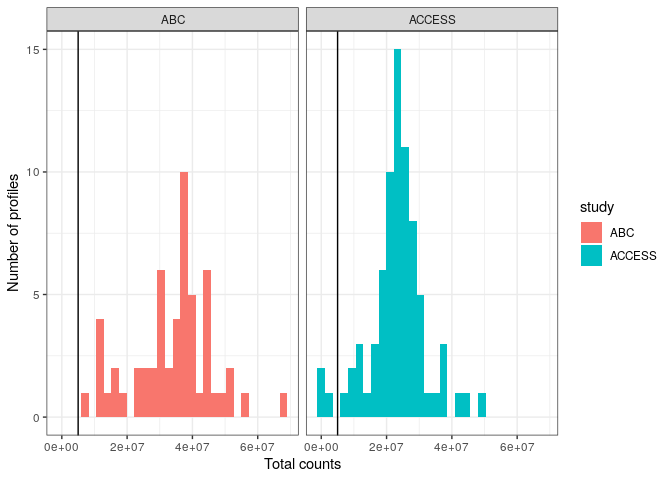

00_preprocess_rna
================
Kevin Thomas
6/20/2023

-   [Preprocessing cell type-specific RNA-seq
    data](#preprocessing-cell-type-specific-rna-seq-data)
    -   [Setup](#setup)
    -   [Transcript import](#transcript-import)
    -   [Filtering out small rRNA
        reads](#filtering-out-small-rrna-reads)
    -   [Metadata import](#metadata-import)
    -   [Make DGEList](#make-dgelist)

# Preprocessing cell type-specific RNA-seq data

## Setup

``` r
library(DESeq2)
```

    ## Loading required package: S4Vectors

    ## Loading required package: stats4

    ## Loading required package: BiocGenerics

    ## Loading required package: parallel

    ## 
    ## Attaching package: 'BiocGenerics'

    ## The following objects are masked from 'package:parallel':
    ## 
    ##     clusterApply, clusterApplyLB, clusterCall, clusterEvalQ,
    ##     clusterExport, clusterMap, parApply, parCapply, parLapply,
    ##     parLapplyLB, parRapply, parSapply, parSapplyLB

    ## The following objects are masked from 'package:stats':
    ## 
    ##     IQR, mad, sd, var, xtabs

    ## The following objects are masked from 'package:base':
    ## 
    ##     anyDuplicated, append, as.data.frame, basename, cbind, colnames,
    ##     dirname, do.call, duplicated, eval, evalq, Filter, Find, get, grep,
    ##     grepl, intersect, is.unsorted, lapply, Map, mapply, match, mget,
    ##     order, paste, pmax, pmax.int, pmin, pmin.int, Position, rank,
    ##     rbind, Reduce, rownames, sapply, setdiff, sort, table, tapply,
    ##     union, unique, unsplit, which.max, which.min

    ## 
    ## Attaching package: 'S4Vectors'

    ## The following objects are masked from 'package:base':
    ## 
    ##     expand.grid, I, unname

    ## Loading required package: IRanges

    ## Loading required package: GenomicRanges

    ## Loading required package: GenomeInfoDb

    ## Loading required package: SummarizedExperiment

    ## Loading required package: MatrixGenerics

    ## Loading required package: matrixStats

    ## 
    ## Attaching package: 'MatrixGenerics'

    ## The following objects are masked from 'package:matrixStats':
    ## 
    ##     colAlls, colAnyNAs, colAnys, colAvgsPerRowSet, colCollapse,
    ##     colCounts, colCummaxs, colCummins, colCumprods, colCumsums,
    ##     colDiffs, colIQRDiffs, colIQRs, colLogSumExps, colMadDiffs,
    ##     colMads, colMaxs, colMeans2, colMedians, colMins, colOrderStats,
    ##     colProds, colQuantiles, colRanges, colRanks, colSdDiffs, colSds,
    ##     colSums2, colTabulates, colVarDiffs, colVars, colWeightedMads,
    ##     colWeightedMeans, colWeightedMedians, colWeightedSds,
    ##     colWeightedVars, rowAlls, rowAnyNAs, rowAnys, rowAvgsPerColSet,
    ##     rowCollapse, rowCounts, rowCummaxs, rowCummins, rowCumprods,
    ##     rowCumsums, rowDiffs, rowIQRDiffs, rowIQRs, rowLogSumExps,
    ##     rowMadDiffs, rowMads, rowMaxs, rowMeans2, rowMedians, rowMins,
    ##     rowOrderStats, rowProds, rowQuantiles, rowRanges, rowRanks,
    ##     rowSdDiffs, rowSds, rowSums2, rowTabulates, rowVarDiffs, rowVars,
    ##     rowWeightedMads, rowWeightedMeans, rowWeightedMedians,
    ##     rowWeightedSds, rowWeightedVars

    ## Loading required package: Biobase

    ## Welcome to Bioconductor
    ## 
    ##     Vignettes contain introductory material; view with
    ##     'browseVignettes()'. To cite Bioconductor, see
    ##     'citation("Biobase")', and for packages 'citation("pkgname")'.

    ## 
    ## Attaching package: 'Biobase'

    ## The following object is masked from 'package:MatrixGenerics':
    ## 
    ##     rowMedians

    ## The following objects are masked from 'package:matrixStats':
    ## 
    ##     anyMissing, rowMedians

``` r
library(tximport)
library(tximeta)
library(tidyverse)
```

    ## ── Attaching packages ─────────────────────────────────────── tidyverse 1.3.1 ──

    ## ✓ ggplot2 3.3.5     ✓ purrr   0.3.4
    ## ✓ tibble  3.1.3     ✓ dplyr   1.0.7
    ## ✓ tidyr   1.1.3     ✓ stringr 1.4.0
    ## ✓ readr   2.0.0     ✓ forcats 0.5.1

    ## ── Conflicts ────────────────────────────────────────── tidyverse_conflicts() ──
    ## x dplyr::collapse()   masks IRanges::collapse()
    ## x dplyr::combine()    masks Biobase::combine(), BiocGenerics::combine()
    ## x dplyr::count()      masks matrixStats::count()
    ## x dplyr::desc()       masks IRanges::desc()
    ## x tidyr::expand()     masks S4Vectors::expand()
    ## x dplyr::filter()     masks stats::filter()
    ## x dplyr::first()      masks S4Vectors::first()
    ## x dplyr::lag()        masks stats::lag()
    ## x ggplot2::Position() masks BiocGenerics::Position(), base::Position()
    ## x purrr::reduce()     masks GenomicRanges::reduce(), IRanges::reduce()
    ## x dplyr::rename()     masks S4Vectors::rename()
    ## x dplyr::slice()      masks IRanges::slice()

``` r
library(openxlsx)
library(edgeR)
```

    ## Loading required package: limma

    ## 
    ## Attaching package: 'limma'

    ## The following object is masked from 'package:DESeq2':
    ## 
    ##     plotMA

    ## The following object is masked from 'package:BiocGenerics':
    ## 
    ##     plotMA

``` r
# Parallel backend
BPPARAM =
  BiocParallel::SnowParam(
    workers       = parallel::detectCores()-2,
    exportglobals = FALSE,
    progressbar   = TRUE,
    type = "SOCK"
  )
BiocParallel::register(BPPARAM)
```

## Transcript import

After pseudoalignment with salmon, transcript counts are imported into R
via `tximport`.

``` r
# Get quant files from output of files
data_dir <- "~/workspace/datasets/rnaseq/lra-bms-advantaseq/data"
count_files <- dir(
  data_dir, 
  pattern = "*.sf.gz",
  full.names = TRUE,
  recursive = TRUE
)
count_files <- count_files[-length(count_files)] ## Remove the last quant file, which contains the undetermined barcodes

# Annotations for tximport
annotations <- read_csv(
  file = "../references/gencode_v32_virus_tx2gene_v1.2.csv"
)
```

    ## Rows: 228646 Columns: 2

    ## ── Column specification ────────────────────────────────────────────────────────
    ## Delimiter: ","
    ## chr (2): transcript, gene_name

    ## 
    ## ℹ Use `spec()` to retrieve the full column specification for this data.
    ## ℹ Specify the column types or set `show_col_types = FALSE` to quiet this message.

``` r
# Transcript import
tx_counts <- tximport(
  files = count_files,
  type = "salmon",
  txIn = TRUE,
  txOut = FALSE,
  tx2gene = annotations,
  importer = data.table::fread
)
```

    ## 1

    ## 2 3 4 5 6 7 8 9 10 11 12 13 14 15 16 17 18 19 20 21 22 23 24 25 26 27 28 29 30 31 32 33 34 35 36 37 38 39 40 41 42 43 44 45 46 47 48 49 50 51 52 53 54 55 56 57 58 59 60 61 62 63 64 65 66 67 68 69 70 71 72 73 74 75 76 77 78 79 80 81 82 83 84 85 86 87 88 89 90 91 92 93 94 95 96 97 98 99 100 101 102 103 104 105 106 107 108 109 110 111 112 113 114 115 116 117 118 119 120 121 122 123 124 125 126 127 128 129 130 131 
    ## removing duplicated transcript rows from tx2gene
    ## transcripts missing from tx2gene: 37
    ## summarizing abundance
    ## summarizing counts
    ## summarizing length

## Filtering out small rRNA reads

``` r
# Filter out small rRNA reads (RNA5 prefix)
filtered_counts <- purrr::map(
  .x = c("abundance", "counts", "length"),
  .f = \(x){
    cleaned_counts <-
      tx_counts[[x]] |>
      tibble::as_tibble(rownames = "gene_symbol") |>
      dplyr::filter(
        stringr::str_detect(
          string = gene_symbol,
          pattern = "^RNA5",
          negate = TRUE
        )
      )
    
    cleaned_counts <-
      cleaned_counts |>
      dplyr::mutate(across(-matches("gene_symbol"), as.numeric)) |>
      tibble::column_to_rownames("gene_symbol") |>
      as.matrix()
  }) %>% 
  set_names(c("abundance", "counts", "length"))
```

    ## Warning: The `x` argument of `as_tibble.matrix()` must have unique column names if `.name_repair` is omitted as of tibble 2.0.0.
    ## Using compatibility `.name_repair`.

``` r
filtered_counts[["countsFromAbundance"]] <- "no"
```

## Metadata import

``` r
advantaseq_md <- readRDS("../data/advantaseq_md.RDS")
```

## Make DGEList

``` r
# Make DeSeq Dataset object
dds_import <- DESeqDataSetFromTximport(
  txi = filtered_counts,
  colData = advantaseq_md,
  design = ~ test_group
)
```

    ## Warning in DESeqDataSet(se, design = design, ignoreRank): some variables in
    ## design formula are characters, converting to factors

    ## using counts and average transcript lengths from tximport

Datasets must have at leaset 5 million counts for further use.

    ## `stat_bin()` using `bins = 30`. Pick better value with `binwidth`.

<!-- -->

``` r
# Remove libraries with low counts
low_count_idx <- counts(dds_import) %>%
  colSums() %>%
  (function(x) which(x < 5e6))
dds_import <- dds_import[,-low_count_idx]

# Count matrix, remove transcripts with no counts
ct_mtx <- counts(dds_import)
keep <- which(rowSums(counts(dds_import)) > 0)
ct_mtx <- ct_mtx[keep,]

# DGEList
d0 <- DGEList(ct_mtx, samples = as.data.frame(colData(dds_import)))

# Normalize and filter out transcripts with CPM < 1
d0 <- calcNormFactors(d0)
drop <- which(apply(cpm(d0), 1, max) < 1)
d <- d0[-drop,] 
dim(d) # number of genes left
```

    ## [1] 26460   128

``` r
d <- calcNormFactors(d)

# Save
saveRDS(object = d, file = "../data/rna_dgelist.RDS")
```

``` r
sessionInfo()
```

    ## R version 4.1.0 (2021-05-18)
    ## Platform: x86_64-pc-linux-gnu (64-bit)
    ## Running under: Ubuntu 20.04.2 LTS
    ## 
    ## Matrix products: default
    ## BLAS/LAPACK: /usr/lib/x86_64-linux-gnu/openblas-pthread/libopenblasp-r0.3.8.so
    ## 
    ## locale:
    ##  [1] LC_CTYPE=en_US.UTF-8       LC_NUMERIC=C              
    ##  [3] LC_TIME=en_US.UTF-8        LC_COLLATE=en_US.UTF-8    
    ##  [5] LC_MONETARY=en_US.UTF-8    LC_MESSAGES=C             
    ##  [7] LC_PAPER=en_US.UTF-8       LC_NAME=C                 
    ##  [9] LC_ADDRESS=C               LC_TELEPHONE=C            
    ## [11] LC_MEASUREMENT=en_US.UTF-8 LC_IDENTIFICATION=C       
    ## 
    ## attached base packages:
    ## [1] parallel  stats4    stats     graphics  grDevices utils     datasets 
    ## [8] methods   base     
    ## 
    ## other attached packages:
    ##  [1] edgeR_3.34.0                limma_3.48.3               
    ##  [3] openxlsx_4.2.4              forcats_0.5.1              
    ##  [5] stringr_1.4.0               dplyr_1.0.7                
    ##  [7] purrr_0.3.4                 readr_2.0.0                
    ##  [9] tidyr_1.1.3                 tibble_3.1.3               
    ## [11] ggplot2_3.3.5               tidyverse_1.3.1            
    ## [13] tximeta_1.10.0              tximport_1.20.0            
    ## [15] DESeq2_1.32.0               SummarizedExperiment_1.22.0
    ## [17] Biobase_2.52.0              MatrixGenerics_1.4.2       
    ## [19] matrixStats_0.60.0          GenomicRanges_1.44.0       
    ## [21] GenomeInfoDb_1.28.1         IRanges_2.26.0             
    ## [23] S4Vectors_0.30.0            BiocGenerics_0.38.0        
    ## [25] BiocManager_1.30.16        
    ## 
    ## loaded via a namespace (and not attached):
    ##   [1] readxl_1.3.1                  backports_1.2.1              
    ##   [3] AnnotationHub_3.0.1           BiocFileCache_2.0.0          
    ##   [5] lazyeval_0.2.2                splines_4.1.0                
    ##   [7] BiocParallel_1.26.1           digest_0.6.27                
    ##   [9] ensembldb_2.16.4              htmltools_0.5.1.1            
    ##  [11] fansi_0.5.0                   magrittr_2.0.1               
    ##  [13] memoise_2.0.0                 tzdb_0.1.2                   
    ##  [15] Biostrings_2.60.2             annotate_1.70.0              
    ##  [17] modelr_0.1.8                  R.utils_2.10.1               
    ##  [19] vroom_1.5.4                   prettyunits_1.1.1            
    ##  [21] colorspace_2.0-2              blob_1.2.2                   
    ##  [23] rvest_1.0.1                   rappdirs_0.3.3               
    ##  [25] haven_2.4.3                   xfun_0.25                    
    ##  [27] crayon_1.4.1                  RCurl_1.98-1.3               
    ##  [29] jsonlite_1.7.2                genefilter_1.74.0            
    ##  [31] survival_3.2-11               glue_1.4.2                   
    ##  [33] gtable_0.3.0                  zlibbioc_1.38.0              
    ##  [35] XVector_0.32.0                DelayedArray_0.18.0          
    ##  [37] scales_1.1.1                  DBI_1.1.1                    
    ##  [39] Rcpp_1.0.7                    xtable_1.8-4                 
    ##  [41] progress_1.2.2                bit_4.0.4                    
    ##  [43] httr_1.4.2                    RColorBrewer_1.1-2           
    ##  [45] ellipsis_0.3.2                farver_2.1.0                 
    ##  [47] pkgconfig_2.0.3               XML_3.99-0.6                 
    ##  [49] R.methodsS3_1.8.1             dbplyr_2.1.1                 
    ##  [51] locfit_1.5-9.4                utf8_1.2.2                   
    ##  [53] labeling_0.4.2                tidyselect_1.1.1             
    ##  [55] rlang_0.4.11                  later_1.2.0                  
    ##  [57] AnnotationDbi_1.54.1          munsell_0.5.0                
    ##  [59] BiocVersion_3.13.1            cellranger_1.1.0             
    ##  [61] tools_4.1.0                   cachem_1.0.5                 
    ##  [63] cli_3.0.1                     generics_0.1.0               
    ##  [65] RSQLite_2.2.7                 broom_0.7.9                  
    ##  [67] evaluate_0.14                 fastmap_1.1.0                
    ##  [69] yaml_2.2.1                    knitr_1.33                   
    ##  [71] bit64_4.0.5                   fs_1.5.0                     
    ##  [73] zip_2.2.0                     KEGGREST_1.32.0              
    ##  [75] AnnotationFilter_1.16.0       mime_0.11                    
    ##  [77] R.oo_1.24.0                   xml2_1.3.2                   
    ##  [79] biomaRt_2.48.2                compiler_4.1.0               
    ##  [81] rstudioapi_0.13               filelock_1.0.2               
    ##  [83] curl_4.3.2                    png_0.1-7                    
    ##  [85] interactiveDisplayBase_1.30.0 reprex_2.0.1                 
    ##  [87] geneplotter_1.70.0            stringi_1.7.3                
    ##  [89] highr_0.9                     GenomicFeatures_1.44.0       
    ##  [91] lattice_0.20-44               ProtGenerics_1.24.0          
    ##  [93] Matrix_1.3-4                  vctrs_0.3.8                  
    ##  [95] pillar_1.6.2                  lifecycle_1.0.0              
    ##  [97] data.table_1.14.0             bitops_1.0-7                 
    ##  [99] httpuv_1.6.1                  rtracklayer_1.52.0           
    ## [101] R6_2.5.0                      BiocIO_1.2.0                 
    ## [103] promises_1.2.0.1              assertthat_0.2.1             
    ## [105] rjson_0.2.20                  withr_2.4.2                  
    ## [107] GenomicAlignments_1.28.0      Rsamtools_2.8.0              
    ## [109] GenomeInfoDbData_1.2.6        hms_1.1.0                    
    ## [111] grid_4.1.0                    rmarkdown_2.10               
    ## [113] shiny_1.6.0                   lubridate_1.7.10             
    ## [115] restfulr_0.0.13
