Machine Learning on Methylation
================
Kevin Thomas
12/27/2024

- [Machine learning identifies a methylation
  signature](#machine-learning-identifies-a-methylation-signature)
  - [Setup](#setup)
  - [Load in methylation data](#load-in-methylation-data)
  - [Perform first round of ML on ACCESS
    data](#perform-first-round-of-ml-on-access-data)
    - [Find top features used](#find-top-features-used)
    - [Training and Testing
      Performance](#training-and-testing-performance)
    - [Feature usage](#feature-usage)
    - [Top Features Used](#top-features-used)
  - [Parsimonious model on ACCESS using top 17
    features](#parsimonious-model-on-access-using-top-17-features)
    - [Training and Testing
      Performance](#training-and-testing-performance-1)
  - [Parsimonious model performance on
    ABC](#parsimonious-model-performance-on-abc)
    - [Performance](#performance)
  - [Top CpG Methylation Across ACCESS and
    ABC](#top-cpg-methylation-across-access-and-abc)
    - [ACCESS](#access)
    - [ABC](#abc)
  - [Apply machine learning to a combined
    cohort](#apply-machine-learning-to-a-combined-cohort)
    - [Find top features used](#find-top-features-used-1)
    - [Calculate error data](#calculate-error-data-1)
    - [Training and Testing
      Performance](#training-and-testing-performance-2)
    - [Feature usage](#feature-usage-1)
    - [Top Features Used](#top-features-used-1)
    - [Eliminate top 4 CpGs and re-do
      model](#eliminate-top-4-cpgs-and-re-do-model)
    - [Model performance on individual cell
      types](#model-performance-on-individual-cell-types)
    - [Calculate error data](#calculate-error-data-4)
    - [Training and Testing
      Performance](#training-and-testing-performance-5)
    - [Parsimonious model trained on T cells tested on B cell and
      Monocyte
      profiles](#parsimonious-model-trained-on-t-cells-tested-on-b-cell-and-monocyte-profiles)
    - [Parsimonious models trained on all T cells tested on ACCESS and
      ABC T cells
      independently](#parsimonious-models-trained-on-all-t-cells-tested-on-access-and-abc-t-cells-independently)
    - [Parsimonious model trained on ABC T cells and tested on ACCESS T
      cells](#parsimonious-model-trained-on-abc-t-cells-and-tested-on-access-t-cells)
    - [Parsimonious model trained on ACCESS T cells and tested on ABC T
      cells](#parsimonious-model-trained-on-access-t-cells-and-tested-on-abc-t-cells)

# Machine learning identifies a methylation signature

## Setup

``` r
req.pkgs <- c("foreach", "doParallel", "doRNG", "glmnet", "Biobase", "caTools", "ggplot2", "rio", "data.table", "ROCR", "dplyr", "doParallel", "pROC", "svglite", "cowplot", "openxlsx")
missing.pkgs <- req.pkgs[!req.pkgs %in% installed.packages()[,1]]
BiocManager::install(missing.pkgs, update = FALSE)
```

    ## 'getOption("repos")' replaces Bioconductor standard repositories, see
    ## 'help("repositories", package = "BiocManager")' for details.
    ## Replacement repositories:
    ##     CRAN: https://p3m.dev/cran/__linux__/jammy/latest

    ## Bioconductor version 3.19 (BiocManager 1.30.23), R 4.4.1 (2024-06-14)

``` r
require(foreach)
```

    ## Loading required package: foreach

``` r
require(doParallel)
```

    ## Loading required package: doParallel

    ## Loading required package: iterators

    ## Loading required package: parallel

``` r
require(doRNG)
```

    ## Loading required package: doRNG

    ## Loading required package: rngtools

``` r
require(glmnet)
```

    ## Loading required package: glmnet

    ## Loading required package: Matrix

    ## Loaded glmnet 4.1-8

``` r
require(Biobase)
```

    ## Loading required package: Biobase

    ## Loading required package: BiocGenerics

    ## 
    ## Attaching package: 'BiocGenerics'

    ## The following objects are masked from 'package:stats':
    ## 
    ##     IQR, mad, sd, var, xtabs

    ## The following objects are masked from 'package:base':
    ## 
    ##     anyDuplicated, aperm, append, as.data.frame, basename, cbind,
    ##     colnames, dirname, do.call, duplicated, eval, evalq, Filter, Find,
    ##     get, grep, grepl, intersect, is.unsorted, lapply, Map, mapply,
    ##     match, mget, order, paste, pmax, pmax.int, pmin, pmin.int,
    ##     Position, rank, rbind, Reduce, rownames, sapply, setdiff, table,
    ##     tapply, union, unique, unsplit, which.max, which.min

    ## Welcome to Bioconductor
    ## 
    ##     Vignettes contain introductory material; view with
    ##     'browseVignettes()'. To cite Bioconductor, see
    ##     'citation("Biobase")', and for packages 'citation("pkgname")'.

``` r
require(caTools) 
```

    ## Loading required package: caTools

``` r
require(ggplot2)
```

    ## Loading required package: ggplot2

``` r
require(rio)
```

    ## Loading required package: rio

``` r
require(data.table)
```

    ## Loading required package: data.table

``` r
require(ROCR)
```

    ## Loading required package: ROCR

``` r
require(dplyr)
```

    ## Loading required package: dplyr

    ## 
    ## Attaching package: 'dplyr'

    ## The following objects are masked from 'package:data.table':
    ## 
    ##     between, first, last

    ## The following object is masked from 'package:Biobase':
    ## 
    ##     combine

    ## The following objects are masked from 'package:BiocGenerics':
    ## 
    ##     combine, intersect, setdiff, union

    ## The following objects are masked from 'package:stats':
    ## 
    ##     filter, lag

    ## The following objects are masked from 'package:base':
    ## 
    ##     intersect, setdiff, setequal, union

``` r
require(doParallel)
require(pROC)
```

    ## Loading required package: pROC

    ## Type 'citation("pROC")' for a citation.

    ## 
    ## Attaching package: 'pROC'

    ## The following object is masked from 'package:BiocGenerics':
    ## 
    ##     var

    ## The following objects are masked from 'package:stats':
    ## 
    ##     cov, smooth, var

``` r
require(svglite)
```

    ## Loading required package: svglite

``` r
source(file = "../R/f_methLab_evaluateClassifier.R")
source(file = "../R/mem_profile_fxn.R")
source(file = "../R/f_plot_AUCs.R")
source(file = "../R/f_eval_model.R")
```

## Load in methylation data

``` r
methyl_b <- readRDS("../data/betaMatrix.RDS")
methyl_md <- readRDS("../data/methylMetaData.RDS")
```

## Perform first round of ML on ACCESS data

``` r
ml_dir <- "../ML_results/ML_ACCESS"
if (!dir.exists(ml_dir)) {dir.create(path = ml_dir, recursive = TRUE)}
#Labels
seed1<-1
runIndexLabel<-paste0("dev_unsupervised_",seed1)
identificationLabel<-"unsupervised"
#Filter data to samples of interest
runData = methyl_b[,methyl_md$Trial == "ACCESS"]
runPheno = data.frame(
  Sentrix_ID = methyl_md$Slide[methyl_md$Trial == "ACCESS"] ,
  Sample_Group = methyl_md$sample_group[methyl_md$Trial == "ACCESS"]
)
#Match filtered data
runData <- runData[,runPheno$Sentrix_ID]
#Set seed
set.seed(12345)

gc(verbose = FALSE) # Memory management
```

    ##             used   (Mb) gc trigger   (Mb)  max used   (Mb)
    ## Ncells   3011430  160.9    5627245  300.6   3451829  184.4
    ## Vcells 242016395 1846.5  406891184 3104.4 338170270 2580.1

``` r
#Run classifier
methLab.evaluateClassifier(
  data = runData,
  pheno = runPheno,
  prop = 0.7,
  ml_dir = ml_dir,
  # n_cores = floor(0.6*detectCores()),
  n_cores = floor(mem.profile.linux()$total/(4*mem.profile.linux()$used)),
  # Memory-intensive, as matrix is copied on parallel instances
  nfolds = 10,
  resultsLabel = runIndexLabel,
  identificationLabel = identificationLabel,
  feature = rownames(runData),
  seeds = 40
)
```

    ## Directory contains a populated 'results' folder. To force a recalculation, set `force` to `TRUE`.

### Find top features used

``` r
# Evaluate top features for each model
features<- data.frame(feature = rownames(runData), counts = 0)
for (seed in 1:40){
  load(file = paste0(ml_dir,"/results/TrueLabels_", runIndexLabel, "_", seed,".R"))
  features$counts[which(features$feature %in% devResults$features)] <- features$counts[which(features$feature %in% devResults$features)] + 1
}
# See how many models used each CpG
topFeatures<-features[order(features$counts,decreasing=T),]
export(topFeatures,file=paste0(ml_dir, "/featuresCounts_",seed1,".csv"))
# Filter for all CpGs used more than once
topFeatures<-dplyr::filter(topFeatures,counts>1)
export(topFeatures,file=paste0(ml_dir, "/topFeatures.csv"))
```

#### Calculate error data

``` r
# Concatenate ROC data
ROCdata <-data.frame()
for (seed in 1:40){
  load(file = paste0(ml_dir,"/results/TrueLabels_", runIndexLabel, "_", seed,".R"))
  
  ROCTesttoAdd<-devResults$aucTest@y.values[[1]]
  trainError<-devResults$trainError
  testError<-devResults$testError
  
  ROCdata <- rbind(
    ROCdata,
    data.frame(
      "split"=seed,
      "ROCTest"=ROCTesttoAdd,
      "trainError"=trainError,
      "testError"=testError
    )
  )
}
export(ROCdata, file = paste0(ml_dir, "/ROCdata.csv"))
summary(ROCdata$testError)
```

    ##    Min. 1st Qu.  Median    Mean 3rd Qu.    Max. 
    ## 0.00000 0.02857 0.05714 0.06143 0.08571 0.17143

### Training and Testing Performance

``` r
gg_Train <- plot_auc_curves(
  ml_dir = ml_dir,
  runIndexLabel = runIndexLabel,
  seed = 40,
  trainTest = "train",
  colIndiv = "lightblue",
  colSumm = "blue"
)
gg_Test <- plot_auc_curves(
  ml_dir = ml_dir,
  runIndexLabel = runIndexLabel,
  seed = 40,
  trainTest = "test",
  colIndiv = "green",
  colSumm = "darkgreen"
)
cowplot::plot_grid(
  gg_Train,
  gg_Test
)
```

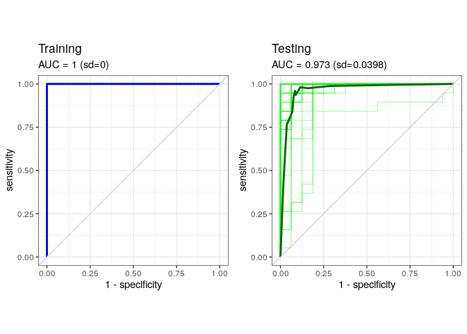<!-- -->

### Feature usage

``` r
# Plot feature usage
num_features = c()
for (i in 1:40) {
  load(paste0(ml_dir,"/results/TrueLabels_", runIndexLabel, "_", i,".R"))
  num_features[i]=length(devResults$features)
}
tibble::enframe(num_features, "seed", "num_features") %>%
  ggplot(aes(x = num_features)) +
  geom_histogram(fill = "black", binwidth = 2) +
  geom_vline(xintercept = median(num_features), col = "red", linetype = 2) +
  labs(x = "Number of CpGs Used", y = "Number of bootstrapped models") +
  theme_bw()
```

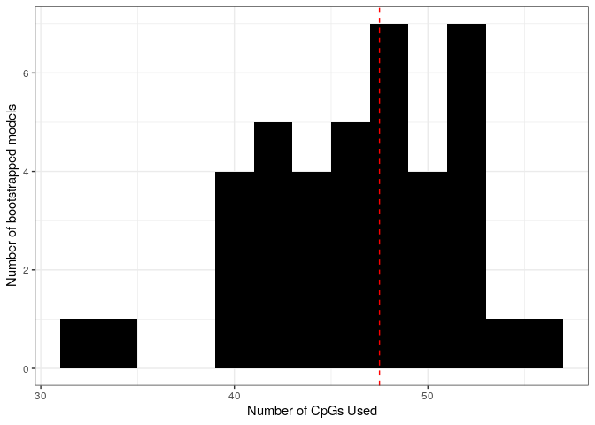<!-- -->

### Top Features Used

``` r
# Plot feature usage
read.csv(paste0(ml_dir, "/topFeatures.csv")) %>%
  head(20) %>%
  mutate(feature = factor(feature, levels = feature), pct_used = 100*counts/40) %>%
  ggplot(aes(x = feature, y = pct_used)) +
  geom_col(aes(fill = pct_used>50), show.legend = FALSE) +
  scale_fill_manual(values = c("TRUE" = "blue", "FALSE", "grey50")) +
  labs(x = "CpG probe", y = "Fraction of models used (%)") +
  theme_bw() +
  theme(axis.text.x = element_text(angle = 45, hjust = 1, vjust = 1))
```

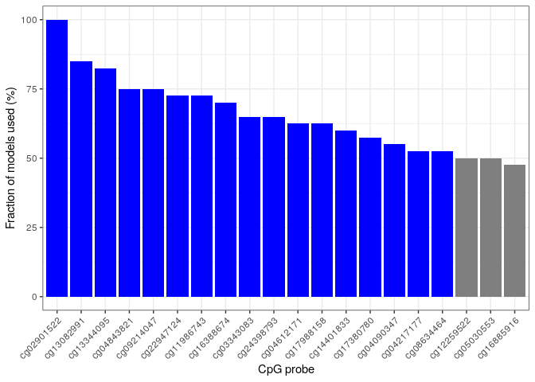<!-- -->

``` r
top_cpg = read.csv(paste0(ml_dir, "/topFeatures.csv")) %>%
  head(20) %>%
  mutate(feature = factor(feature, levels = feature), pct_used = 100*counts/40) %>%
  dplyr::filter(pct_used > 50) %>%
  pull(feature) %>%
  as.character()
```

## Parsimonious model on ACCESS using top 17 features

``` r
ml_dir <- "../ML_results/ML_ACCESS_top17"
if (!dir.exists(ml_dir)) {dir.create(path = ml_dir, recursive = TRUE)}
#Labels
seed1<-1
runIndexLabel<-paste0("dev_unsupervised_",seed1)
identificationLabel<-"unsupervised"
#Filter data to samples and probes of interest
runData = methyl_b[top_cpg, methyl_md$Trial == "ACCESS"]
runPheno = data.frame(
  Sentrix_ID = methyl_md$Slide[methyl_md$Trial == "ACCESS"] ,
  Sample_Group = methyl_md$sample_group[methyl_md$Trial == "ACCESS"]
)
#Match filtered data
runData <- runData[,runPheno$Sentrix_ID]
#Set seed
set.seed(12345)
#Run classifier
methLab.evaluateClassifier(
  data = runData,
  pheno = runPheno,
  prop = 0.7,
  ml_dir = ml_dir,
  keep_all = TRUE,
  n_cores = floor(mem.profile.linux()$total/(4*mem.profile.linux()$used)),
  # Memory-intensive, as matrix is copied on parallel instances
  nfolds = 10,
  resultsLabel = runIndexLabel,
  identificationLabel = identificationLabel,
  feature = rownames(runData),
  seeds = 40
)
```

    ## Directory contains a populated 'results' folder. To force a recalculation, set `force` to `TRUE`.

### Training and Testing Performance

``` r
gg_Train <- plot_auc_curves(
  ml_dir = ml_dir,
  runIndexLabel = runIndexLabel,
  seed = 40,
  trainTest = "train",
  colIndiv = "lightblue",
  colSumm = "blue"
)
gg_Test <- plot_auc_curves(
  ml_dir = ml_dir,
  runIndexLabel = runIndexLabel,
  seed = 40,
  trainTest = "test",
  colIndiv = "green",
  colSumm = "darkgreen"
)
cowplot::plot_grid(
  gg_Train,
  gg_Test
)
```

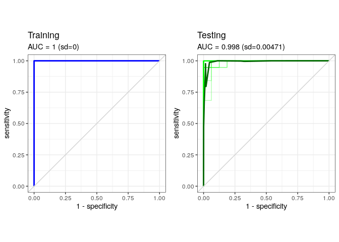<!-- -->

## Parsimonious model performance on ABC

``` r
ml_dir <- "../ML_results/ML_ACCESS_top17_on_ABC"
if (!dir.exists(ml_dir)) {dir.create(path = ml_dir, recursive = TRUE)}
ml_fit_dir <- "../ML_results/ML_ACCESS_top17"
if (!dir.exists(ml_fit_dir)) {message("Fit model has not been calculated.")}

#Filter data to samples and probes of interest
runData = methyl_b[top_cpg, methyl_md$Trial == "ABC"]
runPheno = data.frame(
  Sentrix_ID = methyl_md$Slide[methyl_md$Trial == "ABC"] ,
  Sample_Group = methyl_md$sample_group[methyl_md$Trial == "ABC"]
)
#Match filtered data
runData <- runData[,runPheno$Sentrix_ID]
#Set seed
set.seed(12345)
#Run model on new data
for (seed in 1:40) {
  # Load model used
  load(file = paste0(ml_fit_dir,"/results/CVglmfit_", seed, ".R"))
  # Make predictions based on markers used in developing model
  results = eval.model(model = cv.glmfit, newData = runData, newLabels = runPheno, ml_dir = ml_dir, seed = seed, keep_all = TRUE)
  save(results, file = paste0(ml_dir, "/results/TrueLabels_results_",seed,".R"))
}
```

### Performance

``` r
plot_auc_curves(
  ml_dir = ml_dir,
  runIndexLabel = NULL,
  seed = 40,
  trainTest = "test",
  colIndiv = "orange",
  colSumm = "darkorange"
)
```

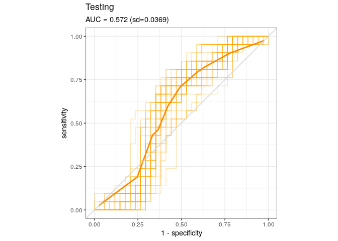<!-- -->

## Top CpG Methylation Across ACCESS and ABC

### ACCESS

``` r
metaData <- left_join(
  methyl_md,
  openxlsx::read.xlsx("../data/dna_metadata.xlsx"),
  by = c(
    "Sample" = "EXS_ID"
  )
) %>%
  mutate(Response = factor(Response, labels = c("NR", "NR", "R")))

metaData %>%
  cbind(t(methyl_b[top_cpg, ])) %>%
  dplyr::filter(Study == "ACCESS") %>%
  tidyr::pivot_longer(starts_with("cg"), names_to = "CpG", values_to = "beta") %>%
  mutate(CpG = factor(CpG, levels = top_cpg)) %>%
  ggplot(aes(x = Response, y = beta)) +
  geom_violin(aes(fill = Response), scale = "width", show.legend = FALSE) +
  geom_jitter(width = 0.2) +
  ggpubr::stat_compare_means(
    comparisons = list(c("NR", "R")),
    label = "p.format",
    tip.length = 0
  ) +
  labs(x = NULL, y = expression(beta), title = "ACCESS") +
  scale_y_continuous(expand = expansion(mult = c(0.1, 0.15))) +
  facet_wrap(~CpG, scales = "free_y", ncol = 3) +
  theme_bw()
```

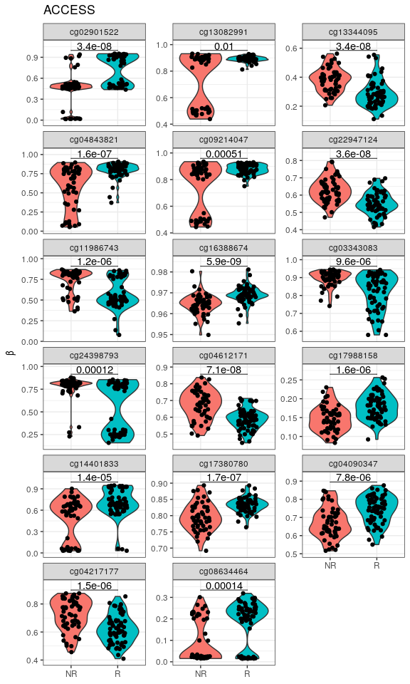<!-- -->

### ABC

``` r
metaData %>%
  cbind(t(methyl_b[top_cpg, ])) %>%
  dplyr::filter(Study == "ABC") %>%
  tidyr::pivot_longer(starts_with("cg"), names_to = "CpG", values_to = "beta") %>%
  mutate(CpG = factor(CpG, levels = top_cpg)) %>%
  ggplot(aes(x = Response, y = beta)) +
  geom_violin(aes(fill = Response), scale = "width", show.legend = FALSE) +
  geom_jitter(width = 0.2) +
  ggpubr::stat_compare_means(
    comparisons = list(c("NR", "R")),
    label = "p.format",
    tip.length = 0
  ) +
  labs(x = NULL, y = expression(beta), title = "ABC") +
  scale_y_continuous(expand = expansion(mult = c(0.1, 0.15))) +
  facet_wrap(~CpG, scales = "free_y", ncol = 3) +
  theme_bw()
```

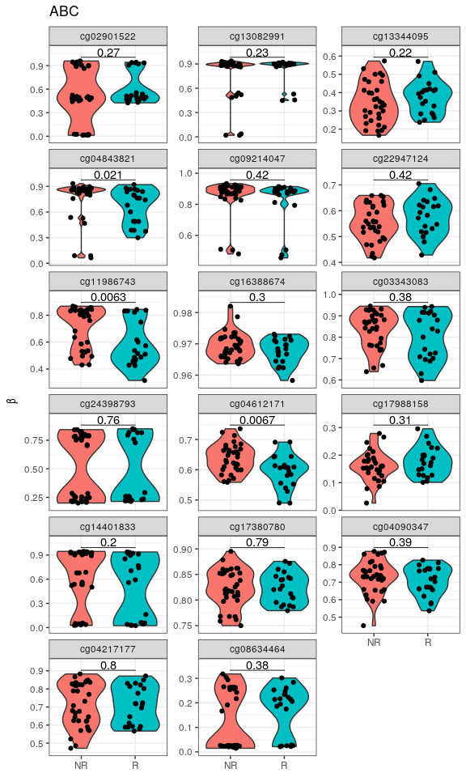<!-- -->

## Apply machine learning to a combined cohort

``` r
ml_dir <- "../ML_results/ML_combined"
if (!dir.exists(ml_dir)) {dir.create(path = ml_dir, recursive = TRUE)}
#Labels
seed1<-1
runIndexLabel<-paste0("dev_unsupervised_",seed1)
identificationLabel<-"unsupervised"
#Filter data to samples of interest
runData = methyl_b[,]
runPheno = data.frame(
  Sentrix_ID = methyl_md$Slide[] ,
  Sample_Group = methyl_md$sample_group[]
)
#Match filtered data
runData <- runData[,runPheno$Sentrix_ID]
#Set seed
set.seed(12345)
#Run classifier
methLab.evaluateClassifier(
  data = runData,
  pheno = runPheno,
  prop = 0.7,
  ml_dir = ml_dir,
  # n_cores = floor(0.6*detectCores()),
  n_cores = floor(mem.profile.linux()$total/(4*mem.profile.linux()$used)),
  # Memory-intensive, as matrix is copied on parallel instances
  nfolds = 10,
  resultsLabel = runIndexLabel,
  identificationLabel = identificationLabel,
  feature = rownames(runData),
  seeds = 40
)
```

    ## Directory contains a populated 'results' folder. To force a recalculation, set `force` to `TRUE`.

### Find top features used

``` r
# Evaluate top features for each model
features<- data.frame(feature = rownames(runData), counts = 0)
for (seed in 1:40){
  load(file = paste0(ml_dir,"/results/TrueLabels_", runIndexLabel, "_", seed,".R"))
  features$counts[which(features$feature %in% devResults$features)] <- features$counts[which(features$feature %in% devResults$features)] + 1
}
# See how many models used each CpG
topFeatures<-features[order(features$counts,decreasing=T),]
export(topFeatures,file=paste0(ml_dir, "/featuresCounts_",seed1,".csv"))
# Filter for all CpGs used more than once
topFeatures<-dplyr::filter(topFeatures,counts>1)
export(topFeatures,file=paste0(ml_dir, "/topFeatures.csv"))
```

### Calculate error data

``` r
# Concatenate ROC data
ROCdata <-data.frame()
for (seed in 1:40){
  load(file = paste0(ml_dir,"/results/TrueLabels_", runIndexLabel, "_", seed,".R"))
  
  ROCTesttoAdd<-devResults$aucTest@y.values[[1]]
  trainError<-devResults$trainError
  testError<-devResults$testError
  
  ROCdata <- rbind(
    ROCdata,
    data.frame(
      "split"=seed,
      "ROCTest"=ROCTesttoAdd,
      "trainError"=trainError,
      "testError"=testError
    )
  )
}
export(ROCdata, file = paste0(ml_dir, "/ROCdata.csv"))
summary(ROCdata$testError)
```

    ##    Min. 1st Qu.  Median    Mean 3rd Qu.    Max. 
    ## 0.00000 0.01961 0.05882 0.06961 0.09804 0.23529

### Training and Testing Performance

``` r
gg_Train <- plot_auc_curves(
  ml_dir = ml_dir,
  runIndexLabel = runIndexLabel,
  seed = 40,
  trainTest = "train",
  colIndiv = "lightblue",
  colSumm = "blue"
)
gg_Test <- plot_auc_curves(
  ml_dir = ml_dir,
  runIndexLabel = runIndexLabel,
  seed = 40,
  trainTest = "test",
  colIndiv = "green",
  colSumm = "darkgreen"
)
cowplot::plot_grid(
  gg_Train,
  gg_Test
)
```

<!-- -->

### Feature usage

``` r
# Plot feature usage
num_features = c()
for (i in 1:40) {
  load(paste0(ml_dir,"/results/TrueLabels_", runIndexLabel, "_", i,".R"))
  num_features[i]=length(devResults$features)
}
tibble::enframe(num_features, "seed", "num_features") %>%
  ggplot(aes(x = num_features)) +
  geom_histogram(fill = "black", binwidth = 2) +
  geom_vline(xintercept = median(num_features), col = "red", linetype = 2) +
  labs(x = "Number of CpGs Used", y = "Number of bootstrapped models") +
  theme_bw()
```

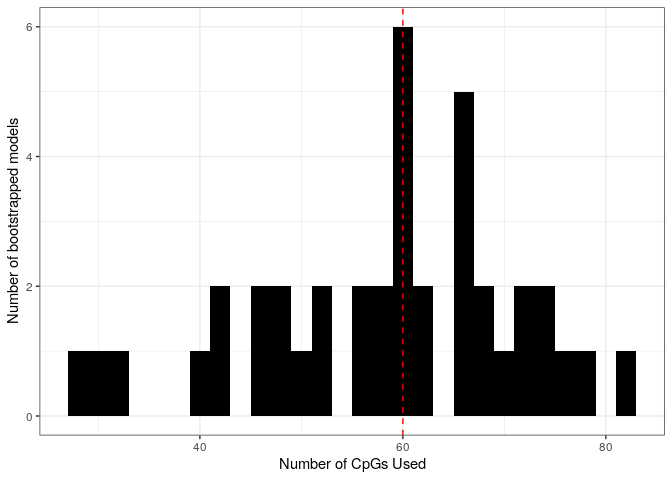<!-- -->

### Top Features Used

``` r
# Plot top features
read.csv(paste0(ml_dir, "/topFeatures.csv")) %>%
  head(20) %>%
  mutate(feature = factor(feature, levels = feature), pct_used = 100*counts/40) %>%
  ggplot(aes(x = feature, y = pct_used)) +
  geom_col(aes(fill = pct_used>=87.5), show.legend = FALSE) +
  scale_fill_manual(values = c("TRUE" = "blue", "FALSE", "grey50")) +
  labs(x = "CpG probe", y = "Fraction of models used (%)") +
  theme_bw() +
  theme(axis.text.x = element_text(angle = 45, hjust = 1, vjust = 1))
```

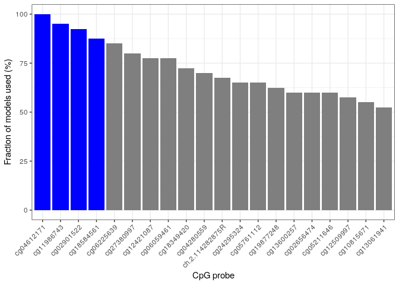<!-- -->

``` r
top_cpg = read.csv(paste0(ml_dir, "/topFeatures.csv")) %>%
  head(20) %>%
  mutate(feature = factor(feature, levels = feature), pct_used = 100*counts/40) %>%
  dplyr::filter(pct_used >= 87.5) %>%
  pull(feature) %>%
  as.character()
```

### Eliminate top 4 CpGs and re-do model

``` r
ml_dir <- "../ML_results/ML_combined_noTop4"
if (!dir.exists(ml_dir)) {dir.create(path = ml_dir, recursive = TRUE)}
#Labels
seed1<-1
runIndexLabel<-paste0("dev_unsupervised_",seed1)
identificationLabel<-"unsupervised"
#Filter data to samples and probes of interest
runData = methyl_b[!(rownames(methyl_b) %in% top_cpg),]
runPheno = data.frame(
  Sentrix_ID = methyl_md$Slide[] ,
  Sample_Group = methyl_md$sample_group[]
)
#Match filtered data
runData <- runData[,runPheno$Sentrix_ID]
#Set seed
set.seed(12345)
#Run classifier
methLab.evaluateClassifier(
  data = runData,
  pheno = runPheno,
  prop = 0.7,
  ml_dir = ml_dir,
  # n_cores = floor(0.6*detectCores()),
  n_cores = floor(mem.profile.linux()$total/(4*mem.profile.linux()$used)),
  # Memory-intensive, as matrix is copied on parallel instances
  nfolds = 10,
  resultsLabel = runIndexLabel,
  identificationLabel = identificationLabel,
  feature = rownames(runData),
  seeds = 40
)
```

    ## Directory contains a populated 'results' folder. To force a recalculation, set `force` to `TRUE`.

#### Calculate error data

``` r
# Concatenate ROC data
ROCdata <-data.frame()
for (seed in 1:40){
  load(file = paste0(ml_dir,"/results/TrueLabels_", runIndexLabel, "_", seed,".R"))
  
  ROCTesttoAdd<-devResults$aucTest@y.values[[1]]
  trainError<-devResults$trainError
  testError<-devResults$testError
  
  ROCdata <- rbind(
    ROCdata,
    data.frame(
      "split"=seed,
      "ROCTest"=ROCTesttoAdd,
      "trainError"=trainError,
      "testError"=testError
    )
  )
}
export(ROCdata, file = paste0(ml_dir, "/ROCdata.csv"))
summary(ROCdata$testError)
```

    ##    Min. 1st Qu.  Median    Mean 3rd Qu.    Max. 
    ## 0.00000 0.05392 0.05882 0.08186 0.11765 0.17647

#### Training and Testing Performance

``` r
gg_Train <- plot_auc_curves(
  ml_dir = ml_dir,
  runIndexLabel = runIndexLabel,
  seed = 40,
  trainTest = "train",
  colIndiv = "lightblue",
  colSumm = "blue"
)
gg_Test <- plot_auc_curves(
  ml_dir = ml_dir,
  runIndexLabel = runIndexLabel,
  seed = 40,
  trainTest = "test",
  colIndiv = "green",
  colSumm = "darkgreen"
)
cowplot::plot_grid(
  gg_Train,
  gg_Test
)
```

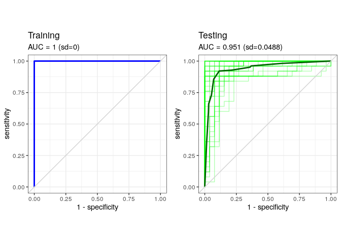<!-- -->

#### Feature usage

``` r
# Plot feature usage
num_features = c()
for (i in 1:40) {
  load(paste0(ml_dir,"/results/TrueLabels_", runIndexLabel, "_", i,".R"))
  num_features[i]=length(devResults$features)
}
tibble::enframe(num_features, "seed", "num_features") %>%
  ggplot(aes(x = num_features)) +
  geom_histogram(fill = "black", binwidth = 2) +
  geom_vline(xintercept = median(num_features), col = "red", linetype = 2) +
  labs(x = "Number of CpGs Used", y = "Number of bootstrapped models") +
  theme_bw()
```

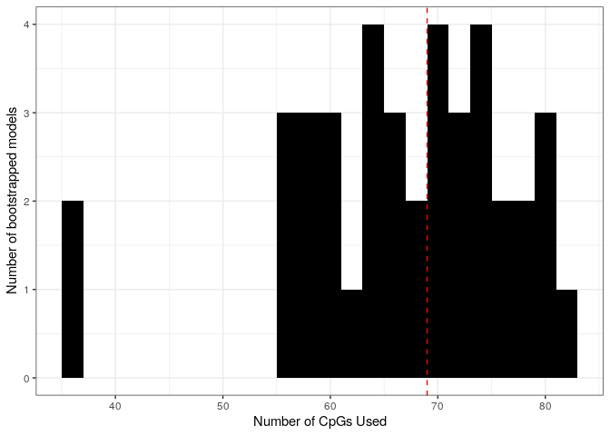<!-- -->

### Model performance on individual cell types

``` r
cell_type = unique(methyl_md$group1)[c(3,1,2)]

# Iterate learning over each cell type
for (ct in cell_type) {
  message("Learning for group: ", ct)
  ml_dir <- paste0("../ML_results/ML_combined_", ct)
  if (!dir.exists(ml_dir)) {dir.create(path = ml_dir, recursive = TRUE)}
  #Labels
  seed1<-1
  runIndexLabel<-paste0("dev_unsupervised_",seed1)
  identificationLabel<-"unsupervised"
  #Filter data to samples and probes of interest
  runData = methyl_b[,methyl_md$group1 == ct]
  runPheno = data.frame(
    Sentrix_ID = methyl_md$Slide[methyl_md$group1 == ct] ,
    Sample_Group = methyl_md$sample_group[methyl_md$group1 == ct]
  )
  #Match filtered data
  runData <- runData[,runPheno$Sentrix_ID]
  #Set seed
  set.seed(12345)
  #Run classifier
  methLab.evaluateClassifier(
    data = runData,
    pheno = runPheno,
    prop = 0.7,
    ml_dir = ml_dir,
    # n_cores = floor(0.6*detectCores()),
    n_cores = floor(mem.profile.linux()$total/(4*mem.profile.linux()$used)),
    # Memory-intensive, as matrix is copied on parallel instances
    nfolds = 10,
    resultsLabel = runIndexLabel,
    identificationLabel = identificationLabel,
    feature = rownames(runData),
    seeds = 40
  )
  # Cleanup
  gc(verbose = FALSE)
}
```

    ## Learning for group: T_cell

    ## Directory contains a populated 'results' folder. To force a recalculation, set `force` to `TRUE`.

    ## Learning for group: B_cell

    ## Directory contains a populated 'results' folder. To force a recalculation, set `force` to `TRUE`.

    ## Learning for group: Monocyte

    ## Directory contains a populated 'results' folder. To force a recalculation, set `force` to `TRUE`.

#### Find top features used

``` r
for (ct in cell_type) {
  message("Finding top CpGs for group: ", ct)
  ml_dir <- paste0("../ML_results/ML_combined_", ct)
  #Filter data to samples and probes of interest
  runData = methyl_b[,methyl_md$group1 == ct]
  runPheno = data.frame(
    Sentrix_ID = methyl_md$Slide[methyl_md$group1 == ct] ,
    Sample_Group = methyl_md$sample_group[methyl_md$group1 == ct]
  )
  #Match filtered data
  runData <- runData[,runPheno$Sentrix_ID]
  
  # Evaluate top features for each model
  features<- data.frame(feature = rownames(runData), counts = 0)
  for (seed in 1:40){
    load(file = paste0(ml_dir,"/results/TrueLabels_", runIndexLabel, "_", seed,".R"))
    features$counts[which(features$feature %in% devResults$features)] <- features$counts[which(features$feature %in% devResults$features)] + 1
  }
  # See how many models used each CpG
  topFeatures<-features[order(features$counts,decreasing=T),]
  export(topFeatures,file=paste0(ml_dir, "/featuresCounts_",seed1,".csv"))
  # Filter for all CpGs used more than once
  topFeatures<-dplyr::filter(topFeatures,counts>1)
  export(topFeatures,file=paste0(ml_dir, "/topFeatures.csv"))
}
```

    ## Finding top CpGs for group: T_cell

    ## Finding top CpGs for group: B_cell

    ## Finding top CpGs for group: Monocyte

#### Calculate error data

``` r
for (ct in cell_type) {
  print (paste0("Error summary for: ", ct))
  ml_dir <- ml_dir <- paste0("../ML_results/ML_combined_", ct)
  
  # Concatenate ROC data
  ROCdata <-data.frame()
  for (seed in 1:40){
    load(file = paste0(ml_dir,"/results/TrueLabels_", runIndexLabel, "_", seed,".R"))
    
    ROCTesttoAdd<-devResults$aucTest@y.values[[1]]
    trainError<-devResults$trainError
    testError<-devResults$testError
    
    ROCdata <- rbind(
      ROCdata,
      data.frame(
        "split"=seed,
        "ROCTest"=ROCTesttoAdd,
        "trainError"=trainError,
        "testError"=testError
      )
    )
  }
  export(ROCdata, file = paste0(ml_dir, "/ROCdata.csv"))
  print(summary(ROCdata$testError))
}
```

    ## [1] "Error summary for: T_cell"
    ##    Min. 1st Qu.  Median    Mean 3rd Qu.    Max. 
    ##  0.2941  0.4118  0.4706  0.4456  0.4706  0.5882 
    ## [1] "Error summary for: B_cell"
    ##    Min. 1st Qu.  Median    Mean 3rd Qu.    Max. 
    ##  0.2353  0.4118  0.5294  0.4912  0.5294  0.8235 
    ## [1] "Error summary for: Monocyte"
    ##    Min. 1st Qu.  Median    Mean 3rd Qu.    Max. 
    ##  0.3529  0.4706  0.4706  0.4809  0.4706  0.7059

#### Training and Testing Performance

``` r
gg_list = vector("list", length = length(cell_type))
names(gg_list) <- cell_type
for (ct in cell_type) {
  ml_dir <- ml_dir <- paste0("../ML_results/ML_combined_", ct)
  
  gg_Train <- plot_auc_curves(
    ml_dir = ml_dir,
    runIndexLabel = runIndexLabel,
    seed = 40,
    trainTest = "train",
    colIndiv = "lightblue",
    colSumm = "blue"
  )
  gg_Test <- plot_auc_curves(
    ml_dir = ml_dir,
    runIndexLabel = runIndexLabel,
    seed = 40,
    trainTest = "test",
    colIndiv = "green",
    colSumm = "darkgreen"
  )
  gg_list[[ct]] <- cowplot::plot_grid(
    gg_Train + theme(plot.margin = unit(c(1.5,0,0,1.5), "lines")),
    gg_Test + theme(plot.margin = unit(c(1.5,0,0,0), "lines")),
    labels = ct
  )
}

cowplot::plot_grid(plotlist = gg_list, nrow = length(gg_list))
```

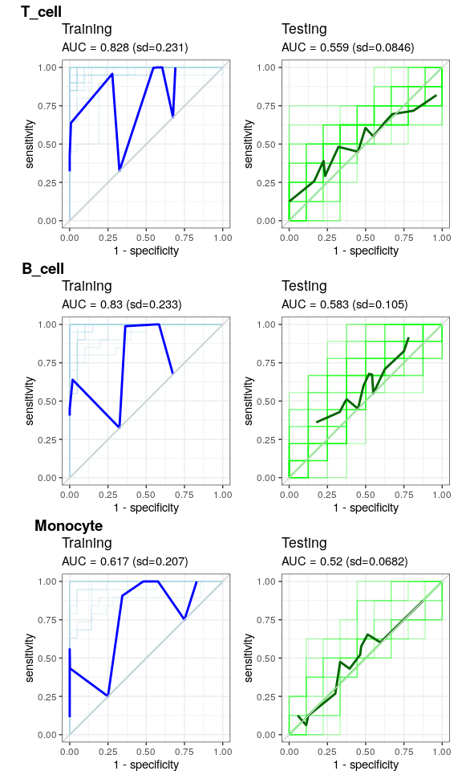<!-- -->

#### Top Features Used

``` r
gg_list = vector("list", length = length(cell_type))
names(gg_list) <- cell_type
for (ct in cell_type) {
  ml_dir <- ml_dir <- paste0("../ML_results/ML_combined_", ct)
  # Plot top features
  gg_list[[ct]] <- read.csv(paste0(ml_dir, "/topFeatures.csv")) %>%
    head(20) %>%
    mutate(feature = factor(feature, levels = feature), pct_used = 100*counts/40) %>%
    ggplot(aes(x = feature, y = pct_used)) +
    geom_col(aes(fill = pct_used>=50), show.legend = FALSE) +
    scale_fill_manual(values = c("TRUE" = "blue", "FALSE", "grey50")) +
    labs(x = "CpG probe", y = "Fraction of models used (%)") +
    theme_bw() +
    theme(
      axis.text.x = element_text(angle = 45, hjust = 1, vjust = 1),
      plot.margin = unit(c(1.5,0,0,1.5), "lines")
    )
}
cowplot::plot_grid(
  plotlist = gg_list,
  nrow = length(cell_type),
  labels = cell_type
)
```

    ## Warning: No shared levels found between `names(values)` of the manual scale and the
    ## data's fill values.
    ## No shared levels found between `names(values)` of the manual scale and the
    ## data's fill values.
    ## No shared levels found between `names(values)` of the manual scale and the
    ## data's fill values.
    ## No shared levels found between `names(values)` of the manual scale and the
    ## data's fill values.
    ## No shared levels found between `names(values)` of the manual scale and the
    ## data's fill values.
    ## No shared levels found between `names(values)` of the manual scale and the
    ## data's fill values.

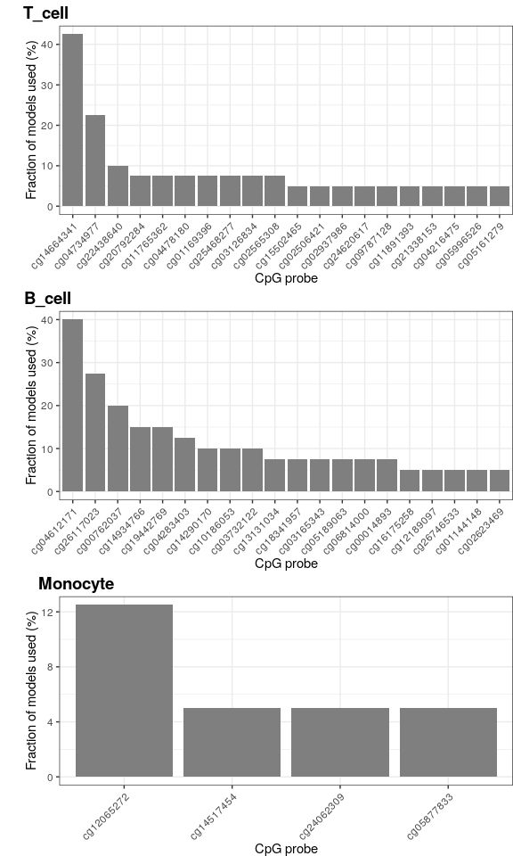<!-- -->
\## Using top 4 features on T cell profiles

``` r
ml_dir <- "../ML_results/ML_combined_T_cell_top4"
if (!dir.exists(ml_dir)) {dir.create(path = ml_dir, recursive = TRUE)}
#Labels
seed1<-1
runIndexLabel<-paste0("dev_unsupervised_",seed1)
identificationLabel<-"unsupervised"
#Filter data to samples of interest
runData = methyl_b[top_cpg, methyl_md$group1 == "T_cell"]
runPheno = data.frame(
  Sentrix_ID = methyl_md$Slide[methyl_md$group1 == "T_cell"] ,
  Sample_Group = methyl_md$sample_group[methyl_md$group1 == "T_cell"]
)
#Match filtered data
runData <- runData[,runPheno$Sentrix_ID]
#Set seed
set.seed(12345)
#Run classifier
methLab.evaluateClassifier(
  data = runData,
  pheno = runPheno,
  prop = 0.7,
  ml_dir = ml_dir,
  keep_all = TRUE,
  n_cores = floor(mem.profile.linux()$total/(4*mem.profile.linux()$used)),
  # Memory-intensive, as matrix is copied on parallel instances
  nfolds = 10,
  resultsLabel = runIndexLabel,
  identificationLabel = identificationLabel,
  feature = rownames(runData),
  seeds = 40
)
```

    ## Directory contains a populated 'results' folder. To force a recalculation, set `force` to `TRUE`.

### Calculate error data

``` r
# Concatenate ROC data
ROCdata <-data.frame()
for (seed in 1:40){
  load(file = paste0(ml_dir,"/results/TrueLabels_", runIndexLabel, "_", seed,".R"))
  
  ROCTesttoAdd<-devResults$aucTest@y.values[[1]]
  trainError<-devResults$trainError
  testError<-devResults$testError
  
  ROCdata <- rbind(
    ROCdata,
    data.frame(
      "split"=seed,
      "ROCTest"=ROCTesttoAdd,
      "trainError"=trainError,
      "testError"=testError
    )
  )
}
export(ROCdata, file = paste0(ml_dir, "/ROCdata.csv"))
summary(ROCdata$testError)
```

    ##    Min. 1st Qu.  Median    Mean 3rd Qu.    Max. 
    ## 0.05882 0.17647 0.23529 0.21176 0.23529 0.41176

### Training and Testing Performance

``` r
gg_Train <- plot_auc_curves(
  ml_dir = ml_dir,
  runIndexLabel = runIndexLabel,
  seed = 40,
  trainTest = "train",
  colIndiv = "lightblue",
  colSumm = "blue"
)
gg_Test <- plot_auc_curves(
  ml_dir = ml_dir,
  runIndexLabel = runIndexLabel,
  seed = 40,
  trainTest = "test",
  colIndiv = "green",
  colSumm = "darkgreen"
)
cowplot::plot_grid(
  gg_Train,
  gg_Test
)
```

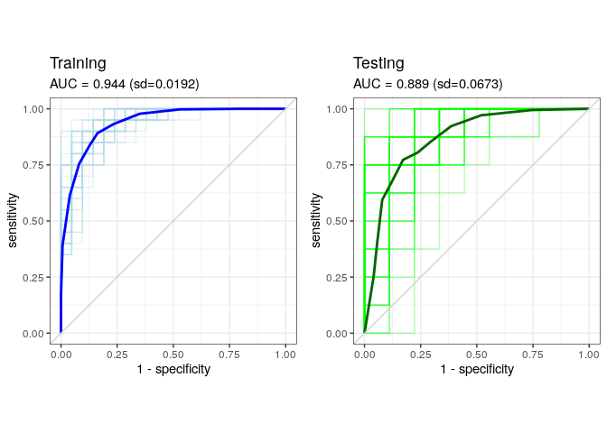<!-- -->

### Parsimonious model trained on T cells tested on B cell and Monocyte profiles

``` r
ml_dir <- "../ML_results/ML_combined_T_cell_top4_on_B_cell"
if (!dir.exists(ml_dir)) {dir.create(path = ml_dir, recursive = TRUE)}
ml_fit_dir <- "../ML_results/ML_combined_T_cell_top4"
if (!dir.exists(ml_fit_dir)) {message("Fit model has not been calculated.")}

#Filter data to samples and probes of interest
runData = methyl_b[top_cpg, methyl_md$group1 == "B_cell"]
runPheno = data.frame(
  Sentrix_ID = methyl_md$Slide[methyl_md$group1 == "B_cell"] ,
  Sample_Group = methyl_md$sample_group[methyl_md$group1 == "B_cell"]
)
#Match filtered data
runData <- runData[,runPheno$Sentrix_ID]
#Set seed
set.seed(12345)
#Run model on new data
for (seed in 1:40) {
  # Load model used
  load(file = paste0(ml_fit_dir,"/results/CVglmfit_", seed, ".R"))
  # Make predictions based on markers used in developing model
  results = eval.model(model = cv.glmfit, newData = runData, newLabels = runPheno, ml_dir = ml_dir, seed = seed, keep_all = TRUE)
  save(results, file = paste0(ml_dir, "/results/TrueLabels_results_",seed,".R"))
}

ml_dir <- "../ML_results/ML_combined_T_cell_top4_on_Monocyte"
if (!dir.exists(ml_dir)) {dir.create(path = ml_dir, recursive = TRUE)}
ml_fit_dir <- "../ML_results/ML_combined_T_cell_top4"
if (!dir.exists(ml_fit_dir)) {message("Fit model has not been calculated.")}

#Filter data to samples and probes of interest
runData = methyl_b[top_cpg, methyl_md$group1 == "Monocyte"]
runPheno = data.frame(
  Sentrix_ID = methyl_md$Slide[methyl_md$group1 == "Monocyte"] ,
  Sample_Group = methyl_md$sample_group[methyl_md$group1 == "Monocyte"]
)
#Match filtered data
runData <- runData[,runPheno$Sentrix_ID]
#Set seed
set.seed(12345)
#Run model on new data
for (seed in 1:40) {
  # Load model used
  load(file = paste0(ml_fit_dir,"/results/CVglmfit_", seed, ".R"))
  # Make predictions based on markers used in developing model
  results = eval.model(model = cv.glmfit, newData = runData, newLabels = runPheno, ml_dir = ml_dir, seed = seed, keep_all = TRUE)
  save(results, file = paste0(ml_dir, "/results/TrueLabels_results_",seed,".R"))
}
```

#### Performance

``` r
gg_list = vector("list", length = 2)
names(gg_list) <- c("B_cell", "Monocyte")
for (ct in names(gg_list)) {
  ml_dir <- paste0("../ML_results/ML_combined_T_cell_top4_on_", ct)
  # Plot performance
  gg_list[[ct]] <- plot_auc_curves(
    ml_dir = ml_dir,
    runIndexLabel = NULL,
    seed = 40,
    trainTest = "test",
    colIndiv = "orange",
    colSumm = "darkorange"
  )
}
cowplot::plot_grid(
  plotlist = gg_list,
  ncol = length(gg_list),
  labels = names(gg_list)
)
```

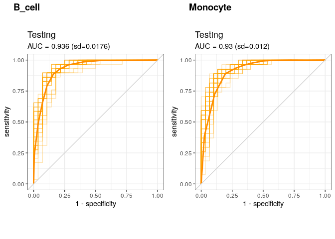<!-- -->

#### Calculate error data

``` r
for (ct in c("B_cell", "Monocyte")) {
  print (paste0("Error summary for: ", ct))
  ml_dir <- paste0("../ML_results/ML_combined_T_cell_top4_on_", ct)
  
  # Concatenate ROC data
  ROCdata <-data.frame()
  for (seed in 1:40){
    devResults <- get(load(file = paste0(ml_dir,"/results/TrueLabels_results_", seed,".R")))
    
    ROCTesttoAdd<-devResults$aucTest@y.values[[1]]
    testError<-devResults$testError
    
    ROCdata <- rbind(
      ROCdata,
      data.frame(
        "split"=seed,
        "ROCTest"=ROCTesttoAdd,
        "testError"=testError
      )
    )
  }
  export(ROCdata, file = paste0(ml_dir, "/ROCdata.csv"))
  print(summary(ROCdata$testError))
}
```

    ## [1] "Error summary for: B_cell"
    ##    Min. 1st Qu.  Median    Mean 3rd Qu.    Max. 
    ##  0.1053  0.1228  0.1404  0.1373  0.1404  0.1754 
    ## [1] "Error summary for: Monocyte"
    ##    Min. 1st Qu.  Median    Mean 3rd Qu.    Max. 
    ##  0.1404  0.1711  0.1930  0.2096  0.2456  0.2982

#### Confusion matrices

``` r
for (ct in c("B_cell", "Monocyte")) {
  print (paste0("Confusion matrix summary for: ", ct))
  ml_dir <- paste0("../ML_results/ML_combined_T_cell_top4_on_", ct)
  
  # Print summary of 40 confusion matrices
  confMatList = list()
  for (seed in 1:40){
    devResults <- get(load(file = paste0(ml_dir,"/results/TrueLabels_results_", seed,".R")))
    confMatList[[seed]] = devResults$confMat
  }
  confMatList %>%
    lapply(function(x) x/sum(x)) %>%
    lapply(as.data.frame) %>%
    bind_rows(.id = "seed") %>%
    group_by(Var1, Var2) %>%
    summarize(dat = paste0(signif(mean(Freq), digits = 3), " (sd=", signif(sd(Freq), digits = 3), ")"),.groups = "drop") %>%
    (function(x) matrix(x$dat, nrow = 2, ncol = 2, byrow = TRUE, dimnames = list(Prediction = c("Responder", "Non-responder"), Status = c("Responder", "Non-responder")))) %>%
    print()
}
```

    ## [1] "Confusion matrix summary for: B_cell"
    ##                Status
    ## Prediction      Responder            Non-responder       
    ##   Responder     "0.464 (sd=0.0198)"  "0.0921 (sd=0.0247)"
    ##   Non-responder "0.0452 (sd=0.0198)" "0.399 (sd=0.0247)" 
    ## [1] "Confusion matrix summary for: Monocyte"
    ##                Status
    ## Prediction      Responder            Non-responder      
    ##   Responder     "0.458 (sd=0.0183)"  "0.194 (sd=0.0569)"
    ##   Non-responder "0.0154 (sd=0.0183)" "0.332 (sd=0.0569)"

### Parsimonious models trained on all T cells tested on ACCESS and ABC T cells independently

``` r
## Test on ACCESS T Cells
ml_dir <- "../ML_results/ML_combined_T_cell_top4_on_ACCESS_T_cell"
if (!dir.exists(ml_dir)) {dir.create(path = ml_dir, recursive = TRUE)}
ml_fit_dir <- "../ML_results/ML_combined_T_cell_top4"
if (!dir.exists(ml_fit_dir)) {message("Fit model has not been calculated.")}

#Filter data to samples and probes of interest
idx_int = which(methyl_md$group1 == "T_cell" & methyl_md$Trial == "ACCESS")
runData = methyl_b[top_cpg, idx_int]
runPheno = data.frame(
  Sentrix_ID = methyl_md$Slide[idx_int] ,
  Sample_Group = methyl_md$sample_group[idx_int]
)
#Match filtered data
runData <- runData[,runPheno$Sentrix_ID]
#Set seed
set.seed(12345)
#Run model on new data
for (seed in 1:40) {
  # Load model used
  load(file = paste0(ml_fit_dir,"/results/CVglmfit_", seed, ".R"))
  # Make predictions based on markers used in developing model
  results = eval.model(model = cv.glmfit, newData = runData, newLabels = runPheno, ml_dir = ml_dir, seed = seed, keep_all = TRUE)
  save(results, file = paste0(ml_dir, "/results/TrueLabels_results_",seed,".R"))
}

## Test on ABC T Cells
ml_dir <- "../ML_results/ML_combined_T_cell_top4_on_ABC_T_cell"
if (!dir.exists(ml_dir)) {dir.create(path = ml_dir, recursive = TRUE)}
ml_fit_dir <- "../ML_results/ML_combined_T_cell_top4"
if (!dir.exists(ml_fit_dir)) {message("Fit model has not been calculated.")}

#Filter data to samples and probes of interest
idx_int = which(methyl_md$group1 == "T_cell" & methyl_md$Trial == "ABC")
runData = methyl_b[top_cpg, idx_int]
runPheno = data.frame(
  Sentrix_ID = methyl_md$Slide[idx_int] ,
  Sample_Group = methyl_md$sample_group[idx_int]
)
#Match filtered data
runData <- runData[,runPheno$Sentrix_ID]
#Set seed
set.seed(12345)
#Run model on new data
for (seed in 1:40) {
  # Load model used
  load(file = paste0(ml_fit_dir,"/results/CVglmfit_", seed, ".R"))
  # Make predictions based on markers used in developing model
  results = eval.model(model = cv.glmfit, newData = runData, newLabels = runPheno, ml_dir = ml_dir, seed = seed, keep_all = TRUE)
  save(results, file = paste0(ml_dir, "/results/TrueLabels_results_",seed,".R"))
}
```

    ## Error in smooth_roc_binormal(roc, n) : 
    ##   ROC curve not smoothable (not enough points).
    ## Error in smooth_roc_binormal(roc, n) : 
    ##   ROC curve not smoothable (not enough points).
    ## Error in smooth_roc_binormal(roc, n) : 
    ##   ROC curve not smoothable (not enough points).
    ## Error in if (is.unsorted(roc$specificities)) { : 
    ##   missing value where TRUE/FALSE needed
    ## Error in smooth_roc_binormal(roc, n) : 
    ##   ROC curve not smoothable (not enough points).
    ## Error in smooth_roc_binormal(roc, n) : 
    ##   ROC curve not smoothable (not enough points).
    ## Error in smooth_roc_binormal(roc, n) : 
    ##   ROC curve not smoothable (not enough points).
    ## Error in smooth_roc_binormal(roc, n) : 
    ##   ROC curve not smoothable (not enough points).
    ## Error in smooth_roc_binormal(roc, n) : 
    ##   ROC curve not smoothable (not enough points).
    ## Error in smooth_roc_binormal(roc, n) : 
    ##   ROC curve not smoothable (not enough points).
    ## Error in smooth_roc_binormal(roc, n) : 
    ##   ROC curve not smoothable (not enough points).
    ## Error in smooth_roc_binormal(roc, n) : 
    ##   ROC curve not smoothable (not enough points).
    ## Error in smooth_roc_binormal(roc, n) : 
    ##   ROC curve not smoothable (not enough points).
    ## Error in smooth_roc_binormal(roc, n) : 
    ##   ROC curve not smoothable (not enough points).
    ## Error in smooth_roc_binormal(roc, n) : 
    ##   ROC curve not smoothable (not enough points).
    ## Error in smooth_roc_binormal(roc, n) : 
    ##   ROC curve not smoothable (not enough points).
    ## Error in smooth_roc_binormal(roc, n) : 
    ##   ROC curve not smoothable (not enough points).
    ## Error in smooth_roc_binormal(roc, n) : 
    ##   ROC curve not smoothable (not enough points).

#### Performance

``` r
gg_list = vector("list", length = 2)
names(gg_list) <- c("ACCESS_T_cell", "ABC_T_cell")
for (ct in names(gg_list)) {
  ml_dir <- paste0("../ML_results/ML_combined_T_cell_top4_on_", ct)
  # Plot performance
  gg_list[[ct]] <- plot_auc_curves(
    ml_dir = ml_dir,
    runIndexLabel = NULL,
    seed = 40,
    trainTest = "test",
    colIndiv = "orange",
    colSumm = "darkorange"
  )
}
cowplot::plot_grid(
  plotlist = gg_list,
  ncol = length(gg_list),
  labels = names(gg_list)
)
```

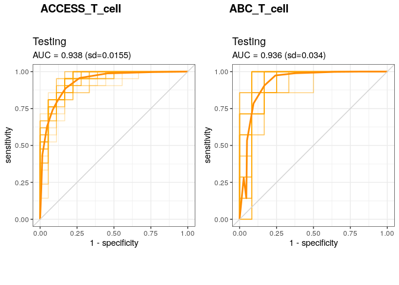<!-- -->

#### Calculate error data

``` r
for (ct in c("ACCESS_T_cell", "ABC_T_cell")) {
  print (paste0("Error summary for: ", ct))
  ml_dir <- paste0("../ML_results/ML_combined_T_cell_top4_on_", ct)
  
  # Concatenate ROC data
  ROCdata <-data.frame()
  for (seed in 1:40){
    devResults <- get(load(file = paste0(ml_dir,"/results/TrueLabels_results_", seed,".R")))
    
    ROCTesttoAdd<-devResults$aucTest@y.values[[1]]
    testError<-devResults$testError
    
    ROCdata <- rbind(
      ROCdata,
      data.frame(
        "split"=seed,
        "ROCTest"=ROCTesttoAdd,
        "testError"=testError
      )
    )
  }
  export(ROCdata, file = paste0(ml_dir, "/ROCdata.csv"))
  print(summary(ROCdata$testError))
}
```

    ## [1] "Error summary for: ACCESS_T_cell"
    ##    Min. 1st Qu.  Median    Mean 3rd Qu.    Max. 
    ##  0.1282  0.1538  0.1538  0.1564  0.1795  0.1795 
    ## [1] "Error summary for: ABC_T_cell"
    ##    Min. 1st Qu.  Median    Mean 3rd Qu.    Max. 
    ## 0.05263 0.10526 0.15789 0.15000 0.15789 0.26316

### Parsimonious model trained on ABC T cells and tested on ACCESS T cells

``` r
source(file = "../R/f_classify_feature.R")

## Train on ABC T cells, test on ACCESS T cells
ml_dir <- "../ML_results/ML_combined_T_cell_top4_trainABC_testACCESS"
if (!dir.exists(ml_dir)) {dir.create(path = ml_dir, recursive = TRUE)}
if (!dir.exists( paste0(ml_dir, "/results"))) {dir.create(path =  paste0(ml_dir, "/results"), recursive = TRUE)}

## Development data
#Filter data to samples and probes of interest
idx_int = which(methyl_md$group1 == "T_cell" & methyl_md$Trial == "ABC")
developmentData = methyl_b[top_cpg, idx_int]
developmentPheno = data.frame(
  Sentrix_ID = methyl_md$Slide[idx_int] ,
  Sample_Group = methyl_md$sample_group[idx_int]
)
#Match filtered data
developmentData <- developmentData[,developmentPheno$Sentrix_ID]

## Validation data
#Filter data to samples and probes of interest
idx_int = which(methyl_md$group1 == "T_cell" & methyl_md$Trial == "ACCESS")
validationData = methyl_b[top_cpg, idx_int]
validationPheno = data.frame(
  Sentrix_ID = methyl_md$Slide[idx_int] ,
  Sample_Group = methyl_md$sample_group[idx_int]
)
#Match filtered data
validationData <- validationData[,validationPheno$Sentrix_ID]

#Set seed
set.seed(12345)

#classify feature
devResults <- classify.feature(
  train=developmentData,
  test = validationData,
  trainLabels = developmentPheno[,"Sample_Group",drop=FALSE],
  testLabels = validationPheno[,"Sample_Group",drop=FALSE],
  keep_all = TRUE,
  ml_dir = ml_dir,
  nfolds = 10,
  method="exact",
  feature=top_cpg,
  seed=1
)
```

    ## Warning in lognet(xd, is.sparse, ix, jx, y, weights, offset, alpha, nobs, : one
    ## multinomial or binomial class has fewer than 8 observations; dangerous ground
    ## Warning in lognet(xd, is.sparse, ix, jx, y, weights, offset, alpha, nobs, : one
    ## multinomial or binomial class has fewer than 8 observations; dangerous ground
    ## Warning in lognet(xd, is.sparse, ix, jx, y, weights, offset, alpha, nobs, : one
    ## multinomial or binomial class has fewer than 8 observations; dangerous ground
    ## Warning in lognet(xd, is.sparse, ix, jx, y, weights, offset, alpha, nobs, : one
    ## multinomial or binomial class has fewer than 8 observations; dangerous ground
    ## Warning in lognet(xd, is.sparse, ix, jx, y, weights, offset, alpha, nobs, : one
    ## multinomial or binomial class has fewer than 8 observations; dangerous ground
    ## Warning in lognet(xd, is.sparse, ix, jx, y, weights, offset, alpha, nobs, : one
    ## multinomial or binomial class has fewer than 8 observations; dangerous ground
    ## Warning in lognet(xd, is.sparse, ix, jx, y, weights, offset, alpha, nobs, : one
    ## multinomial or binomial class has fewer than 8 observations; dangerous ground
    ## Warning in lognet(xd, is.sparse, ix, jx, y, weights, offset, alpha, nobs, : one
    ## multinomial or binomial class has fewer than 8 observations; dangerous ground
    ## Warning in lognet(xd, is.sparse, ix, jx, y, weights, offset, alpha, nobs, : one
    ## multinomial or binomial class has fewer than 8 observations; dangerous ground
    ## Warning in lognet(xd, is.sparse, ix, jx, y, weights, offset, alpha, nobs, : one
    ## multinomial or binomial class has fewer than 8 observations; dangerous ground
    ## Warning in lognet(xd, is.sparse, ix, jx, y, weights, offset, alpha, nobs, : one
    ## multinomial or binomial class has fewer than 8 observations; dangerous ground

    ## Warning: Too few (< 10) observations per fold for type.measure='auc' in
    ## cv.lognet; changed to type.measure='deviance'. Alternatively, use smaller value
    ## for nfolds

    ## Warning: Option grouped=FALSE enforced in cv.glmnet, since < 3 observations per
    ## fold

    ## Setting levels: control = case, case = control

    ## Setting direction: controls < cases

    ## Setting levels: control = case, case = control

    ## Setting direction: controls < cases

    ## 
    ## Call:
    ## roc.default(response = outcomes$actual, predictor = as.numeric(outcomes$predicted),     smooth = T)
    ## 
    ## Data: as.numeric(outcomes$predicted) in 21 controls (outcomes$actual case) < 18 cases (outcomes$actual control).
    ## Smoothing: binormal 
    ## Area under the curve: 0.7699

``` r
save(devResults, file = paste0(ml_dir, "/results/TrueLabels_results_1.R"))
```

#### Performance

``` r
plot_data <- roc(factor(devResults$trainLabels, levels = c("control", "case")), devResults$trainPred[,1], quiet=TRUE) %>%
  (function(x) cbind(coords(x), aucROC = as.numeric(x$auc)))
gg_Train <- ggplot(data = plot_data, aes(x = 1-specificity, y = sensitivity)) +
  geom_path(col = "blue", alpha = 1) +
  geom_abline(slope = 1, intercept = 0, col = "lightgrey") +
  coord_fixed() +
  labs(
    title = "Training (ABC)",
    subtitle = paste0("AUC = ", signif(unique(plot_data$aucROC),digits = 3))
  ) +
  theme_bw()
plot_data <- roc(factor(devResults$testLabels, levels = c("control", "case")), devResults$testPred[,1], quiet=TRUE) %>%
  (function(x) cbind(coords(x), aucROC = as.numeric(x$auc)))
gg_Test <- ggplot(data = plot_data, aes(x = 1-specificity, y = sensitivity)) +
  geom_path(col = "darkgreen", alpha = 1) +
  geom_abline(slope = 1, intercept = 0, col = "lightgrey") +
  coord_fixed() +
  labs(
    title = "Testing (ACCESS)",
    subtitle = paste0("AUC = ", signif(unique(plot_data$aucROC),digits = 3))
  ) +
  theme_bw()
cowplot::plot_grid(
  gg_Train,
  gg_Test
)
```

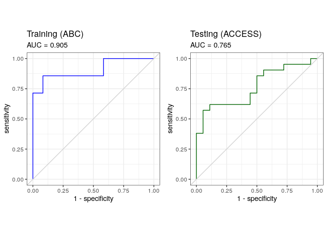<!-- -->

### Parsimonious model trained on ACCESS T cells and tested on ABC T cells

``` r
## Train on ACCESS T cells, test on ABC T cells
ml_dir <- "../ML_results/ML_combined_T_cell_top4_trainACCESS_testABC"
if (!dir.exists(ml_dir)) {dir.create(path = ml_dir, recursive = TRUE)}
if (!dir.exists( paste0(ml_dir, "/results"))) {dir.create(path =  paste0(ml_dir, "/results"), recursive = TRUE)}

## Development data
#Filter data to samples and probes of interest
idx_int = which(methyl_md$group1 == "T_cell" & methyl_md$Trial == "ACCESS")
developmentData = methyl_b[top_cpg, idx_int]
developmentPheno = data.frame(
  Sentrix_ID = methyl_md$Slide[idx_int] ,
  Sample_Group = methyl_md$sample_group[idx_int]
)
#Match filtered data
developmentData <- developmentData[,developmentPheno$Sentrix_ID]

## Validation data
#Filter data to samples and probes of interest
idx_int = which(methyl_md$group1 == "T_cell" & methyl_md$Trial == "ABC")
validationData = methyl_b[top_cpg, idx_int]
validationPheno = data.frame(
  Sentrix_ID = methyl_md$Slide[idx_int] ,
  Sample_Group = methyl_md$sample_group[idx_int]
)
#Match filtered data
validationData <- validationData[,validationPheno$Sentrix_ID]

#Set seed
set.seed(12345)

#classify feature
devResults <- classify.feature(
  train=developmentData,
  test = validationData,
  trainLabels = developmentPheno[,"Sample_Group",drop=FALSE],
  testLabels = validationPheno[,"Sample_Group",drop=FALSE],
  keep_all = TRUE,
  ml_dir = ml_dir,
  nfolds = 10,
  method="exact",
  feature=top_cpg,
  seed=1
)
```

    ## Warning: Too few (< 10) observations per fold for type.measure='auc' in
    ## cv.lognet; changed to type.measure='deviance'. Alternatively, use smaller value
    ## for nfolds

    ## Setting levels: control = case, case = control

    ## Setting direction: controls < cases

    ## Setting levels: control = case, case = control

    ## Setting direction: controls < cases

    ## 
    ## Call:
    ## roc.default(response = outcomes$actual, predictor = as.numeric(outcomes$predicted),     smooth = T)
    ## 
    ## Data: as.numeric(outcomes$predicted) in 7 controls (outcomes$actual case) < 12 cases (outcomes$actual control).
    ## Smoothing: binormal 
    ## Area under the curve: 0.7899

``` r
save(devResults, file = paste0(ml_dir, "/results/TrueLabels_results_1.R"))
```

#### Performance

``` r
plot_data <- roc(factor(devResults$trainLabels, levels = c("control", "case")), devResults$trainPred[,1], quiet=TRUE) %>%
  (function(x) cbind(coords(x), aucROC = as.numeric(x$auc)))
gg_Train <- ggplot(data = plot_data, aes(x = 1-specificity, y = sensitivity)) +
  geom_path(col = "blue", alpha = 1) +
  geom_abline(slope = 1, intercept = 0, col = "lightgrey") +
  coord_fixed() +
  labs(
    title = "Training (ACCESS)",
    subtitle = paste0("AUC = ", signif(unique(plot_data$aucROC),digits = 3))
  ) +
  theme_bw()
plot_data <- roc(factor(devResults$testLabels, levels = c("control", "case")), devResults$testPred[,1], quiet=TRUE) %>%
  (function(x) cbind(coords(x), aucROC = as.numeric(x$auc)))
gg_Test <- ggplot(data = plot_data, aes(x = 1-specificity, y = sensitivity)) +
  geom_path(col = "darkgreen", alpha = 1) +
  geom_abline(slope = 1, intercept = 0, col = "lightgrey") +
  coord_fixed() +
  labs(
    title = "Testing (ABC)",
    subtitle = paste0("AUC = ", signif(unique(plot_data$aucROC),digits = 3))
  ) +
  theme_bw()
cowplot::plot_grid(
  gg_Train,
  gg_Test
)
```

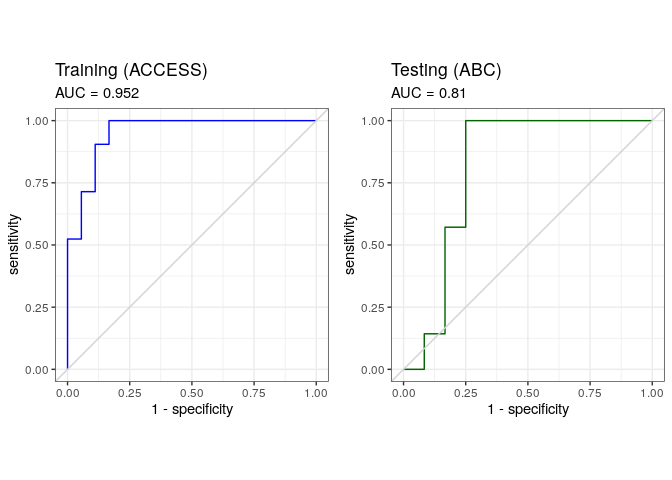<!-- -->
